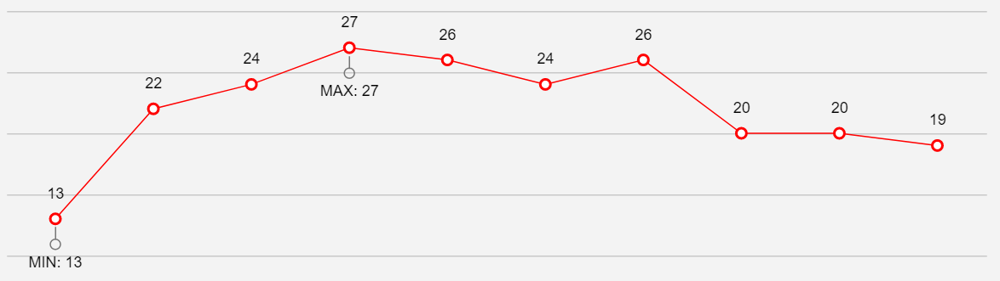

# Series Notes

The **Series Notes** functionality of the [ASP.NET AJAX Chart](https://www.telerik.com/products/aspnet-ajax/html-chart.aspx) can be used as of R2 2022.

The **Series Notes** enables you to display the metadata of series points.



>important The Series Notes functionality is not supported in **Donut**, **Pie**, **Funnel**, **Polar**, **Radar** and **BoxPlot** **series**.

>note Test the Series Notes feature in our **[SeriesNotes live demo](https://demos.telerik.com/aspnet-ajax/htmlchart/examples/functionality/seriesnotes/defaultcs.aspx)**. You can try various NotesAppearance customizations via the Demo Configuration Panel.

## Getting Started

To display additional information for series points, set the `DataNoteTextField` property of the series to a field from the data which contains the information.

You can customize the look of the Notes element through the series `NotesAppearance` inner tag. Each Series Note consist of a **Label**, **Icon** and a **Line**. The appearance of all three parts can be customized via the corresponding nested tag.

Sample declaration of LineSeries with customized NotesAppearance:

````ASPX
<telerik:LineSeries Name="Wins" DataFieldY="Win" DataNoteTextField="Extremum">
    <NotesAppearance Position="Bottom">
        <Icon Type="Circle" Size="8">
            <Border Width="1" />
        </Icon>
        <Label Position="Outside"></Label>
        <Line DashType="Solid" Length="10" Width="1" />
    </NotesAppearance>
</telerik:LineSeries>
````

A complete list of the properties exposed by the `NoteAppearance` object and its embedded objects (`Icon`, `Label`, `Line`) you can find in the following server-side API resources:

 - **NotesAppearance** - [Telerik.Web.UI.HtmlChart.PlotArea.NotesAppearance](https://docs.telerik.com/devtools/aspnet-ajax/api/server/Telerik.Web.UI.HtmlChart.PlotArea/NotesAppearance)

 - **Icon** - [Telerik.Web.UI.HtmlChart.PlotArea.Appearance.NoteIconAppearance](https://docs.telerik.com/devtools/aspnet-ajax/api/server/Telerik.Web.UI.HtmlChart.PlotArea.Appearance/NoteIconAppearance)

 - **Line** - [Telerik.Web.UI.HtmlChart.PlotArea.Appearance.NoteLineAppearance](https://docs.telerik.com/devtools/aspnet-ajax/api/server/Telerik.Web.UI.HtmlChart.PlotArea.Appearance/NoteLineAppearance)

 - **Label** - [Telerik.Web.UI.HtmlChart.PlotArea.Appearance.NoteLabelAppearance](https://docs.telerik.com/devtools/aspnet-ajax/api/server/Telerik.Web.UI.HtmlChart.PlotArea.Appearance/NoteLabelAppearance)


<!-- ## APIs

The Series Notes are exposing the following inner tag and properties to allow flexible appearance customization:

 - `Position` - Sets the position of the series note to one of the predefined `NotePosition` options. It can be set to ***Bottom***, ***Left***, ***Right***, ***Top***. By default the position is set to *Top*.

 - `Icon` - Inner tag where you can customize the Note's Icon appearance by specifying the following properties:

    * `Type` - Sets the shape of the series note icon to one of the predefined `NoteIconType` options. It can be set to ***Circle***, ***Cross***, ***Square***, ***Triangle***. By default the position is set to *Circle*.

    * `Size` - The Size of the Icon.

    * `BackgroundColor` - The fill color of the icon.

    * `Visible` - Sets if the icon should be visible or not.

    * `Border` - Nested tag exposing `Color`, and `Width` properties for customizing the icon border.

 - `Line` - Inner tag where you can customize the Note's Line appearance by specifying the following properties:

    * `DashType` - Sets the dash type of the note line to one of the predefined `DashType` options. The following dash types are supported: ***Dash***, ***DashDot***, ***Dot***, ***LongDash***, ***LongDashDot***, ***LongDashDotDot***, ***Solid***. By default the DashType is set to *Solid*.

    * `Color` - The color of the notes' lines.

    * `Width` - The width of the notes' lines.

    * `Length` - The length of the notes' lines.

 - `Label` - Inner tag where you can customize the Note's Label appearance by specifying the following properties:

    * `Position` - Sets the position of the notes labels to ***Inside*** or ***Outside***. Defining whether the label is position inside or outside of the icon. By default the Label-Position is set to *Inside*.

    * `DataFormatString` - Data format string of the labels.

    * `ClientTemplate` - Nested inner tag for define a client-side template for the labels appearance by leveraging [Kendo UI Templates](https://docs.telerik.com/kendo-ui/framework/templates/overview).

    * `Border` - Nested tag exposing `Color`, `Width`, and `DashType` properties for customizing the label border.

    * `Visible` - Sets if the label should be visible or not.
    
    * `RotationAngle` - Specifies the rotation angle of the label.

    * `TextStyle` - Defines the text style settings. Nested tag exposing `Bold`, `Italic`, `FontFamily` and `FontSize` properties.

    * `Color` - The color of the notes' label text.

    * `BackgroundColor` - The background color of the label.

 - `Visual` - A function that can be used to create a custom visual for the notes. Refer to Kendo Chart documentation on the matter - [series.notes.visual](https://docs.telerik.com/kendo-ui/api/javascript/dataviz/ui/chart/configuration/series.notes.visual) -->


Sample declaration of customized NotesAppearance:

````ASPX
<NotesAppearance Position="Left">
    <Line Width="2" Color="#7d7d7d" Length="10" DashType="Solid" />
    <Icon BackgroundColor="#7d7d7d" Type="Circle" Size="20" Visible="true">
        <Border Color="#3f3f3f" Width="3px" />
    </Icon>
    <Label Color="Red" Position="Outside" DataFormatString="{0} USD" RotationAngle="15" Visible="true" BackgroundColor="Green">
        <Border Color="Yellow" Width="3" DashType="Dash" />
        <TextStyle Bold="true" Italic="true" FontFamily="SansSerif" FontSize="18" />
    </Label>
</NotesAppearance>
````


## See Also
 
 * [SeriesNotes live demo](https://demos.telerik.com/aspnet-ajax/htmlchart/examples/functionality/seriesnotes/defaultcs.aspx)

 * [NotesAppearance](https://docs.telerik.com/devtools/aspnet-ajax/api/server/Telerik.Web.UI.HtmlChart.PlotArea/NotesAppearance)

 * [NoteIconAppearance](https://docs.telerik.com/devtools/aspnet-ajax/api/server/Telerik.Web.UI.HtmlChart.PlotArea.Appearance/NoteIconAppearance)

 * [NoteLineAppearance](https://docs.telerik.com/devtools/aspnet-ajax/api/server/Telerik.Web.UI.HtmlChart.PlotArea.Appearance/NoteLineAppearance)

 * [NoteLabelAppearance](https://docs.telerik.com/devtools/aspnet-ajax/api/server/Telerik.Web.UI.HtmlChart.PlotArea.Appearance/NoteLabelAppearance)

