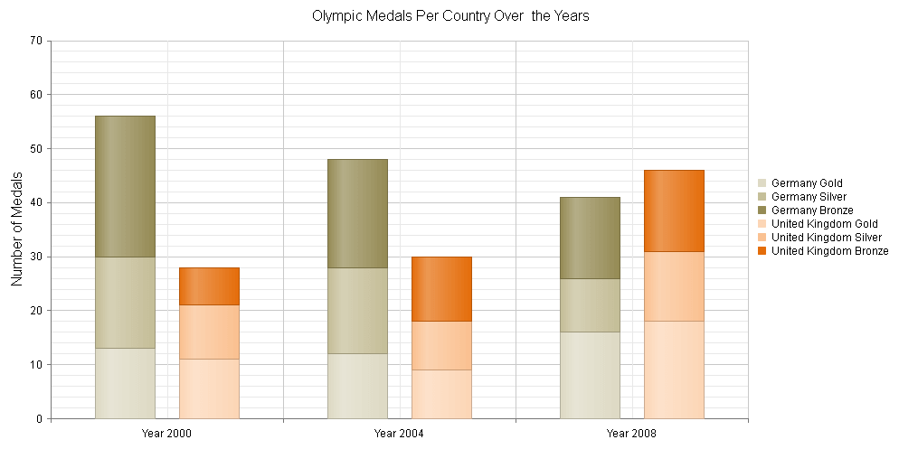

# Stacked Series

**Stacked Column** and **Bar** series in **RadHtmlChart** can be **clustered** in **groups** since the Q3 2013 release.

Series that will be stacked in a separate group must have the same group name set in their **GroupName** property. If you leave the **GroupName** property blank, all series will be placed in one default stack. Setting the **GroupName** property of any series automatically sets the **Stacked** property of the first series to **true**, so it is not required to be explicitly set.

>caption Example 1: Shows the markup code used to create Figure 1, which demonstrates a stacked column series.



You can create **Figure 1** using the markup in **Example 1**.

>caption Example 1: Shows an implementation of chart with stacked columns.

````ASP.NET
<telerik:RadHtmlChart runat="server" ID="RadHtmlChart1" Width="1000" Height="500">
	<PlotArea>
		<Series>
			<telerik:ColumnSeries Name="Germany Gold" GroupName="Germany">
				<Appearance>
					<FillStyle BackgroundColor="#DDD9C3" />
				</Appearance>
				<SeriesItems>
					<telerik:CategorySeriesItem Y="13" />
					<telerik:CategorySeriesItem Y="12" />
					<telerik:CategorySeriesItem Y="16" />
				</SeriesItems>
				<TooltipsAppearance ClientTemplate="#= series.name# medals: #= dataItem.value#" />
				<LabelsAppearance Visible="false"></LabelsAppearance>
			</telerik:ColumnSeries>
			<telerik:ColumnSeries Name="Germany Silver" GroupName="Germany">
				<Appearance>
					<FillStyle BackgroundColor="#C4BD97" />
				</Appearance>
				<SeriesItems>
					<telerik:CategorySeriesItem Y="17" />
					<telerik:CategorySeriesItem Y="16" />
					<telerik:CategorySeriesItem Y="10" />
				</SeriesItems>
				<TooltipsAppearance ClientTemplate="#= series.name# medals: #= dataItem.value#" />
				<LabelsAppearance Visible="false"></LabelsAppearance>
			</telerik:ColumnSeries>
			<telerik:ColumnSeries Name="Germany Bronze" GroupName="Germany">
				<Appearance>
					<FillStyle BackgroundColor="#948A54" />
				</Appearance>
				<SeriesItems>
					<telerik:CategorySeriesItem Y="26" />
					<telerik:CategorySeriesItem Y="20" />
					<telerik:CategorySeriesItem Y="15" />
				</SeriesItems>
				<TooltipsAppearance ClientTemplate="#= series.name# medals: #= dataItem.value#" Color="White" />
				<LabelsAppearance Visible="false"></LabelsAppearance>
			</telerik:ColumnSeries>
			<telerik:ColumnSeries Name="United Kingdom Gold" GroupName="United Kingdom">
				<Appearance>
					<FillStyle BackgroundColor="#FCD5B5" />
				</Appearance>
				<SeriesItems>
					<telerik:CategorySeriesItem Y="11" />
					<telerik:CategorySeriesItem Y="9" />
					<telerik:CategorySeriesItem Y="18" />
				</SeriesItems>
				<TooltipsAppearance ClientTemplate="#= series.name# medals: #= dataItem.value#" />
				<LabelsAppearance Visible="false"></LabelsAppearance>
			</telerik:ColumnSeries>
			<telerik:ColumnSeries Name="United Kingdom Silver" GroupName="United Kingdom">
				<Appearance>
					<FillStyle BackgroundColor="#FAC090" />
				</Appearance>
				<SeriesItems>
					<telerik:CategorySeriesItem Y="10" />
					<telerik:CategorySeriesItem Y="9" />
					<telerik:CategorySeriesItem Y="13" />
				</SeriesItems>
				<TooltipsAppearance ClientTemplate="#= series.name# medals: #= dataItem.value#" />
				<LabelsAppearance Visible="false"></LabelsAppearance>
			</telerik:ColumnSeries>
			<telerik:ColumnSeries Name="United Kingdom Bronze" GroupName="United Kingdom">
				<Appearance>
					<FillStyle BackgroundColor="#E46C0A" />
				</Appearance>
				<SeriesItems>
					<telerik:CategorySeriesItem Y="7" />
					<telerik:CategorySeriesItem Y="12" />
					<telerik:CategorySeriesItem Y="15" />
				</SeriesItems>
				<TooltipsAppearance ClientTemplate="#= series.name# medals: #= dataItem.value#" Color="White" />
				<LabelsAppearance Visible="false"></LabelsAppearance>
			</telerik:ColumnSeries>
		</Series>
		<YAxis>
			<TitleAppearance Text="Number of Medals" />
		</YAxis>
		<XAxis>
			<LabelsAppearance DataFormatString="Year {0}" />
			<Items>
				<telerik:AxisItem LabelText="2000" />
				<telerik:AxisItem LabelText="2004" />
				<telerik:AxisItem LabelText="2008" />
			</Items>
		</XAxis>
	</PlotArea>
	<ChartTitle Text="Olympic Medals Per Country Over the Years">
	</ChartTitle>
	<Legend>
		<Appearance Position="Right" />
	</Legend>
</telerik:RadHtmlChart>
````


## See Also

 * [100% Stacked Series]()

 * [Bar Chart]()

 * [Column Chart]()
 
 * [Stacked Series demo](https://demos.telerik.com/aspnet-ajax/htmlchart/examples/functionality/stacked-series/defaultcs.aspx)
