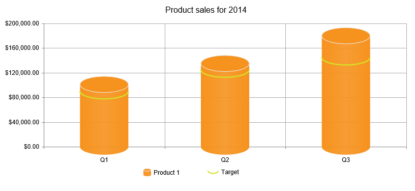

# Visual Template

You can implement custom visualization of **legend items**, **axis titles**, **labels**, **markers** and **series** as of **Q2 2015**. To do this, set the corresponding element's **Visual** property to the **JavaScript function name** that will draw the object through the [Kendo Drawing API](http://demos.telerik.com/kendo-ui/drawing/index). You can read more about it in the [Kendo UI JavaScript API reference](http://docs.telerik.com/kendo-ui/api/javascript/drawing).

The function that will create the custom visual receives arguments that provide context appropriate for the element that called it. This can include the `rect` ([kendo.geometry.Rect](http://docs.telerik.com/kendo-ui/api/javascript/geometry/rect)) that defines where the visual will be rendered, `createVisual` - the function that can be used to get a default visual, and various `options` depending on the item type. You can find more examples in the Kendo UI online demos: [Line Charts - Custom Visuals](http://demos.telerik.com/kendo-ui/line-charts/visuals) and [Bar Charts - Custom Visuals](http://demos.telerik.com/kendo-ui/bar-charts/visuals).

**Example 1** shows how you can customize the markers, series items and their legend items to create a 3D look. You can see it in action in the [HtmlChart - Custom Visuals](http://demos.telerik.com/aspnet-ajax/htmlchart/examples/functionality/visual-templates/defaultcs.aspx) online demo.

>caption Figure 1: A chart with custom visuals for its series, markers and legend items. This is the result from Example 1.

**Example 1**: How to use custom visual templates to create custom HtmlChart elements appearance:

1. Create a chart (this example adds static items and settings in the markup) and ensure that you have set the desired **Visual** properties accordingly.

	**ASP.NET**

		<telerik:RadHtmlChart runat="server" ID="RadHtmlChart1" Width="800px" Height="400px">
			<ClientEvents OnLoad="onChartLoad" />
			<Legend>
				<Appearance Position="Bottom" />
				<Item Visual="legendItemVisual" />
			</Legend>
			<PlotArea>
				<Series>
					<telerik:ColumnSeries Name="Product 1">
						<Appearance Visual="columnVisual"></Appearance>
						<LabelsAppearance Visible="false"></LabelsAppearance>
						<TooltipsAppearance DataFormatString="{0:c}"></TooltipsAppearance>
						<SeriesItems>
							<telerik:CategorySeriesItem Y="101022" />
							<telerik:CategorySeriesItem Y="135005" />
							<telerik:CategorySeriesItem Y="180004" />
						</SeriesItems>
					</telerik:ColumnSeries>
					<telerik:LineSeries Name="Target">
						<MarkersAppearance Visual="markersVisual" />
						<LineAppearance Width="0" />
						<LabelsAppearance Visible="false"></LabelsAppearance>
						<TooltipsAppearance DataFormatString="{0:c}"></TooltipsAppearance>
						<SeriesItems>
							<telerik:CategorySeriesItem Y="90000" />
							<telerik:CategorySeriesItem Y="125000" />
							<telerik:CategorySeriesItem Y="145000" />
						</SeriesItems>
					</telerik:LineSeries>
				</Series>
				<YAxis Step="40000">
					<LabelsAppearance DataFormatString="{0:c}" />
					<MinorGridLines Visible="false" />
				</YAxis>
				<XAxis>
					<MinorGridLines Visible="false" />
					<LabelsAppearance>
						<TextStyle Margin="10 0 0 0" />
					</LabelsAppearance>
					<Items>
						<telerik:AxisItem LabelText="Q1" />
						<telerik:AxisItem LabelText="Q2" />
						<telerik:AxisItem LabelText="Q3" />
					</Items>
				</XAxis>
			</PlotArea>
			<ChartTitle Text="Product sales for 2014">
			</ChartTitle>
		</telerik:RadHtmlChart>

1. Add the scripts that will render the desired shapes:

	**JavaScript**
		
		var drawing = kendo.drawing,
			geometry = kendo.geometry,
			columnWidth;

		function seriesHighLight(e) {
			e.preventDefault();
			if (e.series.name == "Product 1") {
				e.visual.opacity(e.show ? 0.8 : 1);
			}
		}

		function createColumn(rect, color) {
			var origin = rect.origin;
			var center = rect.center();
			var bottomRight = rect.bottomRight();
			var radiusX = rect.width() / 2;
			var radiusY = radiusX / 3;
			var gradient = new drawing.LinearGradient({
				stops: [{
					offset: 0,
					color: color
				}, {
					offset: 0.5,
					color: color,
					opacity: 0.9
				}, {
					offset: 0.5,
					color: color,
					opacity: 0.9
				}, {
					offset: 1,
					color: color
				}]
			});

			var path = new drawing.Path({
				fill: gradient,
				stroke: {
					color: "none"
				}
			}).moveTo(origin.x, origin.y)
				.lineTo(origin.x, bottomRight.y)
				.arc(180, 0, radiusX, radiusY, true)
				.lineTo(bottomRight.x, origin.y)
				.arc(0, 180, radiusX, radiusY);

			var topArcGeometry = new geometry.Arc([center.x, origin.y], {
				startAngle: 0,
				endAngle: 360,
				radiusX: radiusX,
				radiusY: radiusY
			});

			var topArc = new drawing.Arc(topArcGeometry, {
				fill: {
					color: color
				},
				stroke: {
					color: "#ebebeb"
				}
			});
			var group = new drawing.Group();
			group.append(path, topArc);
			return group;
		}

		onChartLoad = function (sender, args) {
			var kendoChart = sender.get_kendoWidget();
			kendoChart.options.seriesDefaults.highlight.toggle = seriesHighLight;
			kendoChart.options.panes[0].clip = false;
			kendoChart.redraw();
		};

		markersVisual = function (e) {
			var center = e.rect.center();
			var radius = (columnWidth || 70) / 2;
			var color = e.options.border.color;
			var path = new kendo.drawing.Path({
				stroke: {
					color: color,
					width: 2.5
				}
			}).moveTo(center.x - radius, center.y)
			.arc(180, 0, radius, 15, true);
			return path;
		};

		columnVisual = function (e) {
			var rect = e.rect;
			if (!columnWidth)
				columnWidth = rect.width();
			return createColumn(rect, e.options.color);
		};

		legendItemVisual = function (e) {
			var column;
			var color = e.options.markers.background;
			var legendLabelsColor = e.options.labels.color ? e.options.labels.color : "#000";
			var rect = new geometry.Rect([0, 0], [120, 50]);
			var layout = new drawing.Layout(rect, {
				spacing: 5,
				alignItems: "center"
			});
			var overlay = drawing.Path.fromRect(rect, {
				fill: {
					color: "#fff",
					opacity: 0
				},
				stroke: {
					color: "none"
				},
				cursor: "pointer"
			});
			if (e.series.name == "Target") {
				column = new kendo.drawing.Path({
					stroke: {
						color: color,
						width: 2
					}
				}).moveTo(rect.x, rect.y)
				.arc(180, 0, 10, 5, true);
			} else {
				column = createColumn(new geometry.Rect([0, 0], [15, 10]), color);
			}
			var label = new drawing.Text(e.series.name, [0, 0], {
				fill: {
					color: legendLabelsColor
				}
			})

			layout.append(column, label);
			layout.reflow();
			var group = new drawing.Group().append(layout, overlay);
			return group;
		};

## See Also

 * [Live Demo: HtmlChart Custom Visuals](http://demos.telerik.com/aspnet-ajax/htmlchart/examples/functionality/visual-templates/defaultcs.aspx)

 * [Live Demo: Kendo Drawing API](http://demos.telerik.com/kendo-ui/drawing/index)

 * [API Reference: Kendo Drawing API](http://docs.telerik.com/kendo-ui/api/javascript/drawing)

 * [API Reference: Kendo Chart](http://docs.telerik.com/kendo-ui/api/javascript/dataviz/ui/chart)

