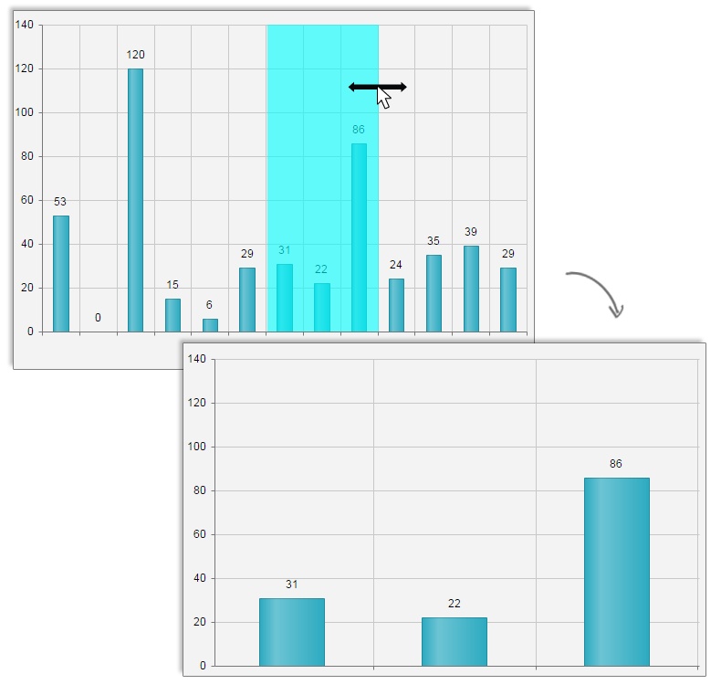

# Pan and Zoom

**Pan** and **Zoom** help end-user to navigate through and zoom in/out the **RadHtmlChart**. You can find here more details how to configure and adjust these features.

**Pan** and **Zoom** are supported in **RadHtmlChart** as of **Q1 2016**. They are also available only for series that use cartesian coordinate system (i.e., category and numeric series).

Here is a list with the sections in this article:

* [Pan](#pan)
	* [Pan - Configuration Properties](#configuration-properties-for-pan)
* [Zoom](#zoom)
	* [Zoom - Configuration Properties](#configuration-properties-for-zoom)
	* [Controlling Initial View](#controlling-initial-view)

## Pan

>caption Figure 1: Chart that can be panned to all directions (the result from the configuration in Example 1).


>caption Example 1: Enabling Pan in HtmlChart.

````ASP.NET
<telerik:RadHtmlChart runat="server" ID="RadHtmlChart1" Width="600px" Height="400px">
    <Pan Enabled="true" />
    <PlotArea>
        <Series>
            <telerik:ColumnSeries>
                <SeriesItems>
                    <telerik:CategorySeriesItem Y="10" /> 
                    <telerik:CategorySeriesItem Y="15" /> 
                    <telerik:CategorySeriesItem Y="53" /> 
                    <telerik:CategorySeriesItem Y="0" /> 
                    <telerik:CategorySeriesItem Y="120" /> 
                    <telerik:CategorySeriesItem Y="15" /> 
                    <telerik:CategorySeriesItem Y="6" /> 
                    <telerik:CategorySeriesItem Y="29" /> 
                    <telerik:CategorySeriesItem Y="31" /> 
                    <telerik:CategorySeriesItem Y="22" /> 
                    <telerik:CategorySeriesItem Y="86" /> 
                    <telerik:CategorySeriesItem Y="24" /> 
                    <telerik:CategorySeriesItem Y="53" /> 
                    <telerik:CategorySeriesItem Y="39" /> 
                    <telerik:CategorySeriesItem Y="29" /> 
                    <telerik:CategorySeriesItem Y="150" /> 
                    <telerik:CategorySeriesItem Y="45" /> 
                </SeriesItems>
            </telerik:ColumnSeries>
        </Series>
        <XAxis MinValue="2" MaxValue="15">
            <MinorGridLines Visible="false"/>
        </XAxis>
        <YAxis MinValue="0" MaxValue="140"/>
    </PlotArea>
</telerik:RadHtmlChart>
````

### Configuration Properties for Pan

If modifier key for panning is specified, the user should hold the assigned key and pan in order to perform panning.

*   **Enabled**—specifies if the chart can be panned;
*   **ModifierKey**—specifies the key that should be pressed to activate panning. The available values are:
    *   _None_—no key is required;
    *   _Ctrl_—the Ctrl key should be pressed;
    *   _Shift_—the Shift key should be pressed;
    *   _Alt_—the Alt key should be pressed.
*   **Lock**—specifies an axis that should not be panned. The supported values are:
    *   _None_—none of the series are locked (i.e., user can pan by either X and Y axis as in **Figure 1**.);
    *   _X_—X axis is locked, i.e., user can pan only by Y axis.
    *   _Y_—Y axis is locked. i.e., user can pan only by X axis.

## Zoom

This tag exposes only the **Enabled** property that toggles the entire **Zoom** feature. If set to _false_ both [MouseWheel](#mousewheel) and [Selection](#selection) features will be disabled.

>caption Figure 2: Chart that is zoomed using Selection, where selection is locked for Y axis (the result from the configuration in Example 2).



>caption Example 2: Enabling MouseWheel-Zoom and with Selection-Zoom locked for Y axis.

````ASP.NET
<telerik:RadHtmlChart runat="server" ID="RadHtmlChart1" Width="600px" Height="400px">
    <Pan Enabled="true" />
    <Zoom Enabled="true">
        <MouseWheel Enabled="true" Lock="Y" />
        <Selection Enabled="true" Lock="Y" ModifierKey="Shift" />
    </Zoom>
    <PlotArea>
        <Series>
            <telerik:ColumnSeries>
                <SeriesItems>
                    <telerik:CategorySeriesItem Y="10" /> 
                    <telerik:CategorySeriesItem Y="15" /> 
                    <telerik:CategorySeriesItem Y="53" /> 
                    <telerik:CategorySeriesItem Y="0" /> 
                    <telerik:CategorySeriesItem Y="120" /> 
                    <telerik:CategorySeriesItem Y="15" /> 
                    <telerik:CategorySeriesItem Y="6" /> 
                    <telerik:CategorySeriesItem Y="29" /> 
                    <telerik:CategorySeriesItem Y="31" /> 
                    <telerik:CategorySeriesItem Y="22" /> 
                    <telerik:CategorySeriesItem Y="86" /> 
                    <telerik:CategorySeriesItem Y="24" /> 
                    <telerik:CategorySeriesItem Y="53" /> 
                    <telerik:CategorySeriesItem Y="39" /> 
                    <telerik:CategorySeriesItem Y="29" /> 
                    <telerik:CategorySeriesItem Y="150" /> 
                    <telerik:CategorySeriesItem Y="45" /> 
                </SeriesItems>
            </telerik:ColumnSeries>
        </Series>
        <XAxis MinValue="2" MaxValue="15">
            <MinorGridLines Visible="false" />
        </XAxis>
        <YAxis MinValue="0" MaxValue="140"></YAxis>
    </PlotArea>
</telerik:RadHtmlChart>
````

### Configuration Properties for Zoom

#### MouseWheel

*   **Enabled**—specifies if the chart can be zoomed via the mousewheel;
*   **Lock**—specifies an axis that should not be zoomed via the mousewheel. The supported values are:
    *   _None_—none of the series are locked (i.e., user can zoom by either X and Y axis.);
    *   _X_—X axis is locked, i.e., user can zoom only by Y axis.
    *   _Y_—Y axis is locked. i.e., user can zoom only by X axis.

#### Selection

If **Selection** is enabled without a modifier key (or if **ModifierKey** property is set to _None_), user will be able to just click and draw an area in the chart and zoom it. Correspondingly, if a modifier key is configured, user should hold the assigned key in order to draw the area to be zoomed. As shown in **Figure 2**, the are to be zoomed is created by holding the **Shift** key.
 
*   **Enabled**—specifies if the chart can be zoomed via selection method;
*   **ModifierKey**—specifies the key that should be pressed to activate selection. The available values are:
    *   _None_—no key is required;
    *   _Ctrl_—the Ctrl key should be pressed;
    *   _Shift_—the Shift key should be pressed;
    *   _Alt_—the Alt key should be pressed.
*   **Lock**—specifies an axis that should not be zoomed via the selection method. The supported values are:
    *   _None_—none of the series are locked (i.e., user can zoom by either X and Y axis.);
    *   _X_—X axis is locked, i.e., user can zoom only by Y axis.
    *   _Y_—Y axis is locked. i.e., user can zoom only by X axis (**Figure 2**).
    
### Controlling Initial View

In order to render the chart with some initial zoom level, you can use the min (**MinValue** property) and max (**MaxValue** property) values of the axis to be zoomed. 

In examples **1** and **2** you can see how defining initially the min and max values actually zoom accordingly into X and Y axis. Thus, enabling the end user to either zoom or pan the chart. 

## See Also

* [Demo: Panning and Zooming](http://demos.telerik.com/aspnet-ajax/HtmlChart/Examples/Functionality/Panning-Zooming/DefaultCS.aspx)

* [Kendo Chart API - Pannable](http://docs.telerik.com/KENDO-UI/api/javascript/dataviz/ui/chart#configuration-pannable)

* [Kendo Chart API - Zoomable](http://docs.telerik.com/KENDO-UI/api/javascript/dataviz/ui/chart#configuration-zoomable)
 