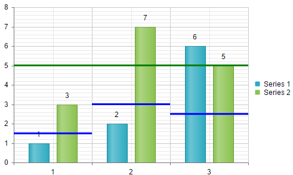
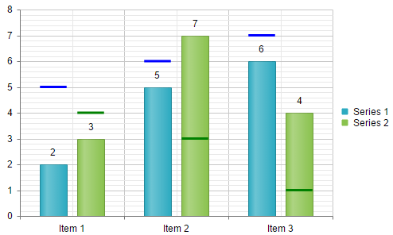
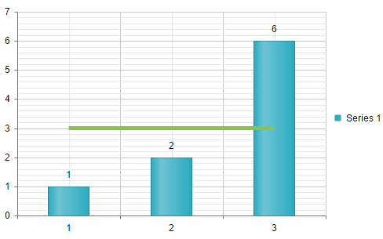
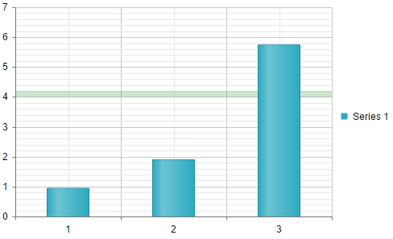

# Plot Threshold Lines

This help article provides different approaches for plotting threshold lines in **RadHtmlChart**.

* [Plot Threshold Lines via Visual Templates and Kendo UI Drawing API](#plot-threshold-lines-via-visual-templates-and-kendo-ui-drawing-api)
 * [Plot Threshold Lines After Chart Rendering](#plot-threshold-lines-after-chart-rendering)
 * [Plot Threshold Lines via Visual Templates](#plot-threshold-lines-via-visual-templates)
* [Plot Threshold Lines via Additional Series](#plot-threshold-lines-via-additional-series)
* [Plot Threshold Lines via Plot Bands](#plot-threshold-lines-via-plot-bands)

## Plot Threshold Lines via Visual Templates and Kendo UI Drawing API

You can plot threshold lines in the **RadHtmlChart** via the [Kendo UI Drawing API](https://docs.telerik.com/kendo-ui/api/javascript/drawing). This can be done once the chart is rendered or during the rendering itself via the [Visual Template](). The examples below shows how to plot threshold lines per a different granularity - chart, categories and items within categories.

 * [Plot Threshold Lines After Chart Rendering](#plot-threshold-lines-after-chart-rendering)
 * [Plot Threshold Lines via Visual Templates](#plot-threshold-lines-via-visual-templates)

### Plot Threshold Lines After Chart Rendering

**Example 1** illustrates how to draw threshold lines in the chart once it is rendered. The sample shows two types of threshold lines - individual lines for each category and a common line for the whole chart. The threshold values are hardcoded at the top of the example. You can see the output in **Figure 1**. 

>caption Example 1: Render threshold liens after rendering the chart. The output is available in Figure 1.

````JavaScript
var commonThresholdValue = 5;
var thresholdValues = [1.5, 3, 2.5];

function OnLoad(chart) {
	setTimeout(function () {
		var kendoChart;
		if (chart instanceof (Telerik.Web.UI.RadHtmlChart)) {
			kendoChart = chart.get_kendoWidget();
		}
		else {
			kendoChart = chart.sender;
		}

		var valueAxis = kendoChart.getAxis("value");
		var categoryAxis = kendoChart.getAxis("category");

		var catetgoriesCount = categoryAxis._axis.labelsCount();
		for (var i = 0; i < catetgoriesCount; i++) {
			plotThresholdLine(kendoChart, categoryAxis.slot(i, i + 1), valueAxis.slot(thresholdValues[i]), "blue")
		}
		plotThresholdLine(kendoChart, categoryAxis.slot(0, catetgoriesCount), valueAxis.slot(commonThresholdValue), "green");
	}, 100);
}

function plotThresholdLine(chart, xSlot, ySlot, colorLine) {
	var path = new kendo.drawing.Path({
		stroke: {
			color: colorLine,
			width: 3
		}
	}).moveTo(xSlot.origin.x, ySlot.origin.y)
	.lineTo(xSlot.bottomRight().x, ySlot.origin.y);
	chart.surface.draw(path);
}
````
````ASP.NET
<telerik:RadHtmlChart runat="server" ID="RadHtmlChart1" Width="500px" Height="300px" Skin="Silk">
	<ClientEvents OnLoad="OnLoad" OnLegendItemClick="OnLoad" />
	<PlotArea>
		<Series>
			<telerik:ColumnSeries Name="Series 1">
				<SeriesItems>
					<telerik:CategorySeriesItem Y="1" />
					<telerik:CategorySeriesItem Y="2" />
					<telerik:CategorySeriesItem Y="6" />
				</SeriesItems>
			</telerik:ColumnSeries>
			<telerik:ColumnSeries Name="Series 2">
				<SeriesItems>
					<telerik:CategorySeriesItem Y="3" />
					<telerik:CategorySeriesItem Y="7" />
					<telerik:CategorySeriesItem Y="5" />
				</SeriesItems>
			</telerik:ColumnSeries>
		</Series>
		<YAxis Name="value"></YAxis>
		<XAxis Name="category">
			<Items>
				<telerik:AxisItem LabelText="1" />
				<telerik:AxisItem LabelText="2" />
				<telerik:AxisItem LabelText="3" />
			</Items>
		</XAxis>
	</PlotArea>
</telerik:RadHtmlChart>
````

>caption Figure 1: RadHtmlChart with a common threshold line and threshold lines for each category.




### Plot Threshold Lines via Visual Templates

**Example 2** illustrates how to dynamically plot threshold lines for each item of a series for a data-bound chart via the [Visual Template]() of the series. The values for the threshold lines and the corresponding colors are stored in the *threshold[index]* and *colorField[index]* data source fields.

>caption Example 2: The example that plots dynamically threshold lines. The output is available in Figure 2.

````JavaScript
function visual(e) {
	var thresholdValue = e.dataItem["threshold" + e.series.index];
	var thresholdColor = e.dataItem["colorField" + e.series.index];

	var valueSlot = e.sender.getAxis("myYaxis").slot(thresholdValue);

	var path = new kendo.drawing.Path({
		stroke: {
			color: thresholdColor,
			width: 3
		}
	}).moveTo(e.rect.bottomLeft().x, valueSlot.origin.y)
	.lineTo(e.rect.bottomRight().x, valueSlot.origin.y);

	var defaultVisual = e.createVisual();

	var group = new kendo.drawing.Group();
	group.append(defaultVisual, path);

	return group;
}
````
````ASP.NET
<telerik:RadHtmlChart runat="server" ID="RadHtmlChart2" Width="500px" Height="300px" Skin="Silk">
	<PlotArea>
		<Series>
			<telerik:ColumnSeries Name="Series 1" DataFieldY="yField0">
				<Appearance Visual="visual"></Appearance>
			</telerik:ColumnSeries>
			<telerik:ColumnSeries Name="Series 2" DataFieldY="yField1">
				<Appearance Visual="visual"></Appearance>
			</telerik:ColumnSeries>
		</Series>
		<YAxis Name="myYaxis"></YAxis>
		<XAxis DataLabelsField="catField">
		</XAxis>
	</PlotArea>
</telerik:RadHtmlChart>
````
````C#
protected void Page_Load(object sender, EventArgs e)
{
	RadHtmlChart2.DataSource = GetData();
	RadHtmlChart2.DataBind();
}

protected DataTable GetData()
{
	DataTable dt = new DataTable();

	dt.Columns.Add("ID", typeof(int));
	dt.Columns.Add("yField0", typeof(int));
	dt.Columns.Add("yField1", typeof(int));
	dt.Columns.Add("threshold0", typeof(int));
	dt.Columns.Add("threshold1", typeof(int));
	dt.Columns.Add("colorField0", typeof(string));
	dt.Columns.Add("colorField1", typeof(string));
	dt.Columns.Add("catField", typeof(string));

	dt.Rows.Add(1, 2, 3, 5, 4, "blue", "green", "Item 1");
	dt.Rows.Add(2, 5, 7, 6, 3, "blue", "green", "Item 2");
	dt.Rows.Add(3, 6, 4, 7, 1, "blue", "green", "Item 3");

	return dt;
}
````
````VB
Protected Sub Page_Load(sender As Object, e As EventArgs)
	RadHtmlChart2.DataSource = GetData()
	RadHtmlChart2.DataBind()
End Sub

Protected Function GetData() As DataTable
	Dim dt As New DataTable()

	dt.Columns.Add("ID", GetType(Integer))
	dt.Columns.Add("yField0", GetType(Integer))
	dt.Columns.Add("yField1", GetType(Integer))
	dt.Columns.Add("threshold0", GetType(Integer))
	dt.Columns.Add("threshold1", GetType(Integer))
	dt.Columns.Add("colorField0", GetType(String))
	dt.Columns.Add("colorField1", GetType(String))
	dt.Columns.Add("catField", GetType(String))

	dt.Rows.Add(1, 2, 3, 5, 4, "blue", _
		"green", "Item 1")
	dt.Rows.Add(2, 5, 7, 6, 3, "blue", _
		"green", "Item 2")
	dt.Rows.Add(3, 6, 4, 7, 1, "blue", _
		"green", "Item 3")

	Return dt
End Function
````

>caption Figure 2: Dynamically plotting threshold lines for each item of a series via the Visual Template of the series.



## Plot Threshold Lines via Additional Series

You can plot a threshold line in the **RadHtmlChart** by adding a line series and disabling its visibility in the legend as well as the visiblity of its markers and labels. **Example 3** shows this approach and **Figure 3** displays the output. 

>caption Example 3: Plot a threshold line by simply including an additional line series.

````ASP.NET
<telerik:RadHtmlChart runat="server" ID="RadHtmlChart1" Width="500px" Height="300px" Skin="Silk">
	<PlotArea>
		<Series>
			<telerik:ColumnSeries Name="Series 1">
				<SeriesItems>
					<telerik:CategorySeriesItem Y="1" />
					<telerik:CategorySeriesItem Y="2" />
					<telerik:CategorySeriesItem Y="6" />
				</SeriesItems>
			</telerik:ColumnSeries>
			<telerik:LineSeries VisibleInLegend="false">
				<LineAppearance Width="5" />
				<MarkersAppearance Visible="false" />
				<LabelsAppearance Visible="false"></LabelsAppearance>
				<SeriesItems>
					<telerik:CategorySeriesItem Y="3" />
					<telerik:CategorySeriesItem Y="3" />
					<telerik:CategorySeriesItem Y="3" />
				</SeriesItems>
			</telerik:LineSeries>
		</Series>
		<XAxis>
			<Items>
				<telerik:AxisItem LabelText="1" />
				<telerik:AxisItem LabelText="2" />
				<telerik:AxisItem LabelText="3" />
			</Items>
		</XAxis>
	</PlotArea>
</telerik:RadHtmlChart>
````

>caption Figure 3: Line series is used as a threshold line.



## Plot Threshold Lines via Plot Bands

You can display threshold lines in the **RadHtmlChart** by drawing [Plot Bands](). **Example 4** shows this approach and **Figure 4** displays the output. 

>caption Example 4: Plot a threshold line by drawing a plot band.

````ASP.NET
<telerik:RadHtmlChart runat="server" ID="RadHtmlChart1" Width="500px" Height="300px" Skin="Silk">
	<PlotArea>
		<YAxis>
			<PlotBands>
				<telerik:PlotBand From="4" To="4.2" Color="Green" Alpha="200" />
			</PlotBands>
		</YAxis>
		<Series>
			<telerik:ColumnSeries Name="Series 1">
				<SeriesItems>
					<telerik:CategorySeriesItem Y="1" />
					<telerik:CategorySeriesItem Y="2" />
					<telerik:CategorySeriesItem Y="6" />
				</SeriesItems>
			</telerik:ColumnSeries>
		</Series>
		<XAxis>
			<Items>
				<telerik:AxisItem LabelText="1" />
				<telerik:AxisItem LabelText="2" />
				<telerik:AxisItem LabelText="3" />
			</Items>
		</XAxis>
	</PlotArea>
</telerik:RadHtmlChart>
````

>caption Figure 4: Plot band is used as a threshold line.




## See Also

 * [Live Demo: Kendo Drawing API](https://demos.telerik.com/kendo-ui/drawing/index)

 * [API Reference: Kendo Drawing API](https://docs.telerik.com/kendo-ui/api/javascript/drawing)

 * [Visual Template]()

 * [Plot Bands]()
 
 * [Column Series]()


