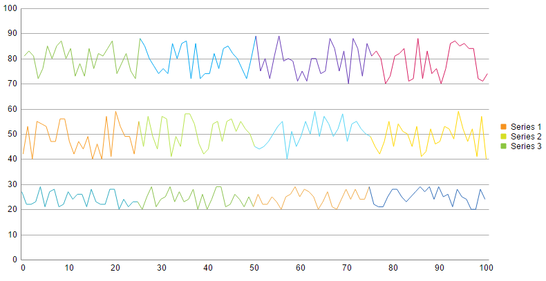

# Plot Threshold Lines

This help article shows different approaches for plotting threshold lines in RadHtmlChart.

* [Plot Threshold Lines via Visual Templates and Kendo UI Drawing API](plot-threshold-lines-via-visual-templates-and-kendo-ui-drawing-api)
* [Plot Threshold Lines via Additional Series](plot-threshold-lines-via-additional-series)
* [Plot Threshold Lines via Plot Bands](plot-threshold-lines-via-plot-bands)

## Plot Threshold Lines via Visual Templates and Kendo UI Drawing API

## Plot Threshold Lines via Additional Series

## Plot Threshold Lines via Plot Bands

**Example 1** illustrates a possible approach for defining different colors for the lines between adjacent points of line series via the [visual template]() that is exposed by the [column series](). You can see the output in **Figure 1**.

>caption Figure 1: Chart with three line series that have different colors.



>caption Example 1: Create multiple colors for line series with visual template.

````JavaScript
//script.js
; (function (global) {
var myInd = new Array();
var oldPos = new Array();
var numSeries = getSeriesCount();

for (var i = 0; i < numSeries; i++) {
	myInd.push(0);
	oldPos.push(0);
}

var telerikDemo = global.telerikDemo = {

	seriesVisual: function (e) {

		var serisIndex = e.series.index;
		myInd[serisIndex]++;

		if (myInd[serisIndex] == e.options.data.length + 1) {
			myInd[serisIndex] = 1;
		}

		var rect = e.rect;

		var origin = { x: rect.topLeft().x + (rect.topRight().x - rect.topLeft().x) / 2, y: 0 };
		if (e.value > 0) {
			origin.y = rect.topLeft().y;
		}
		else {
			origin.y = rect.bottomLeft().y;
		}

		if (myInd[serisIndex] == 1) {
			oldPos[serisIndex] = origin;
			return "";
		}
		var myColor = e.dataItem["colorField" + (serisIndex + 1)];

		var drawing = kendo.drawing;

		var path = new drawing.Path({
			stroke: {
				color: myColor
			}
		}).moveTo(oldPos[serisIndex].x, oldPos[serisIndex].y)
		.lineTo(origin.x, origin.y);
		oldPos[serisIndex] = origin;

		var group = new drawing.Group();
		group.append(path);
		return group;
	}
}
})(window)
````
````ASP.NET
<asp:ScriptManager runat="server"></asp:ScriptManager>
<script>
	function getSeriesCount() { return '<%=RadHtmlChart1.PlotArea.Series.Count%>'; }
</script>
<script src="script.js"></script>
<telerik:RadHtmlChart runat="server" ID="RadHtmlChart1" Width="800px" Height="400px">
	<PlotArea>
		<XAxis DataLabelsField="categoryField" MajorTickType="None">
			<LabelsAppearance Step="10"></LabelsAppearance>
			<MinorGridLines Visible="false" />
			<MajorGridLines Visible="false" />
		</XAxis>
		<YAxis MajorTickType="None">
			<MinorGridLines Visible="false" />
		</YAxis>
	</PlotArea>
</telerik:RadHtmlChart>
````
````C#
protected void Page_Load(object sender, EventArgs e)
{
	if (!Page.IsPostBack)
	{
		CreateChart();
	}
}

private void CreateChart()
{
	RadHtmlChart1.DataSource = GetData();
	List<ColumnSeries> lines = new List<ColumnSeries>();
	for (int i = 0; i < 3; i++)
	{
		ColumnSeries ls = new ColumnSeries();
		ls.Appearance.Visual = "telerikDemo.seriesVisual";
		ls.DataFieldY = "yField" + (i + 1);
		ls.Name = "Series " + (i + 1);
		ls.LabelsAppearance.Visible = false;
		lines.Add(ls);
	}
	RadHtmlChart1.PlotArea.Series.AddRange(lines);
	RadHtmlChart1.DataBind();
}

private DataTable GetData()
{
	DataTable dt = new DataTable();
	dt.Columns.Add("yField1", typeof(int));
	dt.Columns.Add("yField2", typeof(int));
	dt.Columns.Add("yField3", typeof(int));
	dt.Columns.Add("categoryField", typeof(string));
	dt.Columns.Add("colorField1", typeof(string));
	dt.Columns.Add("colorField2", typeof(string));
	dt.Columns.Add("colorField3", typeof(string));

	Random random = new Random();
	for (int i = 0; i <= 100; i++)
	{
		dt.Rows.Add(random.Next(20, 30), random.Next(40, 60), random.Next(70, 90), i.ToString(), GetColor(i, palette1), GetColor(i, palette2), GetColor(i, palette3));
	}
	return dt;
}

private string GetColor(int i, string[] palette)
{
	string color = palette[0];
	if ((i > 25) && (i <= 50))
	{
		color = palette[1];
	}
	else if ((i > 50) && (i <= 75))
	{
		color = palette[2];
	}
	else if (i > 75)
	{
		color = palette[3];
	}
	return color;
}

private string[] palette1 = new string[] { "#2dabc1", "#8ac24e", "#f1ac4a", "#326eb9" };
private string[] palette2 = new string[] { "#f89d26", "#b8e54b", "#52d5f6", "#ffd800" };
private string[] palette3 = new string[] { "#8bc34a", "#03a9f4", "#673ab7", "#d81b60" };
````
````VB
Protected Sub Page_Load(sender As Object, e As EventArgs) Handles Me.Load
	If Not Page.IsPostBack Then
		CreateChart()
	End If
End Sub

Private Sub CreateChart()
	RadHtmlChart1.DataSource = GetData()
	Dim lines As New List(Of ColumnSeries)()
	For i As Integer = 0 To 2
		Dim ls As New ColumnSeries()
		ls.Appearance.Visual = "telerikDemo.seriesVisual"
		ls.DataFieldY = "yField" & (i + 1)
		ls.Name = "Series " & (i + 1)
		ls.LabelsAppearance.Visible = False
		lines.Add(ls)
	Next
	RadHtmlChart1.PlotArea.Series.AddRange(lines)
	RadHtmlChart1.DataBind()
End Sub

Private Function GetData() As DataTable
	Dim dt As New DataTable()
	dt.Columns.Add("yField1", GetType(Integer))
	dt.Columns.Add("yField2", GetType(Integer))
	dt.Columns.Add("yField3", GetType(Integer))
	dt.Columns.Add("categoryField", GetType(String))
	dt.Columns.Add("colorField1", GetType(String))
	dt.Columns.Add("colorField2", GetType(String))
	dt.Columns.Add("colorField3", GetType(String))

	Dim random As New Random()
	For i As Integer = 0 To 100
		dt.Rows.Add(random.[Next](20, 30), random.[Next](40, 60), random.[Next](70, 90), i.ToString(), GetColor(i, palette1), GetColor(i, palette2), _
			GetColor(i, palette3))
	Next
	Return dt
End Function

Private Function GetColor(i As Integer, palette As String()) As String
	Dim color As String = palette(0)
	If (i > 25) AndAlso (i <= 50) Then
		color = palette(1)
	ElseIf (i > 50) AndAlso (i <= 75) Then
		color = palette(2)
	ElseIf i > 75 Then
		color = palette(3)
	End If
	Return color
End Function

Private palette1 As String() = New String() {"#2dabc1", "#8ac24e", "#f1ac4a", "#326eb9"}
Private palette2 As String() = New String() {"#f89d26", "#b8e54b", "#52d5f6", "#ffd800"}
Private palette3 As String() = New String() {"#8bc34a", "#03a9f4", "#673ab7", "#d81b60"}
````

## See Also

 * [Visual Template]()
 
 * [Column Series]()

 * [Live Demo: Kendo Drawing API](http://demos.telerik.com/kendo-ui/drawing/index)

 * [API Reference: Kendo Drawing API](http://docs.telerik.com/kendo-ui/api/javascript/drawing)

 * [API Reference: Kendo Chart](http://docs.telerik.com/kendo-ui/api/javascript/dataviz/ui/chart)
