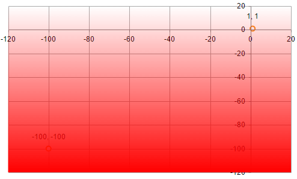

# Set Gradient Color to PlotArea

This help article shows how to set a gradient color to the PlotArea of the **RadHtmlChart**.

Generally, the PlotArea of the **RadHtmlChart** doesn't provide gradient colors. You can, however, use the [Kendo Drawing API](http://docs.telerik.com/kendo-ui/api/javascript/drawing) in order to draw gradient colors over the PlotArea once the chart is rendered. You can see the code that creates **Figure 1** in **Example 1**.

>caption Figure 1: A chart that has a gradient color to its PlotArea.



>caption Example 1: Draw a gradient over the chart's PlotArea via the Kendo UI Drawing API.

````JavaScript
function chartLoad(chart) {
	var chart = chart.get_kendoWidget();
	var draw = kendo.drawing;
	var geom = kendo.geometry;

	var gradient = new draw.LinearGradient({
		start: [0, 0], // Bottom left
		end: [0, 1],   // Top left
		stops: [{
			offset: 0,
			color: "#f00",
			opacity: 0
		}, {
			offset: 1,
			color: "#f00",
			opacity: 1
		}]
	});

	var xAxis = chart.getAxis("xAxis");
	var yAxis = chart.getAxis("yAxis");
	var xSlot = xAxis.slot(xAxis.range().min, xAxis.range().max);
	var ySlot = yAxis.slot(yAxis.range().min, yAxis.range().max);

	var rect = new geom.Rect([
		// Origin X, Y
		xSlot.origin.x, ySlot.origin.y
	], [
		// Width, height
		xSlot.width(), ySlot.height()
	]);

	var path = draw.Path.fromRect(rect, {
		stroke: null,
		fill: gradient
	});
	setTimeout(function () {
		chart.surface.draw(path);
	}, 10);
}
````
````ASP.NET
<telerik:RadHtmlChart ID="RadHtmlChart1" runat="server" Width="500px" Height="300px">
	<ClientEvents OnLoad="chartLoad" />
	<PlotArea>
		<YAxis Name="yAxis">
			<MinorGridLines Visible="false" />
		</YAxis>
		<XAxis Name="xAxis">
			<MinorGridLines Visible="false" />
		</XAxis>
		<Series>
			<telerik:ScatterSeries>
				<SeriesItems>
					<telerik:ScatterSeriesItem X="1" Y="1" />
					<telerik:ScatterSeriesItem X="-100" Y="-100" />
				</SeriesItems>
			</telerik:ScatterSeries>
		</Series>
	</PlotArea>
</telerik:RadHtmlChart>
````


## See Also

 * [Live Demo: Kendo Drawing API](http://demos.telerik.com/kendo-ui/drawing/index)

 * [API Reference: Kendo Drawing API](http://docs.telerik.com/kendo-ui/api/javascript/drawing)
 
 * [Scatter Series]()


