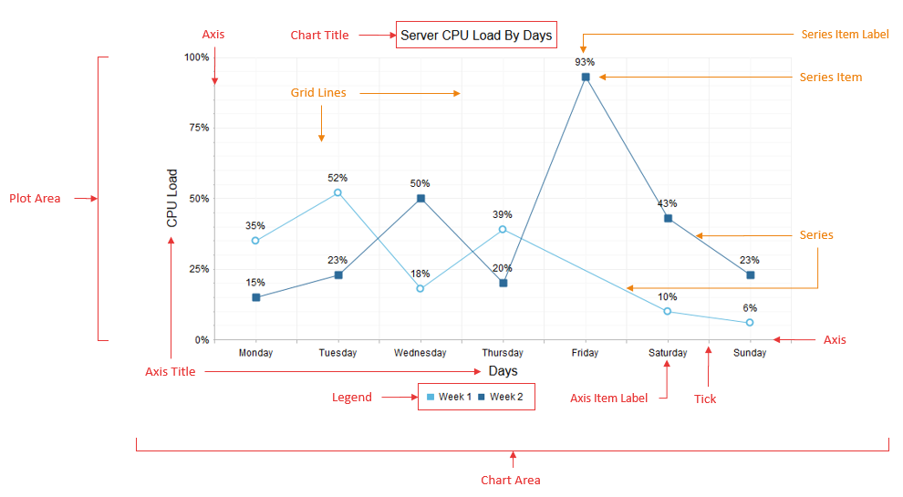
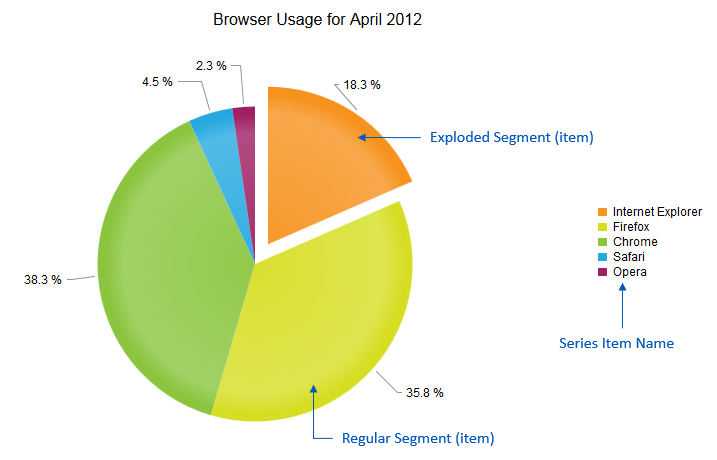

# RadHtmlChart Structure


The __RadHtmlChart__ consists of a series of elements that have a strict hierarchy. The elements correspond to the structure of the controlin the markup or code behind. __Figure 1__ illustrates the basic structure and shows the names of each element. __Example 1__ shows the markup used to create __Figure 1__.
>caption Figure 1: Basic structure of the RadHtmlChart.



## Describing the Basic Elements of RadHtmlChart

The main parts of the chart that can be controlled outside of the specific series are:

* __Chart Area__ - __Figure 1__ shows the chart area as the main panel of the charton which everything else is placed, including the __PlotArea__ with the series and axes, chart title and legend. You can set the background color of the entire chart via the __Appearance.FillStyle.BackgroundColor__ property.

* __Chart Title__ - A chart title is the global title of the chart and you configure it using the__ChartTitle__ inner tag. In the __ChartTitle__ inner tag you set the string for the __RadHtmlChart__. The chart title also provides an __Appearance__ inner tag whereyou set the position (__Bottom__ or __Top__), alignment(__Left__, __Right__ or __Center__), background color and visibility.

* __Legend__ - A chart legend lists series names (or item names in the case of a Pie chart) along with asymbol that indicates their color in the actual chart. You can customize a chart legend's via the__Appearance__ tag inside the __Legend__ tag that is a direct child of the main tag.You can set properties of a chart legend to control background color, position(__Left__, __Right__, __Top__ or __Bottom__) and visibility.

>tip  __Hovering__ a mouse over or __clicking__ on the series name in the	chart legend will highlight and toggle the visibility of the series.
>


* __Plot Area__ - A chart gets rendered in the plot area which includes the series with their labels plus the axes along with theirlabels and titles. __PlotArea__ is also the name of the inner tag of the main chart tag where the axes and series are defined.

All these elements have default styles that depend on the skin the control uses if they are not overriden by a configuration chosen by the developer.

## Describing the Series Elements of RadHtmlChart

You add series via the __Series__ tag inside the __PlotArea__ tag. The inner tags of the series contain further propertiesthat you can use to control series' appearance and data binding. Regardless of their configuration, all series have the same common set of elements.

* __Series__ - This is the shape that is defined by the type of the series. __Figure 1__ shows the series asa line that connects points which represent the series items. For Bar and Column charts, the series consists of several rectangles that correspond to the series items;for the Scatter chart, the series is the points that represents the series items, etc.

* __Series Item__ - This is the unit of data that is passed to the series. A series item defines the value of the chart:

* At the given point for numeric series (e.g., Scatter, ScatterLine and Bubble).

* For the given x-axis item for category series (e.g., Area, Bar, Column, Line, etc.,).For line charts, series items define the spots through which the line passes.

* __Series Item Label__ - This is the text next to each series item that shows the value it holds. You can modify this label	with a format string to show a pattern related to this value.

* __Series Item Tooltip__ - This tooltip is shown only when the mouse hovers over a series item,which is why it is not present in __Figure 1__. It consists of a rectangle with the series' color (or the color predefined by the developer) and the item'svalue (plus format string) inside.

>note The __PieSeries__ (see __Figure 2__ and the markup in __Example 2__ ) is a specifictype of chart and it consists of segments (that can be exploded or not) and the series items are what appears in thelegend instead of the series names. A __PieSeries__ does not have axes and thus none of the elements related to them are shown.	The chart title, plot area, legend, series item labels and series item tooltips are the same as with other series types.
>

>caption Figure 2: Series elements of a PieSeries type of RadHtmlChart.



## The Axis Elements of RadHtmlChart

The axes are two perpendicular lines that define the scale of the chart and show the reference values/items. They can be transposed to form grid lines insidethe chart to aid the visual estimation of the series' values. The axes are direct children of the plot area and this is also the place where they aredefined in the markup of the control via their own inner tags.

* __Axis__ - The actual axis of the chart. An axis is a single line whosecolor and width can be changed if the default values do not match the needs of the developer.

* __Ticks__ - Small marks on the axis that define axis values (or items) and are also starting points for the grid lines.

* __Grid Lines__ - Lines that are parallel to the axes to aid readability of the values. There are two types of grid lines: major(usually thicker and spaced further from each other) and minor (usually thinner and with lighter color and closer together).

* __Axis Item Label__ - An axis item label is text that corresponds to each item on a category x-axis.An axis item label shows a string defined in the code. In the case of a numeric axis, the values are calculatedby the chart and the developer can set a particular format string to them.

* __Axis Title__ - An axis title shows the title of the entire axis. A developer uses an axis title toshow what the axis corresponds to or the unit of measurement.

## The Markup Used to Create a Line and Pie Chart

__Figure 1__ shows the main structure of the control for a __RadHtmlChart__. __Example 1__ shows the markup used to create __Figure 1__. The markup used in __Example 1__ is taken from the	[Line Chart online demo](http://demos.telerik.com/aspnet-ajax/htmlchart/examples/charttypes/linechart/defaultcs.aspx) of the RadHtmlChart.

__Example 1__: The markup below sets many of the properties for the __RadHtmlChart__ in __Figure 1__, which is derived from the [Line Chart online demo](http://demos.telerik.com/aspnet-ajax/htmlchart/examples/charttypes/linechart/defaultcs.aspx).

````ASPNET
			<telerik:RadHtmlChart runat="server" ID="LineChart" Width="800" Height="500" Transitions="true">
				<Appearance>
					<FillStyle BackgroundColor="White"></FillStyle>
				</Appearance>
				<ChartTitle Text="Server CPU Load By Days">
					<Appearance Align="Center" BackgroundColor="White" Position="Top">
					</Appearance>
				</ChartTitle>
				<Legend>
					<Appearance BackgroundColor="White" Position="Bottom">
					</Appearance>
				</Legend>
				<PlotArea>
					<Appearance>
						<FillStyle BackgroundColor="White"></FillStyle>
					</Appearance>
					<XAxis AxisCrossingValue="0" Color="#b3b3b3" MajorTickType="Outside" MinorTickType="Outside"
						Reversed="false">
						<Items>
							<telerik:AxisItem LabelText="Monday"></telerik:AxisItem>
							<telerik:AxisItem LabelText="Tuesday"></telerik:AxisItem>
							<telerik:AxisItem LabelText="Wednesday"></telerik:AxisItem>
							<telerik:AxisItem LabelText="Thursday"></telerik:AxisItem>
							<telerik:AxisItem LabelText="Friday"></telerik:AxisItem>
							<telerik:AxisItem LabelText="Saturday"></telerik:AxisItem>
							<telerik:AxisItem LabelText="Sunday"></telerik:AxisItem>
						</Items>
						<LabelsAppearance DataFormatString="{0}" RotationAngle="0" Skip="0" Step="1" Color="#000000">
						</LabelsAppearance>
						<MajorGridLines Color="#EFEFEF" Width="1"></MajorGridLines>
						<MinorGridLines Color="#F7F7F7" Width="1"></MinorGridLines>
						<TitleAppearance Position="Center" RotationAngle="0" Text="Days">
							<TextStyle Color="#000000" />
						</TitleAppearance>
					</XAxis>
					<YAxis AxisCrossingValue="0" Color="#b3b3b3" MajorTickSize="1" MajorTickType="Outside"
						MaxValue="100" MinorTickSize="1" MinorTickType="Outside" MinValue="0" Reversed="false"
						Step="25">
						<LabelsAppearance DataFormatString="{0}%" RotationAngle="0" Skip="0" Step="1" Color="#000000" >
						</LabelsAppearance>
						<MajorGridLines Color="#EFEFEF" Width="1"></MajorGridLines>
						<MinorGridLines Color="#F7F7F7" Width="1"></MinorGridLines>
						<TitleAppearance Position="Center" RotationAngle="0" Text="CPU Load">
							<TextStyle Color="#000000" />
						</TitleAppearance>
					</YAxis>
					<Series>
						<telerik:LineSeries Name="Week 1">
							<Appearance>
								<FillStyle BackgroundColor="#5ab7de"></FillStyle>
							</Appearance>
							<LabelsAppearance DataFormatString="{0}%" Position="Above">
							</LabelsAppearance>
							<LineAppearance Width="1" />
							<MarkersAppearance MarkersType="Circle" BackgroundColor="White" Size="8" BorderColor="#5ab7de"
								BorderWidth="2"></MarkersAppearance>
							<TooltipsAppearance DataFormatString="{0}%"></TooltipsAppearance>
							<SeriesItems>
								<telerik:CategorySeriesItem Y="35"></telerik:CategorySeriesItem>
								<telerik:CategorySeriesItem Y="52"></telerik:CategorySeriesItem>
								<telerik:CategorySeriesItem Y="18"></telerik:CategorySeriesItem>
								<telerik:CategorySeriesItem Y="39"></telerik:CategorySeriesItem>
								<telerik:CategorySeriesItem></telerik:CategorySeriesItem>
								<telerik:CategorySeriesItem Y="10"></telerik:CategorySeriesItem>
								<telerik:CategorySeriesItem Y="6"></telerik:CategorySeriesItem>
							</SeriesItems>
						</telerik:LineSeries>
						<telerik:LineSeries Name="Week 2">
							<Appearance>
								<FillStyle BackgroundColor="#2d6b99"></FillStyle>
							</Appearance>
							<LabelsAppearance DataFormatString="{0}%" Position="Above">
							</LabelsAppearance>
							<LineAppearance Width="1" />
							<MarkersAppearance MarkersType="Square" BackgroundColor="#2d6b99" Size="8" BorderColor="#2d6b99"
								BorderWidth="2"></MarkersAppearance>
							<TooltipsAppearance DataFormatString="{0}%"></TooltipsAppearance>
							<SeriesItems>
								<telerik:CategorySeriesItem Y="15"></telerik:CategorySeriesItem>
								<telerik:CategorySeriesItem Y="23"></telerik:CategorySeriesItem>
								<telerik:CategorySeriesItem Y="50"></telerik:CategorySeriesItem>
								<telerik:CategorySeriesItem Y="20"></telerik:CategorySeriesItem>
								<telerik:CategorySeriesItem Y="93"></telerik:CategorySeriesItem>
								<telerik:CategorySeriesItem Y="43"></telerik:CategorySeriesItem>
								<telerik:CategorySeriesItem Y="23"></telerik:CategorySeriesItem>
							</SeriesItems>
						</telerik:LineSeries>
					</Series>
				</PlotArea>
			</telerik:RadHtmlChart>
````


__Figure 2__ (showing the Pie chart) is the result of the markup shown in__Example 2__. Most of the properties are set just to show their position in the markup.__Example 2__is taken from the [Pie Chart online demo](http://demos.telerik.com/aspnet-ajax/htmlchart/examples/charttypes/piechart/defaultcs.aspx) of the RadHtmlChart.

__Example 2__: This markup shows how to use a__RadHtmlChart__ to create the Pie chart shown in __Figure 2__.

````ASPNET
	    <telerik:RadHtmlChart runat="server" ID="PieChart1" Width="800" Height="500"
	                Transitions="true">
	                <Appearance>
	                    <FillStyle BackgroundColor="White" />
	                </Appearance>
	                <ChartTitle Text="Browser Usage for April 2012">
	                    <Appearance Align="Center" BackgroundColor="White" Position="Top" />
	                </ChartTitle>
	                <Legend>
	                    <Appearance BackgroundColor="White" Position="Right" Visible="true" />
	                </Legend>
	                <PlotArea>
	                    <Appearance>
	                        <FillStyle BackgroundColor="White" />
	                    </Appearance>
	                    <Series>
	                        <telerik:PieSeries StartAngle="90">
	                            <LabelsAppearance Position="OutsideEnd" DataFormatString="{0} %" />
	                            <TooltipsAppearance DataFormatString="{0} %" />
	                            <SeriesItems>
	                                <telerik:PieSeriesItem Exploded="true" Name="	Internet Explorer" Y="18.3" />
	                                <telerik:PieSeriesItem Exploded="false" Name="Firefox"
	                                    Y="35.8" />
	                                <telerik:PieSeriesItem Exploded="false" Name="Chrome" Y="38.3" />
									<telerik:PieSeriesItem Exploded="false" Name="Safari" Y="4.5" />
									<telerik:PieSeriesItem Exploded="false" Name="Opera" Y="2.3" />
	                            </SeriesItems>
	                        </telerik:PieSeries>
	                    </Series>
	                </PlotArea>
	            </telerik:RadHtmlChart>
````


# See Also

 * [RadHtmlChart Line Chart online demo](http://demos.telerik.com/aspnet-ajax/htmlchart/examples/charttypes/linechart/defaultcs.aspx)

 * [RadHtmlChart Pie Chart online demo](http://demos.telerik.com/aspnet-ajax/htmlchart/examples/charttypes/piechart/defaultcs.aspx)

 * [RadHtmlChart Using the RadHtmlChart Visual Designer]()

 * [RadHtmlChart Visual Structure of the RadHtmlChart Control’s Tag Hierarchy]()
