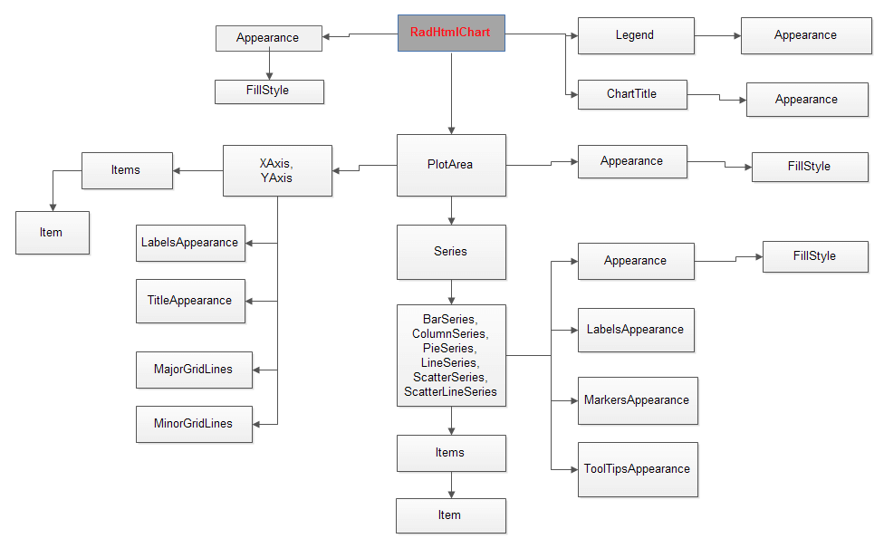

# Server-side Programming Overview

## 

The __RadHtmlChart__ offers many properties to allow detailed customizations.To keep the control and its numerous properties organized, they have a deep hierarchy that you can accessvia inner properties and inner tags in the markup.The sections in the diagram below (__Figure 1__) show the main control hierarchy visually.You can find more information on the control’s rendering and appearance in[this article about RadHtmlChart element structure]().

If you are looking for detailed server-side API reference, examine the following articles, depending on the chart elements you wish to customize:

* [Basic Configuration of the RadHtmlChart]()

* [Configuring RadHtmlChart Series]()

* [Series Items Configuration]()

* [Axes Configuration]()

* [Navigator Configuration]()

>tip When looking for a way to customize a certain element of the chart look for inner tags and their attribute properties as well, not just at the attribute properties	of the main element tag.
>

>caption Figure 1: The hierarchical structure of the main RadHtmlChart tags.

# See Also

 * [Basic Configuration of the RadHtmlChart]()

 * [Configuring RadHtmlChart Series]()

 * [Series Items Configuration]()

 * [Axes Configuration]()

 * [Navigator Configuration]()

 * [RadHtmlChart Element structure]()
