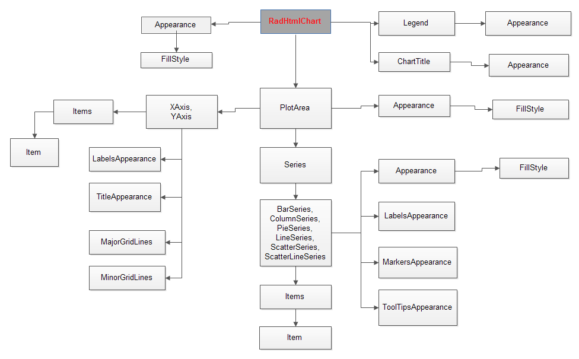

# Server-side Programming Overview

The **RadHtmlChart** offers many properties to allow detailed customizations.To keep the control and its numerous properties organized, they have a deep hierarchy that you can access via inner properties and inner tags in the markup. The sections in the diagram below (**Figure 1**) show the main control hierarchy visually. You can find more information on the control’s rendering and appearance in [this article about RadHtmlChart element structure]().

If you are looking for detailed server-side API reference, examine the following articles, depending on the chart elements you wish to customize:

* [Basic Configuration of the RadHtmlChart]()

* [Configuring RadHtmlChart Series]()

* [Series Items Configuration]()

* [Axes Configuration]()

* [Navigator Configuration]()

>tip When looking for a way to customize a certain element of the chart look for inner tags and their attribute properties as well, not just at the attribute properties of the main element tag.

>caption Figure 1: The hierarchical structure of the main RadHtmlChart tags.



## Programatic Chart Creation

In the sample below you will see how to create and configure a chart entirely on the server-side:


````C#
    protected void Page_Load(object sender, EventArgs e)
    {
        RadHtmlChart scatterChart = new RadHtmlChart();
        scatterChart.ID = "ScatterChart";
        scatterChart.Width = Unit.Pixel(680);
        scatterChart.Height = Unit.Pixel(400);

        scatterChart.Legend.Appearance.Position = Telerik.Web.UI.HtmlChart.ChartLegendPosition.Bottom;

        scatterChart.PlotArea.XAxis.TitleAppearance.Text = "Volts";
        scatterChart.PlotArea.YAxis.TitleAppearance.Text = "mA";

        ScatterLineSeries theoreticalData = new ScatterLineSeries();
        theoreticalData.Name = "Theoretical Data";
        theoreticalData.LabelsAppearance.Visible = false;
        theoreticalData.TooltipsAppearance.Color = System.Drawing.Color.White;
        theoreticalData.TooltipsAppearance.DataFormatString = "{0} Volts, {1} mA";

        for (int i = 0; i < 10; i++)
        {
            ScatterSeriesItem theoreticalItem = new ScatterSeriesItem(i, i+5);
            theoreticalData.SeriesItems.Add(theoreticalItem);
        }

        scatterChart.PlotArea.Series.Add(theoreticalData);
        Page.Form.Controls.Add(scatterChart);
    }
````
````VB
    Protected Sub Page_Load(ByVal sender As Object, ByVal e As EventArgs)
        Dim scatterChart As RadHtmlChart = New RadHtmlChart()
        scatterChart.ID = "ScatterChart"
        scatterChart.Width = Unit.Pixel(680)
        scatterChart.Height = Unit.Pixel(400)
        scatterChart.Legend.Appearance.Position = Telerik.Web.UI.HtmlChart.ChartLegendPosition.Bottom
        scatterChart.PlotArea.XAxis.TitleAppearance.Text = "Volts"
        scatterChart.PlotArea.YAxis.TitleAppearance.Text = "mA"
        Dim theoreticalData As ScatterLineSeries = New ScatterLineSeries()
        theoreticalData.Name = "Theoretical Data"
        theoreticalData.LabelsAppearance.Visible = False
        theoreticalData.TooltipsAppearance.Color = System.Drawing.Color.White
        theoreticalData.TooltipsAppearance.DataFormatString = "{0} Volts, {1} mA"

        For i As Integer = 0 To 10 - 1
            Dim theoreticalItem As ScatterSeriesItem = New ScatterSeriesItem(i, i + 5)
            theoreticalData.SeriesItems.Add(theoreticalItem)
        Next

        scatterChart.PlotArea.Series.Add(theoreticalData)
        Page.Form.Controls.Add(scatterChart)
    End Sub
````


## See Also

 * [Basic Configuration of the RadHtmlChart]()

 * [Configuring RadHtmlChart Series]()

 * [Series Items Configuration]()

 * [Axes Configuration]()

 * [Navigator Configuration]()

 * [RadHtmlChart Element structure]()
