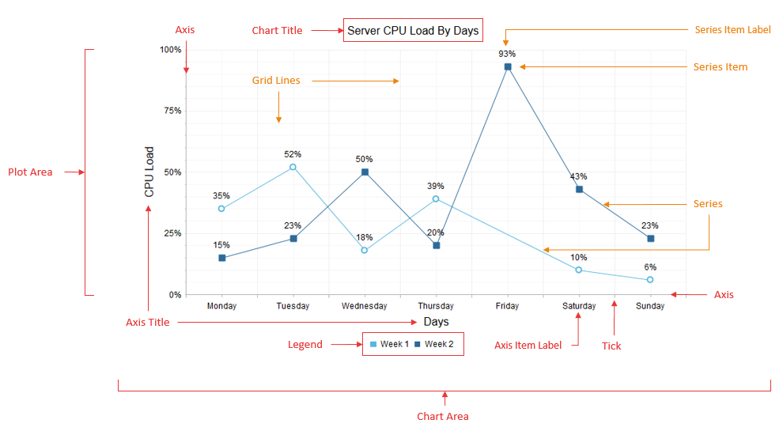
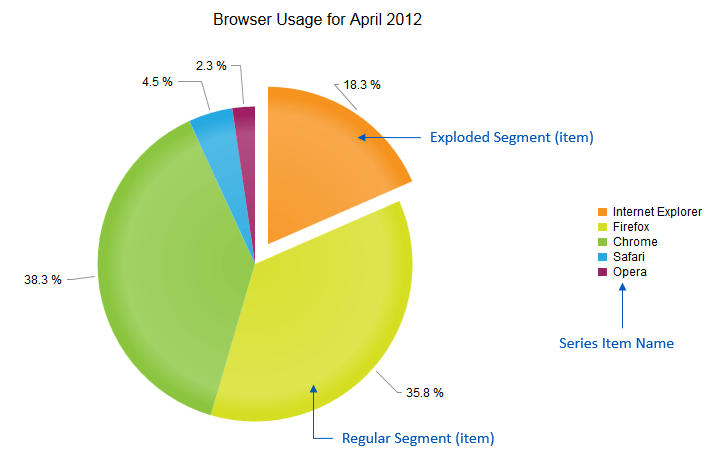

# RadHtmlChart Structure

The **RadHtmlChart** consists of a series of elements that have a strict hierarchy. The elements correspond to the structure of the controlin the markup or code behind. **Figure 1** illustrates the basic structure and shows the names of each element. **Example 1** shows the markup used to create **Figure 1**.

>caption Figure 1: Basic structure of the RadHtmlChart.



## Describing the Basic Elements of RadHtmlChart

The main parts of the chart that can be controlled outside of the specific series are:

* **Chart Area** - **Figure 1** shows the chart area as the main panel of the chart on which everything else is placed, including the **PlotArea** with the series and axes, chart title and legend. You can set the background color of the entire chart via the **Appearance.FillStyle.BackgroundColor** property.

* **Chart Title** - A chart title is the global title of the chart and you configure it using the **ChartTitle** inner tag. In the **ChartTitle** inner tag you set the string for the **RadHtmlChart**. The chart title also provides an **Appearance** inner tag where you set the position (**Bottom** or **Top**), alignment(**Left**, **Right** or **Center**), background color and visibility.

* **Legend** - A chart legend lists series names (or item names in the case of a Pie chart) along with a symbol that indicates their color in the actual chart. You can customize a chart legend's via the **Appearance** tag inside the **Legend** tag that is a direct child of the main tag.You can set properties of a chart legend to control background color, position(**Left**, **Right**, **Top** or **Bottom**) and visibility.

	>tip **Hovering** a mouse over or **clicking** on the series name in the chart legend will highlight and toggle the visibility of the series.

* **Plot Area** - A chart gets rendered in the plot area which includes the series with their labels plus the axes along with their labels and titles. **PlotArea** is also the name of the inner tag of the main chart tag where the axes and series are defined.

All these elements have default styles that depend on the skin the control uses if they are not overridden by a configuration chosen by the developer.

## Describing the Series Elements of RadHtmlChart

You add series via the **Series** tag inside the **PlotArea** tag. The inner tags of the series contain further properties that you can use to control series' appearance and data binding. Regardless of their configuration, all series have the same common set of elements.

* **Series** - This is the shape that is defined by the type of the series. **Figure 1** shows the series as a line that connects points which represent the series items. For Bar and Column charts, the series consists of several rectangles that correspond to the series items;for the Scatter chart, the series is the points that represents the series items, etc.

* **Series Item** - This is the unit of data that is passed to the series. A series item defines the value of the chart:

	* At the given point for numeric series (e.g., Scatter, ScatterLine and Bubble).

	* For the given x-axis item for category series (e.g., Area, Bar, Column, Line, etc.,).For line charts, series items define the spots through which the line passes.

* **Series Item Label** - This is the text next to each series item that shows the value it holds. You can modify this label	with a format string to show a pattern related to this value.

* **Series Item Tooltip** - This tooltip is shown only when the mouse hovers over a series item,which is why it is not present in **Figure 1**. It consists of a rectangle with the series' color (or the color predefined by the developer) and the item's value (plus format string) inside.

>note The **PieSeries** (see **Figure 2** and the markup in **Example 2**) is a specific type of chart and it consists of segments (that can be exploded or not) and the series items are what appears in the legend instead of the series names. A **PieSeries** does not have axes and thus none of the elements related to them are shown.	The chart title, plot area, legend, series item labels and series item tooltips are the same as with other series types.

>caption Figure 2: Series elements of a PieSeries type of RadHtmlChart.



## The Axis Elements of RadHtmlChart

The axes are two perpendicular lines that define the scale of the chart and show the reference values/items. They can be transposed to form grid lines inside the chart to aid the visual estimation of the series' values. The axes are direct children of the plot area and this is also the place where they are defined in the markup of the control via their own inner tags.

* **Axis** - The actual axis of the chart. An axis is a single line whose color and width can be changed if the default values do not match the needs of the developer.

* **Ticks** - Small marks on the axis that define axis values (or items) and are also starting points for the grid lines.

* **Grid Lines** - Lines that are parallel to the axes to aid readability of the values. There are two types of grid lines: major(usually thicker and spaced further from each other) and minor (usually thinner and with lighter color and closer together).

* **Axis Item Label** - An axis item label is text that corresponds to each item on a category x-axis.An axis item label shows a string defined in the code. In the case of a numeric axis, the values are calculated by the chart and the developer can set a particular format string to them.

* **Axis Title** - An axis title shows the title of the entire axis. A developer uses an axis title to show what the axis corresponds to or the unit of measurement.

## The Markup Used to Create a Line and Pie Chart

**Figure 1** shows the main structure of the control for a **RadHtmlChart**. **Example 1** shows the markup used to create **Figure 1**. The markup used in **Example 1** is taken from the	[Line Chart online demo](http://demos.telerik.com/aspnet-ajax/htmlchart/examples/charttypes/linechart/defaultcs.aspx) of the RadHtmlChart.

>caption Example 1: The markup below sets many of the properties for the **RadHtmlChart** in **Figure 1**, which is derived from the [Line Chart online demo](http://demos.telerik.com/aspnet-ajax/htmlchart/examples/charttypes/linechart/defaultcs.aspx).

````ASP.NET
<telerik:RadHtmlChart runat="server" ID="LineChart" Width="800" Height="500" Transitions="true">
	<Appearance>
		<FillStyle BackgroundColor="White"></FillStyle>
	</Appearance>
	<ChartTitle Text="Server CPU Load By Days">
		<Appearance Align="Center" BackgroundColor="White" Position="Top">
		</Appearance>
	</ChartTitle>
	<Legend>
		<Appearance BackgroundColor="White" Position="Bottom">
		</Appearance>
	</Legend>
	<PlotArea>
		<Appearance>
			<FillStyle BackgroundColor="White"></FillStyle>
		</Appearance>
		<XAxis AxisCrossingValue="0" Color="#b3b3b3" MajorTickType="Outside" MinorTickType="Outside"
			Reversed="false">
			<Items>
				<telerik:AxisItem LabelText="Monday"></telerik:AxisItem>
				<telerik:AxisItem LabelText="Tuesday"></telerik:AxisItem>
				<telerik:AxisItem LabelText="Wednesday"></telerik:AxisItem>
				<telerik:AxisItem LabelText="Thursday"></telerik:AxisItem>
				<telerik:AxisItem LabelText="Friday"></telerik:AxisItem>
				<telerik:AxisItem LabelText="Saturday"></telerik:AxisItem>
				<telerik:AxisItem LabelText="Sunday"></telerik:AxisItem>
			</Items>
			<LabelsAppearance DataFormatString="{0}" RotationAngle="0" Skip="0" Step="1" Color="#000000">
			</LabelsAppearance>
			<MajorGridLines Color="#EFEFEF" Width="1"></MajorGridLines>
			<MinorGridLines Color="#F7F7F7" Width="1"></MinorGridLines>
			<TitleAppearance Position="Center" RotationAngle="0" Text="Days">
				<TextStyle Color="#000000" />
			</TitleAppearance>
		</XAxis>
		<YAxis AxisCrossingValue="0" Color="#b3b3b3" MajorTickSize="1" MajorTickType="Outside"
			MaxValue="100" MinorTickSize="1" MinorTickType="Outside" MinValue="0" Reversed="false"
			Step="25">
			<LabelsAppearance DataFormatString="{0}%" RotationAngle="0" Skip="0" Step="1" Color="#000000" >
			</LabelsAppearance>
			<MajorGridLines Color="#EFEFEF" Width="1"></MajorGridLines>
			<MinorGridLines Color="#F7F7F7" Width="1"></MinorGridLines>
			<TitleAppearance Position="Center" RotationAngle="0" Text="CPU Load">
				<TextStyle Color="#000000" />
			</TitleAppearance>
		</YAxis>
		<Series>
			<telerik:LineSeries Name="Week 1">
				<Appearance>
					<FillStyle BackgroundColor="#5ab7de"></FillStyle>
				</Appearance>
				<LabelsAppearance DataFormatString="{0}%" Position="Above">
				</LabelsAppearance>
				<LineAppearance Width="1" />
				<MarkersAppearance MarkersType="Circle" BackgroundColor="White" Size="8" BorderColor="#5ab7de"
					BorderWidth="2"></MarkersAppearance>
				<TooltipsAppearance DataFormatString="{0}%"></TooltipsAppearance>
				<SeriesItems>
					<telerik:CategorySeriesItem Y="35"></telerik:CategorySeriesItem>
					<telerik:CategorySeriesItem Y="52"></telerik:CategorySeriesItem>
					<telerik:CategorySeriesItem Y="18"></telerik:CategorySeriesItem>
					<telerik:CategorySeriesItem Y="39"></telerik:CategorySeriesItem>
					<telerik:CategorySeriesItem></telerik:CategorySeriesItem>
					<telerik:CategorySeriesItem Y="10"></telerik:CategorySeriesItem>
					<telerik:CategorySeriesItem Y="6"></telerik:CategorySeriesItem>
				</SeriesItems>
			</telerik:LineSeries>
			<telerik:LineSeries Name="Week 2">
				<Appearance>
					<FillStyle BackgroundColor="#2d6b99"></FillStyle>
				</Appearance>
				<LabelsAppearance DataFormatString="{0}%" Position="Above">
				</LabelsAppearance>
				<LineAppearance Width="1" />
				<MarkersAppearance MarkersType="Square" BackgroundColor="#2d6b99" Size="8" BorderColor="#2d6b99"
					BorderWidth="2"></MarkersAppearance>
				<TooltipsAppearance DataFormatString="{0}%"></TooltipsAppearance>
				<SeriesItems>
					<telerik:CategorySeriesItem Y="15"></telerik:CategorySeriesItem>
					<telerik:CategorySeriesItem Y="23"></telerik:CategorySeriesItem>
					<telerik:CategorySeriesItem Y="50"></telerik:CategorySeriesItem>
					<telerik:CategorySeriesItem Y="20"></telerik:CategorySeriesItem>
					<telerik:CategorySeriesItem Y="93"></telerik:CategorySeriesItem>
					<telerik:CategorySeriesItem Y="43"></telerik:CategorySeriesItem>
					<telerik:CategorySeriesItem Y="23"></telerik:CategorySeriesItem>
				</SeriesItems>
			</telerik:LineSeries>
		</Series>
	</PlotArea>
</telerik:RadHtmlChart>
````

**Figure 2** (showing the Pie chart) is the result of the markup shown in **Example 2**. Most of the properties are set just to show their position in the markup.**Example 2** is taken from the [Pie Chart online demo](http://demos.telerik.com/aspnet-ajax/htmlchart/examples/charttypes/piechart/defaultcs.aspx) of the RadHtmlChart.

>caption Example 2: This markup shows how to use a **RadHtmlChart** to create the Pie chart shown in **Figure 2**.

````ASP.NET
<telerik:RadHtmlChart runat="server" ID="PieChart1" Width="800" Height="500"
	Transitions="true">
	<Appearance>
		<FillStyle BackgroundColor="White" />
	</Appearance>
	<ChartTitle Text="Browser Usage for April 2012">
		<Appearance Align="Center" BackgroundColor="White" Position="Top" />
	</ChartTitle>
	<Legend>
		<Appearance BackgroundColor="White" Position="Right" Visible="true" />
	</Legend>
	<PlotArea>
		<Appearance>
			<FillStyle BackgroundColor="White" />
		</Appearance>
		<Series>
			<telerik:PieSeries StartAngle="90">
				<LabelsAppearance Position="OutsideEnd" DataFormatString="{0} %" />
				<TooltipsAppearance DataFormatString="{0} %" />
				<SeriesItems>
					<telerik:PieSeriesItem Exploded="true" Name="	Internet Explorer" Y="18.3" />
					<telerik:PieSeriesItem Exploded="false" Name="Firefox"
						Y="35.8" />
					<telerik:PieSeriesItem Exploded="false" Name="Chrome" Y="38.3" />
					<telerik:PieSeriesItem Exploded="false" Name="Safari" Y="4.5" />
					<telerik:PieSeriesItem Exploded="false" Name="Opera" Y="2.3" />
				</SeriesItems>
			</telerik:PieSeries>
		</Series>
	</PlotArea>
</telerik:RadHtmlChart>
````

## See Also

 * [RadHtmlChart Line Chart online demo](http://demos.telerik.com/aspnet-ajax/htmlchart/examples/charttypes/linechart/defaultcs.aspx)

 * [RadHtmlChart Pie Chart online demo](http://demos.telerik.com/aspnet-ajax/htmlchart/examples/charttypes/piechart/defaultcs.aspx)

 * [RadHtmlChart Using the RadHtmlChart Visual Designer]()

 * [RadHtmlChart Visual Structure of the RadHtmlChart Control’s Tag Hierarchy]()
