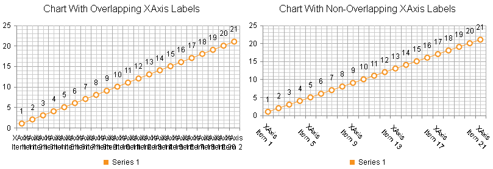
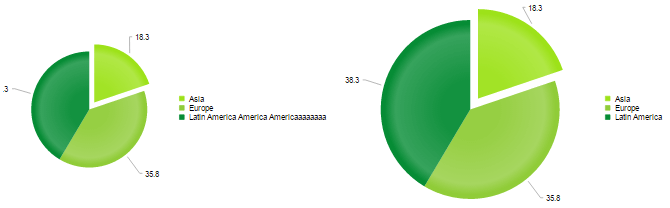
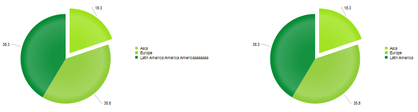

# Common Issues

This help article lists the most common issues one can face when using the **RadHtmlChart** control and offers possible solutions for them.

1. [ Tooltips are hidden behind RadWindow or RadNotification. ](#tooltips-are-hidden-behind-radwindow-or-radnotification)
1. [ Legend is not visible. ](#legend-is-not-visible)
1. [ XAxis labels are cluttered or overlapping. ](#xaxis-labels-are-cluttered-or-overlapping)
1. [ YAxis is not rescaled in a stock chart when changing the selection range. ](#yaxis-is-not-rescaled-in-a-stock-chart-when-changing-the-selection-range)
1. [ There is a redundant space between pie or donut chart and its legend. ](#there-is-a-redundant-space-between-pie-or-donut-chart-and-its-legend)
1. [ PlotArea is Shrunk by the Legend / PlotArea Dimensions Depend on the Legend Size.](#plotarea-is-shrunk-by-the-legend--plotarea-dimensions-depend-on-the-legend-size)
1. [ RadHtmlChart cannot be bound to a data source that has special characters in its field names. ](#radhtmlchart-cannot-be-bound-to-a-data-source-that-has-special-characters-in-its-field-names)
1. [Chart with display: none does not show itself](#chart-with-display-none-does-not-show-itself)

## Tooltips are Hidden Behind RadWindow or RadNotification

Solution: The chart's tooltip has a z-index of 1000 which is lower than the z-index of the **RadWindow**/**RadNotification**. You can ensure a higher z-index for the tooltips by overriding the default style:

````HTML
<style type="text/css">
	html .k-tooltip.k-chart-tooltip {
		z-index: 100001;
	}
</style>
````

You can find the list of Telerik UI controls with absolute positioning and their default z-index in the [Controlling Absolute Positioning with z-index]() help article.

## Legend is Not Visible

Solution: The chart's legend consists of series' names for all series except for the pie, donut and funnel series where the items' names are used. You must set the **Name** property of each series/item for them to show in the legend.

## XAxis Labels are Cluttered or Overlapping

Solution: This happens when the x-axis labels are either too long, or there are many labels on the x-axis (see the left chart in **Figure 1**). You can try one of the following steps (the fixed labels appearance is shown in the right chart in **Figure 1**):

* Render every n-th label through the **XAxis.LabelsAppearance.Step** property.
* Rotate x-axis labels to a particular angle through the **XAxis.LabelsAppearance.RotationAngle** property.
* Wrap labels through the **"\n"** line feed character. See an example in the [Multiline Labels]() help article.

>caption Figure 1: A chart with cluttered x-axis labels next to a chart with properly displayed x-axis labels. The code that creates both charts is available in **Example 1**.



>caption Example 1: Calling the FixAxisLabelsOverlapping() method for the right chart (**Figure 1**) resolves the x-axis labels cluttering in the left chart(**Figure 1**).

````ASP.NET
<style>
	.RadHtmlChart {
		display: inline-block;
	}
</style>
<telerik:RadHtmlChart runat="server" ID="RadHtmlChart1" Width="400px" Height="300px">
	<ChartTitle Text="Chart With Overlapping XAxis Labels"></ChartTitle>
	<PlotArea>
		<Series>
			<telerik:LineSeries Name="Series 1">
			</telerik:LineSeries>
		</Series>
	</PlotArea>
	<Legend>
		<Appearance Position="Bottom"></Appearance>
	</Legend>
</telerik:RadHtmlChart>
<telerik:RadHtmlChart runat="server" ID="RadHtmlChart2" Width="400px" Height="300px">
	<ChartTitle Text="Chart With Non-Overlapping XAxis Labels"></ChartTitle>
	<PlotArea>
		<Series>
			<telerik:LineSeries Name="Series 1">
			</telerik:LineSeries>
		</Series>
	</PlotArea>
	<Legend>
		<Appearance Position="Bottom"></Appearance>
	</Legend>
</telerik:RadHtmlChart>
````
````C#
protected void Page_Load(object sender, EventArgs e)
{
	//Configure first chart
	AddSeriesAxisItems(RadHtmlChart1, 21);

	//Configure second chart
	AddSeriesAxisItems(RadHtmlChart2, 21);
	FixAxisLabelsOverlapping(RadHtmlChart2, 4, 45);
}
protected void FixAxisLabelsOverlapping(RadHtmlChart radHtmlChart, int labelsStep, int labelsRotationAngle)
{
	radHtmlChart.PlotArea.XAxis.LabelsAppearance.Step = labelsStep;
	radHtmlChart.PlotArea.XAxis.LabelsAppearance.RotationAngle = labelsRotationAngle;
}
protected void AddSeriesAxisItems(RadHtmlChart radHtmlChart, int numItems)
{
	for (int i = 0; i < numItems; i++)
	{
		CategorySeriesItem csi = new CategorySeriesItem() { Y = i + 1 };
		(radHtmlChart.PlotArea.Series[0] as LineSeries).SeriesItems.Add(csi);

		//Use the \n line feed character for line breaks
		AxisItem ai1 = new AxisItem() { LabelText = "XAxis \\nItem " + (i + 1) };
		radHtmlChart.PlotArea.XAxis.Items.Add(ai1);
	}
}
````
````VB
 Protected Sub Page_Load(sender As Object, e As EventArgs)
	'Configure first chart
	AddSeriesAxisItems(RadHtmlChart1, 21)

	'Configure second chart
	AddSeriesAxisItems(RadHtmlChart2, 21)
	FixAxisLabelsOverlapping(RadHtmlChart2, 4, 45)
End Sub
Protected Sub FixAxisLabelsOverlapping(radHtmlChart As RadHtmlChart, labelsStep As Integer, labelsRotationAngle As Integer)
	radHtmlChart.PlotArea.XAxis.LabelsAppearance.[Step] = labelsStep
	radHtmlChart.PlotArea.XAxis.LabelsAppearance.RotationAngle = labelsRotationAngle
End Sub
Protected Sub AddSeriesAxisItems(radHtmlChart As RadHtmlChart, numItems As Integer)
	For i As Integer = 0 To numItems - 1
		Dim csi As New CategorySeriesItem() With {.Y = i + 1}
		TryCast(radHtmlChart.PlotArea.Series(0), LineSeries).SeriesItems.Add(csi)

		'Use the \n line feed character for line breaks
		Dim ai1 As New AxisItem() With {.LabelText = "XAxis \nItem " & (i + 1)}
		radHtmlChart.PlotArea.XAxis.Items.Add(ai1)
	Next
End Sub
````

## YAxis is not Rescaled in a Stock Chart When Changing the Selection Range

Solution: The **YAxis.Name** property of the main **YAxis** is set but the series' **AxisName** property is not. You must either remove the main axis' **YAxis.Name** property declaration or associate it to the corresponding series **AxisName** property.

## There is a Redundant Space Between Pie or Donut Chart and its Legend

Solution: You can either offset the legend (see an example in the [ADD legend positioning options for RadHtmlChart](http://feedback.telerik.com/Project/108/Feedback/Details/67001) feedback item) or set a negative value for the **Margin** property of the chart's **PlotArea** (see **Example 2**).

>caption Example 2: Decreasing the distance between the pie and its legend by setting a negative margin for its **PlotArea**.

````ASP.NET
<telerik:RadHtmlChart runat="server" ID="PieChart1" Width="400px" Height="400px">
	<PlotArea>
		<Appearance>
			<TextStyle Margin="-30" />
		</Appearance>
		<Series>
			<telerik:PieSeries>
				<SeriesItems>
					<telerik:PieSeriesItem Y="30" Name="Item 1" />
					<telerik:PieSeriesItem Y="10" Name="Item 2" />
					<telerik:PieSeriesItem Y="20" Name="Item 3" />
				</SeriesItems>
			</telerik:PieSeries>
		</Series>
	</PlotArea>
</telerik:RadHtmlChart>
````

## PlotArea is Shrunk by the Legend / PlotArea Dimensions Depend on the Legend Size

Generally, the size of the chart's elements, including the PlotArea, is dynamic, so that all the elements can fit in with the chart's wrapper size. This, however, may lead to the following issues:

* Longer legend names will shrunk the PlotArea dimensions.

* Charts with similar dimensions and series but different legend size (e.g., the length of the legend items varies) will have a different PlotArea size.

>caption Figure 2: Compare two charts with similar dimensions but different PlotArea sizes.



You can resolve these issues as follows:

1. Set additional margin between the PlotArea and the legend via the [PlotArea.Appearance.TextStyle.Margin property](#setting-text-styles-for-titles-and-labels).

1. Define a custom position for the legend via the [Legend.Appearance.Position, OffsetX and OffsetY properties](#position-and-alignment).

>caption Figure 3: Comparing two charts with similar sized PlotAreas and wrapper elements.



>caption Example 3: Set a custom position for the legend in order to get a fixed PlotArea size.

````ASP.NET
<telerik:RadHtmlChart runat="server" ID="PieChart1" Transitions="true" Width="750px" Height="400px">
	<Legend>
		<Appearance Position="Custom" OffsetX="450" OffsetY="150"></Appearance>
	</Legend>
	<PlotArea>
		<Appearance>
			<TextStyle Margin="0 250 0 0" />
		</Appearance>
		<Series>
			<telerik:PieSeries StartAngle="90">
				<SeriesItems>
					<telerik:PieSeriesItem BackgroundColor="#9de219" Exploded="true" Name="Asia" Y="18.3" />
					<telerik:PieSeriesItem BackgroundColor="#90cc38" Exploded="false" Name="Europe" Y="35.8" />
					<telerik:PieSeriesItem BackgroundColor="#068c35" Exploded="false" Name="Latin America America Americaaaaaaaa" Y="38.3" />
				</SeriesItems>
			</telerik:PieSeries>
		</Series>
	</PlotArea>
</telerik:RadHtmlChart>
<telerik:RadHtmlChart runat="server" ID="RadHtmlChart1" Transitions="true" Width="750px" Height="400px">
	<Legend>
		<Appearance Position="Custom" OffsetX="450" OffsetY="150"></Appearance>
	</Legend>
	<PlotArea>
		<Appearance>
			<TextStyle Margin="0 250 0 0" />
		</Appearance>
		<Series>
			<telerik:PieSeries StartAngle="90">
				<SeriesItems>
					<telerik:PieSeriesItem BackgroundColor="#9de219" Exploded="true" Name="Asia" Y="18.3" />
					<telerik:PieSeriesItem BackgroundColor="#90cc38" Exploded="false" Name="Europe" Y="35.8" />
					<telerik:PieSeriesItem BackgroundColor="#068c35" Exploded="false" Name="Latin America" Y="38.3" />
				</SeriesItems>
			</telerik:PieSeries>
		</Series>
	</PlotArea>
</telerik:RadHtmlChart>
````

## RadHtmlChart Cannot be Bound to a Data Source that Has Special Characters in Its Field Names

**Solution**: Rename the fields in the query so they do not contain special symbols like white space (intervals), quotation marks, apostrophes, slashes, brackets and so on.

**Potential Workaround**: Special characters in data source field names can sometimes be escaped by surrounding the name with quotes and brackets (see **Example 4**). This applies to properties of the axes. Properties of series may work without such escaping (see **Example 5**).

>note Certain special characters may still break this and you also need to make sure to escape the field names properly for JavaScript, such as in client templates (see **Example 5**) and that may not always be possible. In such cases you need to rename the fields so they do not contain special symbols and follow the rules for JavaScript variable names.

>caution There are invalid characters in data source field names that cannot be escaped including "(", ")", "[", "]", ".", "/", "\". More information is available in the [Datacolumn name illegal character](https://social.msdn.microsoft.com/Forums/en-US/e2a88f75-da11-49db-8ec8-ef3007a66d28/datacolumn-name-illegal-character) forum post.


>caption Example 4: Escaping special characters in field names by surrounding the name with quotes and brackets.

````ASP.NET
<telerik:RadHtmlChart runat="server" ID="ColumnChart" Width="600px" Height="400px">
	<PlotArea>
		<Series>
			<telerik:ColumnSeries DataFieldY="yValues" Name="Series 1"></telerik:ColumnSeries>
		</Series>
	</PlotArea>
</telerik:RadHtmlChart>
````
````C#
const string DATA_TABLE_NAME = "@1my xvalues";

protected void Page_Load(object sender, EventArgs e)
{
	//Escape data source field names that contain special characters with quotes surrounded by brackets
	ColumnChart.PlotArea.XAxis.DataLabelsField = "[\\'" + DATA_TABLE_NAME + "\\']";

	ColumnChart.DataSource = GetData();
	ColumnChart.DataBind();
}
protected DataTable GetData()
{
	DataTable table = new DataTable();
	table.Columns.Add("yValues", typeof(int));
	table.Columns.Add(DATA_TABLE_NAME, typeof(string));
	table.Rows.Add(new object[] { 10, "item 1" });
	table.Rows.Add(new object[] { 20, "item 2" });
	return table;
}
````
````VB
Const DATA_TABLE_NAME As String = "@1my xvalues"

Protected Sub Page_Load(sender As Object, e As EventArgs)
	'Escape data source field names that contain special characters with quotes surrounded by brackets
	ColumnChart.PlotArea.XAxis.DataLabelsField = "[\'" & DATA_TABLE_NAME & "\']"

	ColumnChart.DataSource = GetData()
	ColumnChart.DataBind()
End Sub
Protected Function GetData() As DataTable
	Dim table As New DataTable()
	table.Columns.Add("yValues", GetType(Integer))
	table.Columns.Add(DATA_TABLE_NAME, GetType(String))
	table.Rows.Add(New Object() {10, "item 1"})
	table.Rows.Add(New Object() {20, "item 2"})
	Return table
End Function
````

>caption Example 5: Using fields with whitespace in the name in client templates and for series properties

````C#
protected void Page_Load(object sender, EventArgs e)
{
	RadHtmlChart chart = new RadHtmlChart();
	chart.ID = "theChart";
	Form.Controls.Add(chart);
	PieSeries series = new PieSeries();
	series.DataFieldY = "yValues";
	series.NameField = "my Field";
	series.TooltipsAppearance.ClientTemplate = "Category: #=dataItem[\\'my Field\\']#";
	chart.PlotArea.Series.Add(series);

	chart.DataSource = GetData();
	chart.DataBind();
}

protected DataTable GetData()
{
	DataTable table = new DataTable();
	table.Columns.Add("yValues", typeof(int));
	table.Columns.Add("my Field", typeof(string));
	table.Rows.Add(new object[] { 10, "item 1" });
	table.Rows.Add(new object[] { 20, "item 2" });
	return table;
}
````
````VB
Protected Sub Page_Load(sender As Object, e As EventArgs) Handles Me.Load
	Dim chart As New RadHtmlChart()
	chart.ID = "theChart"
	Form.Controls.Add(chart)
	Dim series As New PieSeries()
	series.DataFieldY = "yValues"
	series.NameField = "my Field"
	series.TooltipsAppearance.ClientTemplate = "Category: #=dataItem[\'my Field\']#"
	chart.PlotArea.Series.Add(series)

	chart.DataSource = GetData()
	chart.DataBind()
End Sub

Protected Function GetData() As DataTable
	Dim table As New DataTable()
	table.Columns.Add("yValues", GetType(Integer))
	table.Columns.Add("my Field", GetType(String))
	table.Rows.Add(New Object() {10, "item 1"})
	table.Rows.Add(New Object() {20, "item 2"})
	Return table
End Function
````


## Chart with 'display: none' Does Not Show Itself

If you have a **RadHtmlChart** with `display: none` set to its wrapper element, toggling its CSS attribute to `display: block`, for example, may result in the chart not showing itself, remaining invisible or being distorted.

This happens because the hidden container does not let the control evaluate its dimensions, size and render properly.

To resolve this, call its `repaint` client-side method so the chart will redraw itself.

>caption Example 6: Showing an initially hidden chart.

````ASP.NET
<script>
	function showChart() {
		var chartId = "<%=RadHtmlChart1.ClientID%>";
		var wrapper = $get(chartId);
		var chartObj = $find(chartId);
		wrapper.style.display = "";
		chartObj.repaint();
	}
</script>
<asp:Button ID="Button1" Text="show chart" OnClientClick="showChart(); return false;" runat="server" />
<telerik:RadHtmlChart runat="server" ID="RadHtmlChart1" Style="display: none;" Width="400px" Height="400px">
	<PlotArea>
		<Series>
			<telerik:PieSeries>
				<SeriesItems>
					<telerik:PieSeriesItem Y="1" Name="one" />
					<telerik:PieSeriesItem Y="2" Name="two" />
					<telerik:PieSeriesItem Y="3" Name="three" />
				</SeriesItems>
			</telerik:PieSeries>
		</Series>
	</PlotArea>
</telerik:RadHtmlChart>
````


## See Also

 * [RadHtmlChart: Multiline labels]()

 * [ADD legend positioning options for RadHtmlChart](http://feedback.telerik.com/Project/108/Feedback/Details/67001)

 * [Datacolumn name illegal character](https://social.msdn.microsoft.com/Forums/en-US/e2a88f75-da11-49db-8ec8-ef3007a66d28/datacolumn-name-illegal-character)
