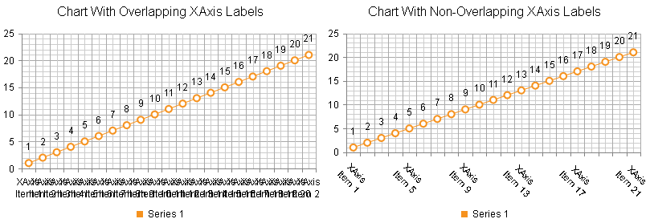

# Common Issues

This help article lists the most common issues one can face when using the **RadHtmlChart** control and offers possible solutions for them.

1. [ Tooltips are hidden behind RadWindow or RadNotification. ](#tooltips-are-hidden-behind-radwindow-or-radnotification)
1. [ Legend is not visible. ](#legend-is-not-visible)
1. [ XAxis labels are cluttered or overlapping. ](#xaxis-labels-are-cluttered-or-overlapping)
1. [ YAxis is not rescaled in a stock chart when changing the selection range. ](#yaxis-is-not-rescaled-in-a-stock-chart-when-changing-the-selection-range)
1. [ There is a redundant space between pie or donut chart and its legend. ](#there-is-a-redundant-space-between-pie-or-donut-chart-and-its-legend)
1. [ RadHtmlChart cannot be bound to a data source that has special characters in its field names. ](#radhtmlchart-cannot-be-bound-to-a-data-source-that-has-special-characters-in-its-field-names)

## Tooltips are Hidden Behind RadWindow or RadNotification

Solution: The chart's tooltip has a z-index of 1000 which is lower than the z-index of the **RadWindow**/**RadNotification**. You can ensure a higher z-index for the tooltips by overriding the default style:

````HTML
<style type="text/css">
	html .k-tooltip.k-chart-tooltip {
		z-index: 100001;
	}
</style>
````

You can find the list of Telerik UI controls with absolute positioning and their default z-index in the [](A346ABA1-4892-4441-B66E-B4A8F7549BD0) help article.

## Legend is Not Visible

Solution: The chart's legend consists of series' names for all series except for the pie, donut and funnel series where the items' names are used. You must set the **Name** property of each series/item for them to show in the legend.

## XAxis Labels are Cluttered or Overlapping

Solution: This happens when the x-axis labels are either too long, or there are many labels on the x-axis (see the left chart in **Figure 1**). You can try one of the following steps (the fixed labels appearance is shown in the right chart in **Figure 1**):

* Render every n-th label through the **XAxis.LabelsAppearance.Step** property.
* Rotate x-axis labels to a particular angle through the **XAxis.LabelsAppearance.RotationAngle** property.
* Wrap labels through the **"\n"** line feed character. See an example in the [Multiline Labels]() help article.

>caption Figure 1: A chart with cluttered x-axis labels next to a chart with properly displayed x-axis labels. The code that creates both charts is available in **Example 1**.



>caption Example 1: Calling the FixAxisLabelsOverlapping() method for the right chart (**Figure 1**) resolves the x-axis labels cluttering in the left chart(**Figure 1**).

````ASP.NET
<style>
	.RadHtmlChart {
		display: inline-block;
	}
</style>
<telerik:RadHtmlChart runat="server" ID="RadHtmlChart1" Width="400px" Height="300px">
	<ChartTitle Text="Chart With Overlapping XAxis Labels"></ChartTitle>
	<PlotArea>
		<Series>
			<telerik:LineSeries Name="Series 1">
			</telerik:LineSeries>
		</Series>
	</PlotArea>
	<Legend>
		<Appearance Position="Bottom"></Appearance>
	</Legend>
</telerik:RadHtmlChart>
<telerik:RadHtmlChart runat="server" ID="RadHtmlChart2" Width="400px" Height="300px">
	<ChartTitle Text="Chart With Non-Overlapping XAxis Labels"></ChartTitle>
	<PlotArea>
		<Series>
			<telerik:LineSeries Name="Series 1">
			</telerik:LineSeries>
		</Series>
	</PlotArea>
	<Legend>
		<Appearance Position="Bottom"></Appearance>
	</Legend>
</telerik:RadHtmlChart>
````
````C#
protected void Page_Load(object sender, EventArgs e)
{
	//Configure first chart
	AddSeriesAxisItems(RadHtmlChart1, 21);

	//Configure second chart
	AddSeriesAxisItems(RadHtmlChart2, 21);
	FixAxisLabelsOverlapping(RadHtmlChart2, 4, 45);
}
protected void FixAxisLabelsOverlapping(RadHtmlChart radHtmlChart, int labelsStep, int labelsRotationAngle)
{
	radHtmlChart.PlotArea.XAxis.LabelsAppearance.Step = labelsStep;
	radHtmlChart.PlotArea.XAxis.LabelsAppearance.RotationAngle = labelsRotationAngle;
}
protected void AddSeriesAxisItems(RadHtmlChart radHtmlChart, int numItems)
{
	for (int i = 0; i < numItems; i++)
	{
		CategorySeriesItem csi = new CategorySeriesItem() { Y = i + 1 };
		(radHtmlChart.PlotArea.Series[0] as LineSeries).SeriesItems.Add(csi);

		//Use the \n line feed character for line breaks
		AxisItem ai1 = new AxisItem() { LabelText = "XAxis \\nItem " + (i + 1) };
		radHtmlChart.PlotArea.XAxis.Items.Add(ai1);
	}
}
````
````VB
 Protected Sub Page_Load(sender As Object, e As EventArgs)
	'Configure first chart
	AddSeriesAxisItems(RadHtmlChart1, 21)

	'Configure second chart
	AddSeriesAxisItems(RadHtmlChart2, 21)
	FixAxisLabelsOverlapping(RadHtmlChart2, 4, 45)
End Sub
Protected Sub FixAxisLabelsOverlapping(radHtmlChart As RadHtmlChart, labelsStep As Integer, labelsRotationAngle As Integer)
	radHtmlChart.PlotArea.XAxis.LabelsAppearance.[Step] = labelsStep
	radHtmlChart.PlotArea.XAxis.LabelsAppearance.RotationAngle = labelsRotationAngle
End Sub
Protected Sub AddSeriesAxisItems(radHtmlChart As RadHtmlChart, numItems As Integer)
	For i As Integer = 0 To numItems - 1
		Dim csi As New CategorySeriesItem() With {.Y = i + 1}
		TryCast(radHtmlChart.PlotArea.Series(0), LineSeries).SeriesItems.Add(csi)

		'Use the \n line feed character for line breaks
		Dim ai1 As New AxisItem() With {.LabelText = "XAxis \nItem " & (i + 1)}
		radHtmlChart.PlotArea.XAxis.Items.Add(ai1)
	Next
End Sub
````

## YAxis is not Rescaled in a Stock Chart When Changing the Selection Range

Solution: The **YAxis.Name** property of the main **YAxis** is set but the series' **AxisName** property is not. You must either remove the main axis' **YAxis.Name** property declaration or associate it to the corresponding series **AxisName** property.

## There is a Redundant Space Between Pie or Donut Chart and its Legend

Solution: You can either offset the legend (see an example in the [ADD legend positioning options for RadHtmlChart](http://feedback.telerik.com/Project/108/Feedback/Details/67001) feedback item) or set a negative value for the **Margin** property of the chart's **PlotArea** (see **Example 2**).

>caption Example 2: Decreasing the distance between the pie and its legend by setting a negative margin for its **PlotArea**.

````ASP.NET
<telerik:RadHtmlChart runat="server" ID="PieChart1" Width="400px" Height="400px">
	<PlotArea>
		<Appearance>
			<TextStyle Margin="-30" />
		</Appearance>
		<Series>
			<telerik:PieSeries>
				<SeriesItems>
					<telerik:PieSeriesItem Y="30" Name="Item 1" />
					<telerik:PieSeriesItem Y="10" Name="Item 2" />
					<telerik:PieSeriesItem Y="20" Name="Item 3" />
				</SeriesItems>
			</telerik:PieSeries>
		</Series>
	</PlotArea>
</telerik:RadHtmlChart>
````

## RadHtmlChart Cannot be Bound to a Data Source that Has Special Characters in Its Field Names

Solution: Special characters in data source field names are escaped by surrounding the name with quotes and brackets (see **Example 3**).

>caution There are invalid characters in data source field names which cannot be escaped like "(", ")", "[", "]", ".", "/", "\". More information is available in the [Datacolumn name illegal character](https://social.msdn.microsoft.com/Forums/en-US/e2a88f75-da11-49db-8ec8-ef3007a66d28/datacolumn-name-illegal-character) forum post.


>caption Example 3: Escaping special characters in field names by surrounding the name with quotes and brackets.

````ASP.NET
<telerik:RadHtmlChart runat="server" ID="ColumnChart" Width="600px" Height="400px">
	<PlotArea>
		<Series>
			<telerik:ColumnSeries DataFieldY="yValues" Name="Series 1"></telerik:ColumnSeries>
		</Series>
	</PlotArea>
</telerik:RadHtmlChart>
````
````C#
const string DATA_TABLE_NAME = "@1my xvalues";

protected void Page_Load(object sender, EventArgs e)
{
	//Escape data source field names that contain special characters with quotes surrounded by brackets
	ColumnChart.PlotArea.XAxis.DataLabelsField = "[\\'" + DATA_TABLE_NAME + "\\']";

	ColumnChart.DataSource = GetData();
	ColumnChart.DataBind();
}
protected DataTable GetData()
{
	DataTable table = new DataTable();
	table.Columns.Add("yValues", typeof(int));
	table.Columns.Add(DATA_TABLE_NAME, typeof(string));
	table.Rows.Add(new object[] { 10, "item 1" });
	table.Rows.Add(new object[] { 20, "item 2" });
	return table;
}
````
````VB
Const DATA_TABLE_NAME As String = "@1my xvalues"

Protected Sub Page_Load(sender As Object, e As EventArgs)
	'Escape data source field names that contain special characters with quotes surrounded by brackets
	ColumnChart.PlotArea.XAxis.DataLabelsField = "[\'" & DATA_TABLE_NAME & "\']"

	ColumnChart.DataSource = GetData()
	ColumnChart.DataBind()
End Sub
Protected Function GetData() As DataTable
	Dim table As New DataTable()
	table.Columns.Add("yValues", GetType(Integer))
	table.Columns.Add(DATA_TABLE_NAME, GetType(String))
	table.Rows.Add(New Object() {10, "item 1"})
	table.Rows.Add(New Object() {20, "item 2"})
	Return table
End Function
````


## See Also

 * [RadHtmlChart: Multiline labels]()

 * [ADD legend positioning options for RadHtmlChart](http://feedback.telerik.com/Project/108/Feedback/Details/67001)

 * [Datacolumn name illegal character](https://social.msdn.microsoft.com/Forums/en-US/e2a88f75-da11-49db-8ec8-ef3007a66d28/datacolumn-name-illegal-character)
