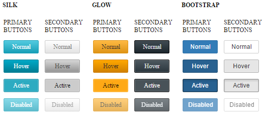

# Primary and Secondary Action Buttons

**RadImageButton** offers primary and secondary states, named primary and secondary action buttons (**Figure 1**), that share a unique innovation styles for some skins(**Bootstrap**, **Silk** and **Glow**). **Primary** action buttons use bright and saturated colors that pop up more and catch attention easily, while the **Secondary buttons** are the default ones.

>caption Figure 1: RadImageButton with primary and secondary action states for the Silk, Glow and Bootstrap skins.



In order to switch to the primary state you must set the **CssClass** property of the **RadImageButton** to **rbPrimaryButton** (see **Example 1** below).

>caption Example 1: Configure primary and secondary action buttons for the **Silk**, **Glow** and **Bootstrap** skins in **RadImageButton**.

````ASP.NET
Silk Skin:
<telerik:RadImageButton ID="RadImageButton1" runat="server" Text="Primary Button" Skin="Silk" CssClass="rbPrimaryButton" />
<telerik:RadImageButton ID="RadImageButton2" runat="server" Text="Secondary Button" Skin="Silk" />
<br />

Glow Skin:
<telerik:RadImageButton ID="RadImageButton3" runat="server" Text="Primary Button" Skin="Glow" CssClass="rbPrimaryButton" />
<telerik:RadImageButton ID="RadImageButton4" runat="server" Text="Secondary Button" Skin="Glow" />
<br />

Bootstrap Skin:
<telerik:RadImageButton ID="RadImageButton5" runat="server" Text="Primary Button" Skin="Bootstrap" CssClass="rbPrimaryButton" />
<telerik:RadImageButton ID="RadImageButton6" runat="server" Text="Secondary Button" Skin="Bootstrap" />
````

<!--

>caption Example 2: The code that renders the result in Figure 1.

````ASP.NET
<style>
	body {
		font-size: 12px;
	}

	.buttonsWrapper {
		display: inline-block;
	}

	td {
		padding: 5px;
	}

	.skinName {
		margin-left: 5px;
	}
</style>
<div class="buttonsWrapper">
	<asp:Label ID="Label1" Text="" runat="server" Font-Bold="true" CssClass="skinName" />
	<table>
		<thead>
			<tr>
				<td></td>
			</tr>
		</thead>
		<tbody>
			<tr>
				<td>PRIMARY
                    <br />
					BUTTONS
				</td>
				<td>SECONDARY
                    <br />
					BUTTONS
				</td>
			</tr>
			<tr>
				<td>
					<telerik:RadImageButton ID="RadImageButton1" runat="server" Text="Normal" Width="69px" CssClass="rbPrimaryButton" />
				</td>
				<td>
					<telerik:RadImageButton ID="RadImageButton2" runat="server" Text="Normal" Width="69px" />
				</td>
			</tr>
			<tr>
				<td>
					<telerik:RadImageButton ID="RadImageButton3" runat="server" Text="Hover" Width="69px" CssClass="rbPrimaryButton rbHovered" />
				</td>
				<td>
					<telerik:RadImageButton ID="RadImageButton4" runat="server" Text="Hover" Width="69px" CssClass="rbHovered" />
				</td>
			</tr>
			<tr>
				<td>
					<telerik:RadImageButton ID="RadImageButton5" runat="server" Text="Active" Width="69px" CssClass="rbPrimaryButton rbSelected" />
				</td>
				<td>
					<telerik:RadImageButton ID="RadImageButton6" runat="server" Text="Active" Width="69px" CssClass="rbSelected" />
				</td>
			</tr>
			<tr>
				<td>
					<telerik:RadImageButton ID="RadImageButton7" runat="server" Text="Disabled" Width="69px" Enabled="false" CssClass="rbPrimaryButton" />
				</td>
				<td>
					<telerik:RadImageButton ID="RadImageButton8" runat="server" Text="Disabled" Width="69px" Enabled="false" />
				</td>
			</tr>
		</tbody>
	</table>
</div>
````

````C#
protected void Page_Load(object sender, EventArgs e)
{
	//Load the user control with the RadImageButton with Silk, Glow and BootStrap skins
	LoadUserControl("RadImageButtonsUserControl.ascx", "RadImageButtonsUserControl1", "Silk");
	LoadUserControl("RadImageButtonsUserControl.ascx", "RadImageButtonsUserControl2", "Glow");
	LoadUserControl("RadImageButtonsUserControl.ascx", "RadImageButtonsUserControl3", "Bootstrap");
}

protected void LoadUserControl(string controlName, string controlID, string skin)
{
	//Load the user control
	UserControl userControl = (UserControl)this.LoadControl(controlName);
	userControl.ID = controlID;
	//Set the skin for the controls inside the user control
	SetUserControlSkin(skin, userControl.Controls);
	//Add the user control to the form
	this.form1.Controls.Add(userControl);
}

protected void SetUserControlSkin(string skinName, ControlCollection cc)
{
	(cc[1] as Label).Text = skinName.ToUpper();
	for (int i = 2; i < cc.Count; i++)
	{
		Control currControl = cc[i];
		if (currControl.GetType().Name == "RadImageButton")
		{
			(currControl as RadImageButton).Skin = skinName;
		}
	}
}
````
````VB
Protected Sub Page_Load(sender As Object, e As EventArgs)
	'Load the user control with the RadImageButton with Silk, Glow and BootStrap skins
	LoadUserControl("RadImageButtonsUserControl.ascx", "RadImageButtonsUserControl1", "Silk")
	LoadUserControl("RadImageButtonsUserControl.ascx", "RadImageButtonsUserControl2", "Glow")
	LoadUserControl("RadImageButtonsUserControl.ascx", "RadImageButtonsUserControl3", "Bootstrap")
End Sub

Protected Sub LoadUserControl(controlName As String, controlID As String, skin As String)
	'Load the user control
	Dim userControl As UserControl = DirectCast(Me.LoadControl(controlName), UserControl)
	userControl.ID = controlID
	'Set the skin for the controls inside the user control
	SetUserControlSkin(skin, userControl.Controls)
	'Add the user control to the form
	Me.form1.Controls.Add(userControl)
End Sub

Protected Sub SetUserControlSkin(skinName As String, cc As ControlCollection)
	TryCast(cc(1), Label).Text = skinName.ToUpper()
	For i As Integer = 2 To cc.Count - 1
		Dim currControl As Control = cc(i)
		If currControl.[GetType]().Name = "RadImageButton" Then
			TryCast(currControl, RadImageButton).Skin = skinName
		End If
	Next
End Sub
````

-->

## See Also

 * [Skins]()

 * [Create a Custom Skin]()
