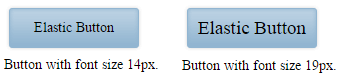

# Elastic Design

This article explains the **elastic design capabilities RadImageButton offers**. The **Example 1** below shows the basic approaches you can use to scale the control by only changing its default font size.

Generally, responsive design means that the page and its content are able to adapt to different screen resolutions without deteriorating the user experience. This often includes changing the font size and having dimensions set in percent.

>caption Figure 1: Comparison between appearance of a RadImageButton with regular font size and with increased font size.



>caption Example 1: Shows how to increase the font size of a RadImageButton in Figure 1.

````CSS
<style type="text/css">
	button.RadButton {
		font-size: 26px;
	}
</style>
````

````ASP.NET
<telerik:RadImageButton runat="server" ID="ImageButton"
	Text="Elastic Button" Skin="Default" Width="200px">
</telerik:RadImageButton>
````

## See Also

 * [Mobile Support Overview]()

 * [Render Modes]()

 * [Fluid Design]()

