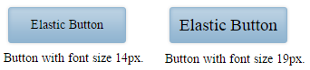

# Elastic Design

This article explains the **elastic design capabilities offered by RadImageButton**. **Example 1** shows the basic approaches you can use to scale the control by only changing its default font size.

@[template](/_templates/common/render-mode.md#resp-design-desc "slug-el: no, slug-fl: imagebutton/mobile-support/fluid-design")

>caption Figure 1: Comparison between appearance of a RadImageButton with regular font size and with increased font size.



@[template](/_templates/common/font-size-notes.md#note-and-example "control: RadImageButton")

>caption **Example 2**: Shows how to increase the font size of a RadImageButton in Figure 1.

````CSS
<style type="text/css">
    button.RadButton {
        font-size: 19px;
    }
</style>
````

````ASP.NET
<telerik:RadImageButton runat="server" ID="RadImageButton2" Text="Elastic Button" Width="140px" Height="50px">
    <Image Url="images/blue_button_bg.png" />
</telerik:RadImageButton>
````

You can download the image used in this example from here—[blue_button_bg.png](images/blue_button_bg.png).

## See Also

 * [Mobile Support Overview]()

 * [Render Modes]()

 * [Fluid Design]()

@[template](/_templates/common/font-size-notes.md#related-resources)
