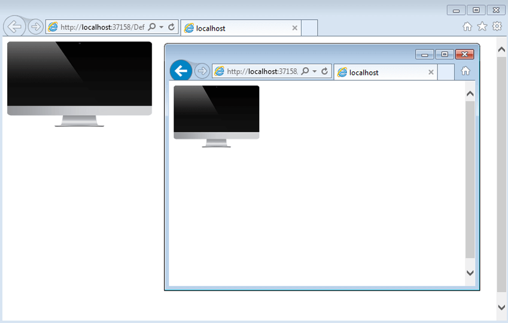

# Fluid Design

This article explains the **fluid design capabilities RadImageButton offers**. **Example 1** shows how you can set button size in percent so it can resize with its parent element. If you need the image to also respect the button size, you need to set the `Sizing` property of the `Image` tag to `Stretch`.

@[template](/_templates/common/render-mode.md#resp-design-desc "slug-el: imagebutton/mobile-support/elastic-design, slug-fl: no")

>caption Figure 1: RadImageButton set to 100% width and 25% height.



>caption Example 1: Markup that provides fluid design of the RadImageButton in Figure 1.

````ASP.NET
<style>
    html, body, form {
        height: 100%;
    }
</style>

<div style="width: 30%; height: 30%;">
    <telerik:RadImageButton runat="server" ID="ImageButton"
        Skin="Default" Width="100%" Height="100%">
        <Image Url="images/iMac_normal.png" Sizing="Stretch" />
    </telerik:RadImageButton>
</div>
````

You can download the image used in this example from here—[iMac_normal.png](images/iMac_normal.png).

## See Also

 * [Mobile Support Overview]()

 * [Render Modes]()

 * [Elastic Design]()

