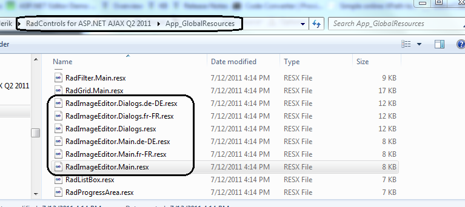
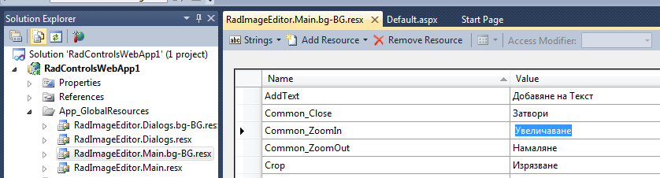

# Localization


## Localization Overview

__RadImageEditor__ is fully localized using Global resources. The control comes with three built-in language packs, English, German and French, between you can easily switch be setting the __Language__ property or setting __UICulture__ property to the @Page. The __Language__ property is with higher priority than the global __UICulture__ setting.

Similar to __RadGrid__, __RadEditor__ and __RadScheduler__, you can use resx files to localize (or customize) the control’s localization strings with minimum efforts. The Telerik UI for ASP.NET AJAX suite’s installation wizard copies the built-in resource files in the __App_GlobalResources__ folder in your local installation.

You can either create your own language pack or use an existing one (if available for your language).

## Create New Language

The following steps demonstrate how to create a new language pack for __RadImageEditor__.

1. Add __App_GlobalResources__ folder to the application folder (if it does not already exists).

1. Copy __RadImageEditor.Main.resx__ and __RadImageEditor.Dialogs.resx__ files to __App_GlobalResources__ folder.

1. Create another copies of the above files and name them according to the new language’s culture. __RadImageEditor.Main.[your_language].resx__ and __RadImageEditorDialogs.[your_language].resx__.

>note Please note that you need to keep the original files in the folder as well
>


1. Open the newly copied language specific resource file and modify the keys’ values

>caution Please do not modify/remove the ReservedResource key.
>


1. Set the RadImageEditor’s Language property to the corresponding language:


````ASPNET
	    <telerik:RadImageEditor runat="server" ID="RadImageEditor1" Language="bg-BG">
	    </telerik:RadImageEditor>
````
````C#
	        RadImageEditor1.Language = "bg-BG";
````
````VB
	        RadImageEditor1.Language = "bg-BG"
````


1. When you run the application, the new resources will be recognized and the corresponding hints or other UI elements will display in the new language:
