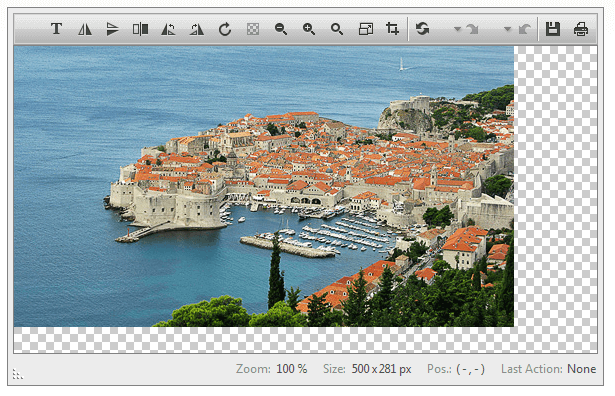

# Right-to-left Support


**RadImageEditor** fully supports right-to-left (RTL) language locales. It is created and added to the page root (as a direct child of the form element) and in order to turn on the RTL support you should set **dir=rtl to the html or body** element.

````CSS
html
{
    direction: rtl;
}
````


````ASP.NET
<telerik:RadImageEditor runat="server" ID="RadImageEditor1" Skin="Telerik" ImageUrl="~/Image1.jpg"
    Height="365px" Width="585px">
</telerik:RadImageEditor>
````

>caption RadImageEditor in RTL mode


# See Also

 * [Live Demo: RadImageEditor Right-to-left Support](http://demos.telerik.com/aspnet-ajax/imageeditor/examples/righttoleft/defaultcs.aspx)
