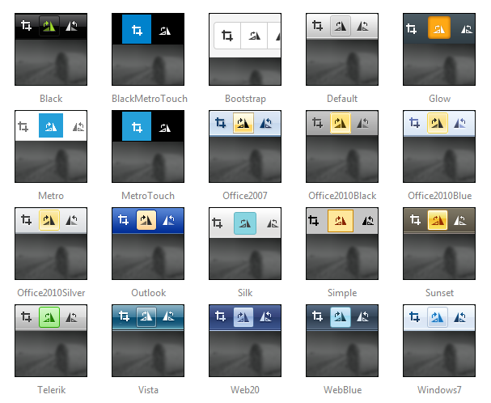

# Skins

__RadImageEditor__uses __skins__ to control its overall look-and-feel. A skin is a set of images and a CSS stylesheet that can be applied to the control elements (items, images, etc.) and defines their look and feel.

To apply a skin to a __RadImageEditor__control, set its __Skin__ property.

__RadImageEditor__ is installed with a number of preset skins. These are shown below:
>caption 

>note The __Hay__ , __Forest__ , __Sitefinity__ and __Transparent__ skins are obsolete and have been removed from the Telerik.Web.UI.Skins.dll assembly as of __Q1 2014__ .	You can find more information on the matter in[this blog post](http://blogs.telerik.com/aspnet-ajax/posts/13-04-11/6-telerik-asp.net-ajax-skins-going-obsolete).
>

## Customizing Skins

You can tweak the existing skins or create your own. Each skin has two main elements: images and a stylesheet. When creating your own, it is a good idea to start with the stylesheet for an existing skin and alter that. See [Creating a Custom Skin For RadImageEditor]() for a step-by-step walk through. To use your own skin

1. Add the new CSS file to your project.

1. Drag and drop the CSS file from the Project Explorer onto your Web page.

1. Set the __EnableEmbeddedSkins__ property of the control to __False__.

The stylesheet for a __RadImageEditor__skin has the name __ImageEditor.[SkinName].css__ and can be found in the __...Skins/[SkinName]__ directory. The images are found in the __...Skins/[SkinName]/ImageEditor__ directory. For example, the stylesheet for the "Black" skin is called ImageEditor.Black.css and is located in the ...Skins/Black directory. The images are found in the ...Skins/Black/ImageEditor directory. The images are referenced by name from within the stylesheet.
