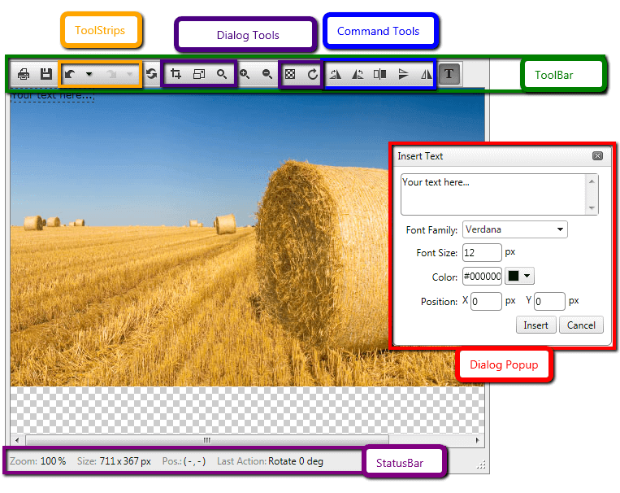

# Structure

## 

The diagram below show the element structure of **RadImageEditor**. The control elements are described below.

* **ToolBar** - The main elements of Telerik’s RadImageEditor is the toolbar. It is the container of the image editor’s tools.

* **ToolStrips** – These are tools with multiple functions combined in a group as a dropdown.

* **Dialog Tools** -Dialog Tools are tools that provide more precise modification.

* **Dialog’s Popup** –User Interface offering tools for applying the precise modifications.

* **Command Tools** – These are tools executing a single predefined manipulation like FlipHorizontally.

* **StatusBar** – Displays information for various data related to the image editing.
