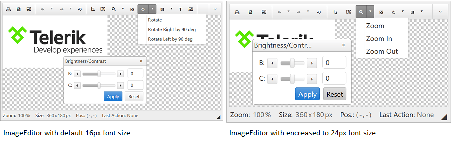

# Elastic Design


This article explains the **elastic design capabilities RadImageEditor offers**. The [Lightweight RenderMode]() of RadImageEditor supports **elastic design as of R3 2015** (**Figure 1**).

@[template](/_templates/common/render-mode.md#resp-design-desc "slug-el: no, slug-fl: no")


>caption Figure 1: Comparison between the appearance of a RadImageEditor with regular font size and with increased font size (50% scale). See the code in **Example 2**.




**RadImageEditor** does not create elastic design by itself, but can fit in a page that follows this pattern. This means that its **Lightweight RenderMode** supports **changing the font size** without breaking the control's appearance - if the new size is larger than the original, the elements in the control will simply increase their size as well to accommodate the text. This fluid layout is achieved by using `em` units for setting dimensions and paddings in the control, instead of `px` because `em` units are tied to the font size. This allows dimensions and sizes to scale with the font size.

@[template](/_templates/common/font-size-notes.md#note-and-example "control: RadImageEditor")

>caption **Example 2**: Changing the font-size of RadImageEditor 

````CSS
div.RadImageEditor,
div.rtbSlide {
    font-size: 24px;
    font-family: "Segoe UI", Arial, Sans-serif;
}

/*Optional style centering the Toolbar drop-down icon*/
/*.RadImageEditor span.radIconDown {
    line-height: 2em;
}*/
````
````ASP.NET
<telerik:RadImageEditor RenderMode="Lightweight" runat="server" ID="RadImageEditor1" ImageUrl="~/images/logo.jpg"></telerik:RadImageEditor>
````

>important Prior to R2 2016 only the ImageEditor control itself is fully elastic (i.e., takes the font size of the page). The toolbar requires additional CSS rules and the dialogs do not support elastic design (i.e., there may be issues with their appearance).


>caption **Example 3**: Changing the font-size of an ImageEditor and its toolbar (prior to R2 2016)

````CSS
div.RadImageEditor,
div.RadImageEditor div.RadToolBar
{
	font-size: 24px;
}
````
````ASP.NET
<telerik:RadImageEditor RenderMode="Lightweight" runat="server" ID="RadImageEditor1" ImageUrl="~/images/logo.jpg"></telerik:RadImageEditor>
````


# See Also


 * [Render Modes]()

@[template](/_templates/common/font-size-notes.md#related-resources)
