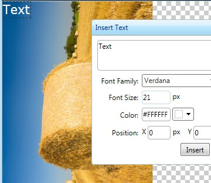

# AddText Limitation

There is a known limitation in **RadImageEditor**'s **AddText** tool.

The **AddText** tool inserts the text to the image currently saved on the server. If any client-side operations are performed, such as Rotate, Flip, or Resize, and they are not applied on the server, the text will be added without taking into consideration the current client state of the image. To be sure that the text is added correctly please apply all changes to the image on the server.

Example of how the **AddText** tool does not respect the client operations performed up to now:

1. Original image

	

1. We rotate the image

	

1. We AddText

	

1. Result

	
