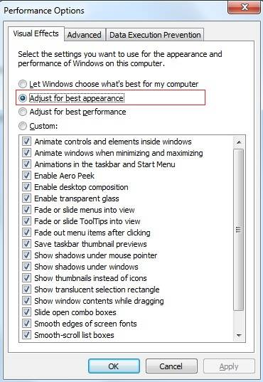

# IE9 Compatibility Modes


There is a known issue in **RadImageEditor** with IE9 Compatibility modes. It applies in the following case:

* IE9 with "Browser Mode" different than IE9 or Document Mode different than IE9

* Windows 7 adjusted for best appearance

**RadImageEditor** uses the MS Filters for some of its operations performed on the client for the older Internet Explorer browsers (IE6, IE7 and IE8). These are the filters used:

* [Matrix Filter](http://msdn.microsoft.com/en-us/library/ms533014%28v=vs.85%29.aspx)

* [Alpha Filter](http://msdn.microsoft.com/en-us/library/ms532967%28v=vs.85%29.aspx)

* [FlipH Filter](http://msdn.microsoft.com/en-us/library/ms532992%28v=vs.85%29.aspx)

* [FlipV Filter](http://msdn.microsoft.com/en-us/library/ms532994%28v=vs.85%29.aspx)

If this filters are applied to an image (`` element) and the page is viewed in IE9 with "Browser Mode" different than IE9 or Document Mode different than IE9, under Windows 7 adjusted for best appearance, **the actual image is not shown - the `` element is shown and has the exact dimensions of the image but the image is invisible**. This issue can be reproduced with any image type.




No known fix is available for the moment, and our recommendation is setting a `<meta/>` tag in the `<head/>` section of the document, that will explicitly tell the browser to use Browser Mode: IE9 and Document Mode: IE9. This is the `<meta/>` tag:

````HTML
<meta http-equiv="X-UA-Compatible" content="IE=Edge" />
````


To reproduce the issue locally use the following HTML:

````HTML

````


