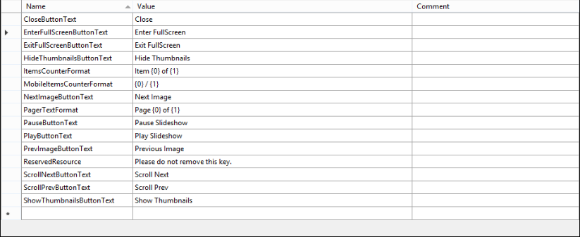

# Localization through Resource Files


**RadImageGallery** supports localization through resource files (.*resx*). You can localize the strings and the popup messages that are displayed in the control.  

You should set the **LocalizationPath** property of **RadImageGallery** to a folder in your project where the resource files are located. Also the **Culture** property should correspond to the culture or the resource file.

````ASP.NET
<telerik:RadImageGallery runat="server" ID="RadImageGallery1" ImagesFolderPath="~/Images" 
LocalizationPath="~/Localization/ImageGallery" Culture="bg-BG">
</telerik:RadImageGallery>
````


## Creating/Modifying resource files


The resource files are represented in a human-readable format (XML) and can be easily modified either in the built-in Visual Studio resource editor or directly in the file, by hand.





## Creating a new localization resource

You can easily create a new resource file by copying an old one and modifying its contents.

1. Copy the **RadImageGallery.Main.resx** file and save it as **RadImageGallery.Main.YOURLANGUAGE.resx** (e.g. **RadImageGallery.Main.bg-BG.resx**)

1. Replace the default strings with translated ones

1. Set the **Culture** property of the control to the relevant language


>caution Do not modify or remove the **ReservedResource** key.
>

>note If you are localizing the mobile version of the control (RenderMode="Mobile") you should use **MobileItemsCounterFormat** string for the pager instead of **ItemsCounterFormat**.
>


