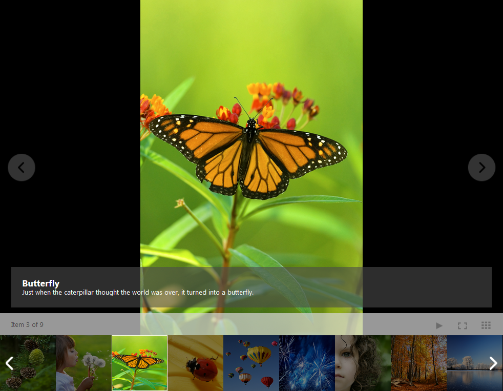

# Binding RadImageGallery to a Static Collection of Items


**RadImageGallery** provides an option to bind to a static collection and manually define your gallery items by specifyingeach one individually in the **RadImageGallery.Items** collection. This type of binding is ideal when the informationthat you want to display is not stored in a database and you want to add it manually.Each item has properties that define the image and thumbnail URL, description, title, width and height.**Example 1** shows how to bind a **RadImageGallery** to a static collection of images.**Figure1** shows the result.

````ASPNET
	    <telerik:radimagegallery id="RadImageGallery1" runat="server" contentviewmode="ContentArea">
	    <Items>
	        <telerik:ImageGalleryItem ImageUrl="../images/1.png" ThumbnailUrl="../images/thumbnail/thumb1.png" Title="Mountain Pine Cones" 
	            Description="You can find these little treasures amidst the pine branches, deep in the green summer mountain." />
	        <telerik:ImageGalleryItem ImageUrl="../images/2.png" ThumbnailUrl="../images/thumbnail/thumb2.png" Title="Girl Holding Dandelions" 
	            Description="A thousand wishes." />
	        <telerik:ImageGalleryItem ImageUrl="../images/3.png" ThumbnailUrl="../images/thumbnail/thumb3.png" Title="Butterfly" 
	            Description="Just when the caterpillar thought the world was over, it turned into a butterfly." />
	        <telerik:ImageGalleryItem ImageUrl="../images/4.png" ThumbnailUrl="../images/thumbnail/thumb4.png" Title="Ladybug" 
	            Description="Rumor has it if a ladybug lands on you, something wonderful will happen to you." />
	        <telerik:ImageGalleryItem ImageUrl="../images/5.png" ThumbnailUrl="../images/thumbnail/thumb5.png" Title="Air Balloons" 
	            Description="Fairy tale in the sky." />
	        <telerik:ImageGalleryItem ImageUrl="../images/6.png" ThumbnailUrl="../images/thumbnail/thumb6.png" Title="Fireworks" 
	            Description="Rain of light." />
	        <telerik:ImageGalleryItem ImageUrl="../images/7.png" ThumbnailUrl="../images/thumbnail/thumb7.png" Title="Young Girl" 
	            Description="Innocence." />
	        <telerik:ImageGalleryItem ImageUrl="../images/8.png" ThumbnailUrl="../images/thumbnail/thumb8.png" Title="Forest" 
	            Description="The golden hues of the fall trees merge in one living organism." />
	        <telerik:ImageGalleryItem ImageUrl="../images/9.png" ThumbnailUrl="../images/thumbnail/thumb9.png" Title="Lake" 
	            Description="The crystal beauty of the winter and magical wonderland it creates." />
	    </Items>
	</telerik:radimagegallery>
````


**This figure represents the thumbnail image, the title and the description of particular item from the ImageGallery.**

# See Also

 * [Binding to Folder and Static Collection demo](http://demos.telerik.com/aspnet-ajax/image-gallery/examples/data-binding/server-side/binding-to-folder-and-static-collection/defaultcs.aspx)

 * [Binding to Folder]()

 * [Binding to a Declarative Data Source]()

 * [Advanced Data-binding]()
