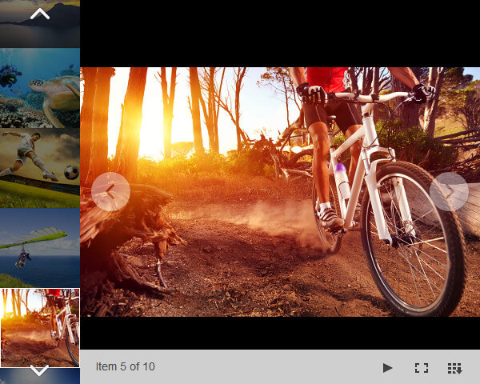

# Binding to Folder


You can bind **RadImageGallery** to a virtual folder path and display all images contained in it. All that you need to do is set the **ImagesFolderPath** property as shown in the code snippet. The control will automatically generate thumbnail images. If necessary the thumbnails will be cropped to fit the defined thumbnail width and height. The images in the Image Area have relative paths and the user only needs to wait for the image to be loaded by the browser. Figure 1 shows how the rendered control will look on the web page.

## 

````ASPNET
<telerik:RadImageGallery runat="server" ID="RadImageGallery1" 
	ImagesFolderPath="~/Images"
	Width="600px" Height="480px">
	<ThumbnailsAreaSettings Position="Left" ScrollOrientation="Vertical" ScrollButtonsTrigger="Click" />
	<ImageAreaSettings ShowNextPrevImageButtons="true" NavigationMode="Button" />
</telerik:RadImageGallery>
````


**Figure 1** - RadImageGallery bound to a Folder


# See Also

 * [Binding to a Static Collection]()

 * [Binding to a Declarative Data Source]()

 * [Advanced Data-binding]()
