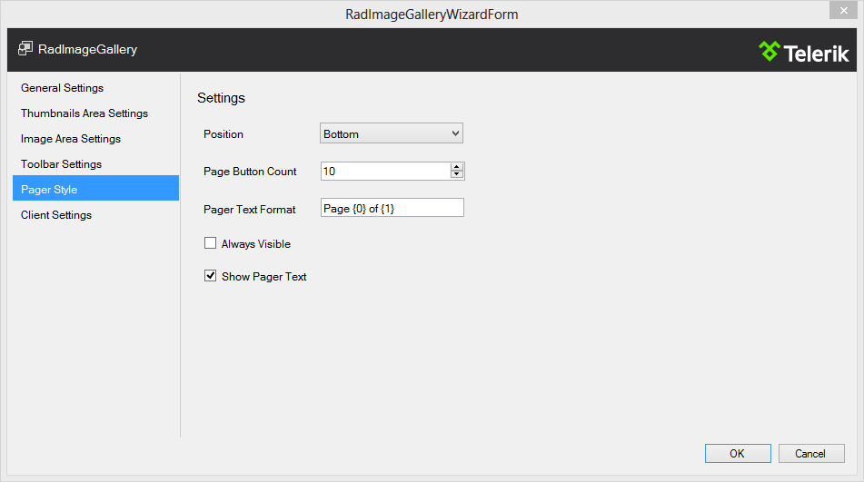

# Design Time

The __RadImageGallery__ designer provides a convenient __Smart Tag__ that allows easy access to frequently needed tasks. You can display it by right clicking on the control in the design window, and choosing Show __Smart Tag__ from its context menu, or by simplyclicking on the arrow button on top-right corner of the control.

__The Smart Tag enables easy visual configuration of the control at design-time.__

__RadImageGallery__ Smart Tag lets you perform the following:

## RadImageGallery Tasks

* __Open Configuration Wizard:__ - Opens the __RadImageGalleryWizardForm__ window for furthercustomization of the control settings.

## Ajax Resources

* __Add RadAjaxManager:__ Adds a RadAjaxManager component to your Web page, and displays the RadAjax Property Builder where you can configure it.

* __Replace ScriptManager with RadScriptManager:__ Replaces the default ScriptManager component added for AJAX-enabled Web sites with RadScriptManager.

* __Add RadStyleSheetManager:__ Adds a RadStyleSheetManager to your Web page.

## Skin

The __Skin__ drop-down lets you select from a list of available skins to customize the look of your __RadImageGallery__ control.

## Learning Center

Links navigate you directly to __RadImageGallery__ examples, help or Code Library. You can also search the Telerik web site for a given string.The last link will take you to Telerik feedback portal where you can submit your ideas or opinions regarding the control.

## RadImageGalleryWizardForm

The wizard will smoothly guide you through the various settings and properties of __RadImageGallery__ providing an accessible and organized way of configuring the control.

__General Settings__

* __Display Area Mode:__ : Controls the mode that the __RadImageGallery__ will operate in. The modedetermines the appearance and the way the entire control will work.

* __Loop Items:__ If enabled, this will loop the items when the last/first one is reached.

* __Page Size:__ Controls the number of items that the RadImageGallery will populate at a given time.

* __Data Source ID:__ Defines the ID of the control from which the __RadImageGallery__ retrieves its list of data items.

* __Images Folder Path:__ Indicates a relative or absolute path to a folder from which the __RadImageGallery__will populate its items.

* __Append Data Bound Items:__Indicates whether __RadImageGallery.Items__ collection is cleared before__DataBinding__. If enabled, the __RadImageGallery__ will append the retrieved items from the datasource to the statically declared ones.

__Thumbnails Area Settings__

* __Thumbnail Spacing:__ Controls the padding between the items in the area.

* __Show Scrollbar:__ Determines if a scrollbar will be displayed in the ThumbnailsArea.

* __Show Scroll Buttons:__ Indicates if the buttons that scroll the ThumbnailsArea view will be visible.

* __Enable Zone Scroll:__ Determines if the ThumbnailsArea will be automatically scrolled when the mouse is closeenough from the left or right side of the area.

* __Scroll Buttons Trigger:__ An enumeration value, which determines when the scroll buttons action will be triggered.Note that scroll amount changes based on the value specified.

* __Scroll Orientation:__ Determines the position of the scrollbar and in what direction (horizontally or vertically) the content will be moved.

* __Mode:__ An enumeration value, which determines how the ThumbnailsArea will look and function.

__Image Area Settings__

* __Navigation Mode:__ An enumeration value, which determines the way images will be navigated.

* __Show Description Box:__ Determines if the box that holds the item title and description will be visible.

* __Show Next/Prev Image Buttons:__ Determines if the Next/Prev navigate buttons will be visible.

__Toolbar Settings__

* __Position:__ An enumeration value, which represents where the Toolbar item will be created relativeto the __RadImageGallery__ position.

* __Item Counter Format:__ The string used to format the item counter text that appears in the Toolbar.

* __Show Items Counter:__ Controls the visibility of the items counter information text.

__Pager Style__

* __Position:__ An enumeration value, which represents where the pager items will be created relative tothe __RadImageGallery__ position.

* __Page Button Count:__ Controls the number of page buttons that will be rendered if the pager is in mode that renders the page buttons.

* __Pager Text Format:__ The string used to format the description text that appears in a pager item.

* __Always Visible:__ Determines whether the pager item will be still visible when there is only one page.

__Client Settings__

* __AnimationSettings:__ Defines the animation settings for the __RadImageGallery__. Inner settings determine the animations between images.

* __ClientEvents:__ Provides a reference to __ImageGalleryClientEvents__ collection, which holds properties for setting the client-side events of the __RadImageGallery__.

# See Also

 * [Overview]()

 * [Getting Started]()
