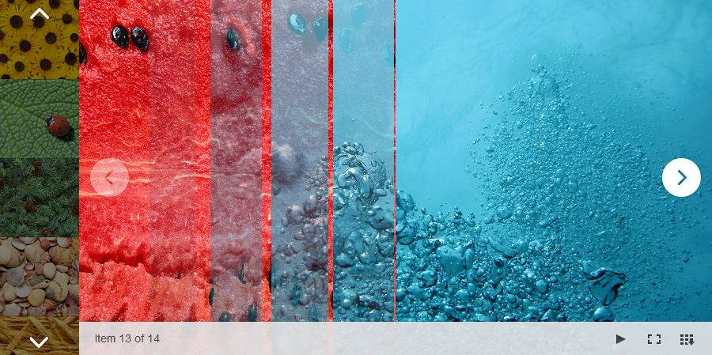

# Animations


**RadImageGallery** provides an option for using advanced animations, which are transitions between the images.You can change different animation effects by using the **Easing**, **Speed** and **Type** properties.

By using the **Easing** and **Speed** properties, you could configure the animation effect when navigating to the next or previous image.

**Figure 1:** Animation in action.


## Type

The **Type** property allows you to choose an animation effect. **RadImageGallery** offers 14different animation effects or you can choose the **Random** type, which will apply a different effect between the image transitions. You can check out the different animation effects in the [live example](https://demos.telerik.com/aspnet-ajax/image-gallery/examples/functionality/animations/defaultcs.aspx).

The **NextImagesAnimation** and **PrevImagesAnimation** properties contain predefined lists with all available animations. You can choose a particular animation, which will be applied to one or both properties. **Easing** and **Speed** properties are not mandatory. **Table 1** shows the different animations.

**Table 1:** All available animation effects.


|  **Fade**  |  **Resize**  |  **Blocks**  |  **BigBlocks**  |
| ------ | ------ | ------ | ------ |
| **SmallBlocks** | **HorizontalResize** | **VerticalResize** | **DiagonalResize** |
| **HorizontalSlide** | **VerticalSlide** | **HorizontalStripes** | **VerticalStripes** |
| **CollapsingHorizontalStripes** | **CollapsingVerticalStripes** |||

## Easing

Easing functions makes animation look more realistic by controlling the rate of the transition between the images.The simplest easing function, the line, is linear interpolation at constant rate.More advanced easing functions can have accelerating or decelerating at the beginning, the end or both.You could read the following [MSDN Easing Function](https://msdn.microsoft.com/en-us/library/ee308751%28v=vs.110%29.aspx)help article, which provides detailed information about the different easing functions.Since easing functions are inherited from .NET, **RadImageGallery** supports them.**Table 2** shows the different easing functions.

**Table 2:** All available easing functions.


|  **Linear**  |  **EaseInSine**  |  **EaseOutSine**  |  **EaseInOutSine**  |
| ------ | ------ | ------ | ------ |
| **EaseInQuad** | **EaseOutQuad** | **EaseInOutQuad** | **EaseInCubic** |
| **EaseOutCubic** | **EaseInOutCubic** | **EaseInQuart** | **EaseOutQuart** |
| **EaseInOutQuart** | **EaseInQuint** | **EaseOutQuint** | **EaseInOutQuint** |
| **EaseInExpo** | **EaseOutExpo** | **EaseInOutExpo** | **EaseInCirc** |
| **EaseOutCirc** | **EaseInOutCirc** | **EaseInBack** | **EaseOutBack** |
| **EaseInOutBack** | **EaseInElastic** | **EaseOutElastic** | **EaseInOutElastic** |
| **EaseInBounce** | **EaseOutBounce** | **EaseInOutBounce** ||

## Speed

The **Speed** property determines the duration of the animation, measured in milliseconds.

## Slideshow

**RadImageGallery** provides a slideshow feature where the images will automatically move from oneimage to another over a specified period. You could change the duration between the slides by using the **SlideshowSlideDuration** property as shown in **Example 1**. The default value for this propertyis three seconds.

````ASPNET
<ClientSettings>
	<AnimationSettings SlideshowSlideDuration="2000">
		<NextImagesAnimation Type="DiagonalResize" Easing="EaseInExpo" Speed="1000" /> 
		<PrevImagesAnimation Type="VerticalStripes" Easing="EaseOutBack" Speed="1000" />
	</AnimationSettings>
</ClientSettings>
````


# See Also

 * [Animation Live Demo](https://demos.telerik.com/aspnet-ajax/image-gallery/examples/functionality/animations/defaultcs.aspx)

 * [RadImageGallery Overview]()
