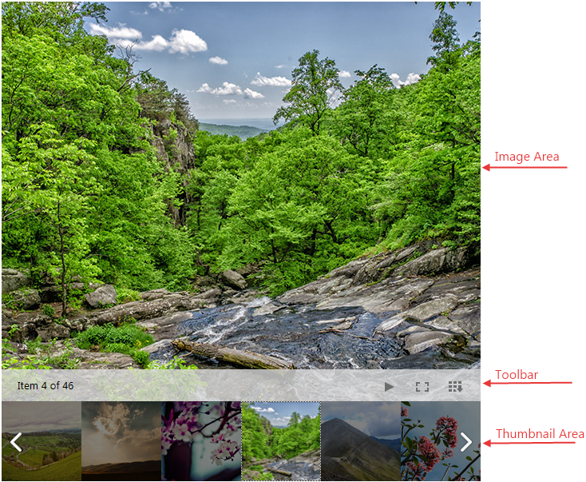

# Modes

RadImageGallery control is a flexible control that provides different presentation modes which configures the way the __ImageArea__ and __ThumbnailsArea__ looks.

## 

There are four different __DisplayArea Modes__ that could be set for the__ImageGallery__ control. They determine the ImageArea appearance:

* __Image__ – This is the default mode when the __ThumbnailsArea__ and the __ImageArea__ are simultaneously visible.The image below presents all areas and sections in this mode.When the __DisplayArea Mode__ is set to __Image__ you could specify different modes for the ThumnbailsArea which are listed below:

* __Thumbnails__- It is available for all DisplayArea Modes. This is the default __ThumbnailsArea Mode__ which is also presented in the image above.

* __ImageSlider__- It is available only for __DisplayArea Mode__ set to __Image__. In this case the Thumbnails are presented as dots which could be selected to open the image.

* __ImageSliderPreview__- It is available only for __DisplayArea Mode__ set to __Image__. In this case the Thumbnails are presented as dots which could be previewed on hover.

* __Thumbnails__ - The area initially shows only thumbnail images and upon click it hides the thumbnails and shows the __ImageArea__ with close button on the top right in order to give the possibility to go back to the __ThumbnailsArea__.

* __ToolTip__ – The area initially shows only thumbnail images and on click opens a ToolTip control with the image.

* __LightBox__ – The area initially shows only thumbnail images and on click opens a LightBox control with the image.
