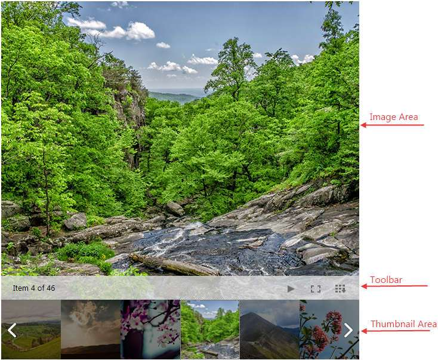
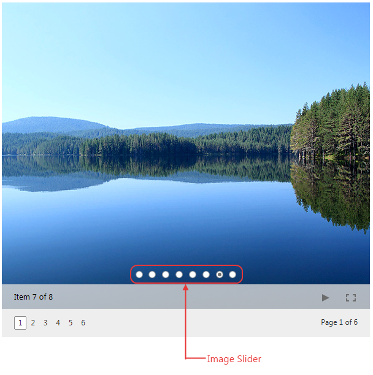
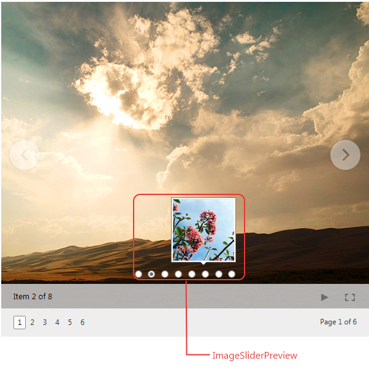
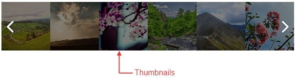
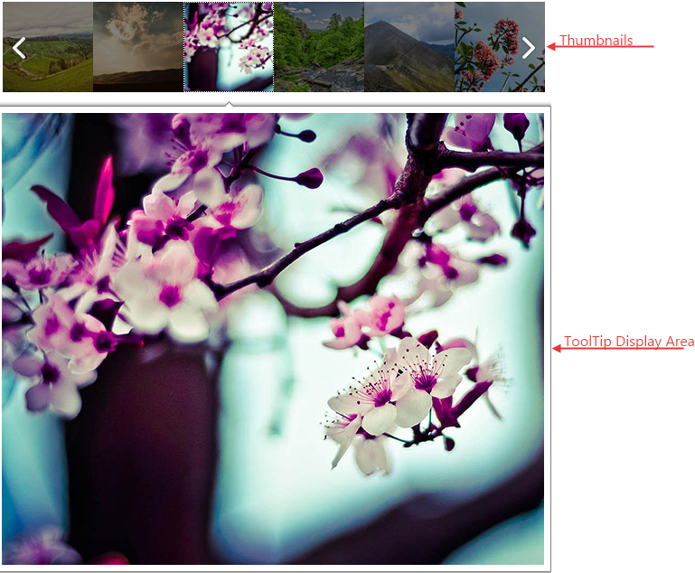
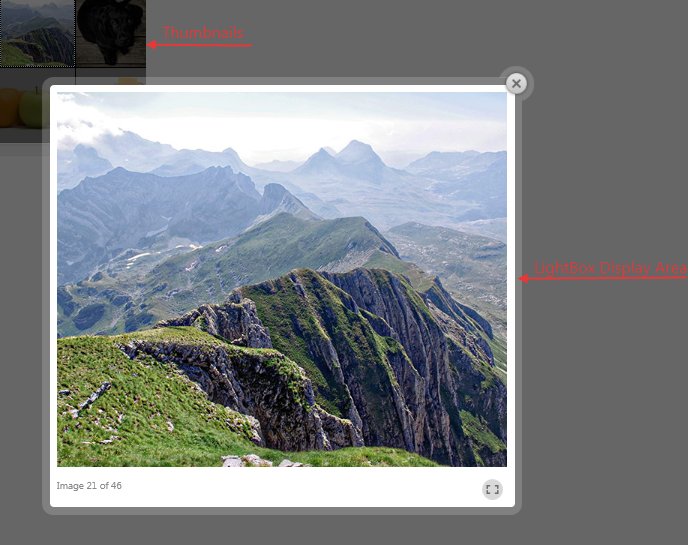

# Modes

RadImageGallery control is a flexible control that provides different presentation modes which configures the way the **ImageArea** and **ThumbnailsArea** looks.

## 

There are four different **DisplayArea Modes** that could be set for the **ImageGallery** control. They determine the ImageArea appearance:

* **Image** – This is the default mode when the **ThumbnailsArea** and the **ImageArea** are simultaneously visible.The image below presents all areas and sections in this mode.
When the **DisplayArea Mode** is set to **Image** you could specify different modes for the ThumnbailsArea which are listed below:

* **Thumbnails**- It is available for all DisplayArea Modes. This is the default **ThumbnailsArea Mode** which is also presented in the image above.

* **ImageSlider**- It is available only for **DisplayArea Mode** set to **Image**. In this case the Thumbnails are presented as dots which could be selected to open the image.

* **ImageSliderPreview**- It is available only for **DisplayArea Mode** set to **Image**. In this case the Thumbnails are presented as dots which could be previewed on hover.

* **Thumbnails** - The area initially shows only thumbnail images and upon click it hides the thumbnails and shows the **ImageArea** with close button on the top right in order to give the possibility to go back to the **ThumbnailsArea**.

* **ToolTip** – The area initially shows only thumbnail images and on click opens a ToolTip control with the image.

* **LightBox** – The area initially shows only thumbnail images and on click opens a LightBox control with the image.

