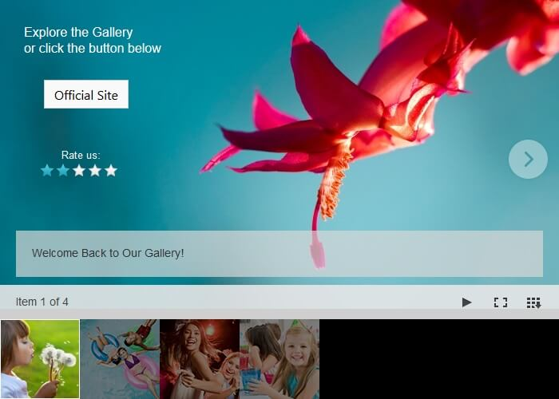

# Templates


## 

Telerik RadImageGallery supports complete customization of the item layout. Using the ImageGalleryTemplateItem, you can define your own configuration that can build up various layout structures.

The control provides the opportunity to display your data in any preferable way. You can include the template item in any desired position in the items collection, just as a regular ImageGalleryItem.

__You can add a company logo, video, contact information or build your own advanced custom configuration to match your specific needs.__

## Creating the Template Configuration

The first step is to create a new ImageGalleryTemplateItem in the Items collection of the RadImageGallery. You can create as many as you want and set their __ThumbnailUrl__ property which determines the small image displayed in the thumbnail area to represent the original item. There are also __Title__ and __Description__ properties available, used to set a descriptive display message to the user.

Inside the __ContentTemplate__ of the item you can build-up your custom configuration.

````ASPNET
	        <telerik:RadImageGallery ID="RadImageGallery1" runat="server" Skin="Silk"
	            Height="500px" Width="700px">
	            <Items>
	                <telerik:ImageGalleryTemplateItem Description="Welcome Back to Our Gallery!"
	                    ThumbnailUrl="~/Images/thumbnail5.png">
	                    <ContentTemplate>
	                        <div style="width: 700px; height: 357px; padding: 30px 0 0 30px; background-image: url(Images/img7.jpg);">
	                            <asp:Label ID="Label1" runat="server" ForeColor="White" Font-Size="Larger"
	                                Font-Names="Arial,​Helvetica,​sans-serif"
	                                Text="Explore the Gallery<br/>or click the button below"></asp:Label>
	                            <div style="padding: 30px 0 0 25px;">
	                                <telerik:RadButton ID="RadButton1" runat="server" Text="Official Site"
	                                    Skin="MetroTouch">
	                                </telerik:RadButton>
	                                <div style="padding-top: 50px; margin-left: -8px;">
	                                    <asp:Label ID="Label2" runat="server" ForeColor="White" Font-Size="Small"
	                                        Font-Names="Arial,​Helvetica,​sans-serif" Style="margin-left: 30px;"
	                                        Text="Rate us:"></asp:Label>
	                                    <telerik:RadRating ID="RadRating1" runat="server" Skin="Silk"></telerik:RadRating>
	                                </div>
	                            </div>
	                        </div>
	                    </ContentTemplate>
	                </telerik:ImageGalleryTemplateItem>
	                <telerik:ImageGalleryItem ImageUrl="~/Images/img2.jpg"
	                    ThumbnailUrl="~/Images/thumbnail2.png" />
	                <telerik:ImageGalleryItem ImageUrl="~/Images/img2.jpg"
	                    ThumbnailUrl="~/Images/thumbnail3.png" />
	                <telerik:ImageGalleryItem ImageUrl="~/Images/img2.jpg"
	                    ThumbnailUrl="~/Images/thumbnail4.png" />
	            </Items>
	        </telerik:RadImageGallery>
````


The ImageGalleryTemplateItem supports the use of data-bound controls.

````ASPNET
	                <telerik:ImageGalleryTemplateItem>
	                    <ContentTemplate>
	                        <telerik:RadComboBox ID="RadComboBox1" EmptyMessage="Select a Country"
	                            DataSourceID="SqlDataSource1" DataTextField="ShipCountry"
	                            DataValueField="ShipCountry" runat="server">
	                        </telerik:RadComboBox>
	                        <asp:SqlDataSource ID="SqlDataSource1" runat="server"
	                            ConnectionString="<%$ ConnectionStrings:ConnectionString %>"
	                            SelectCommand="SELECT [OrderID], [OrderDate], [Freight], [ShipName], [ShipCountry] FROM [Orders]"></asp:SqlDataSource>
	                    </ContentTemplate>
	                </telerik:ImageGalleryTemplateItem>
````


You can also configure the properties of the ImageGalleryTemplateItem programmatically.

````C#
	    protected void RadImageGallery1_ItemDataBound(object sender, ImageGalleryItemEventArgs e)
	    {
	        if (e.Item is ImageGalleryTemplateItem)
	        {
	            e.Item.Title = "Success";
	        }
	    }
````


You should have in mind that the templates are not individual INamingContainers. Therefore, to access the inner controls, you can use their own event handlers.

````C#
	    protected void Label1_Load(object sender, EventArgs e)
	    {
	        Label label = sender as Label;
	        label.Text = "I am an inner control.";
	    }
````


# See Also

 * [Overview]()

 * [Live Demo](http://demos.telerik.com/aspnet-ajax/image-gallery/examples/functionality/templates/defaultcs.aspx)
