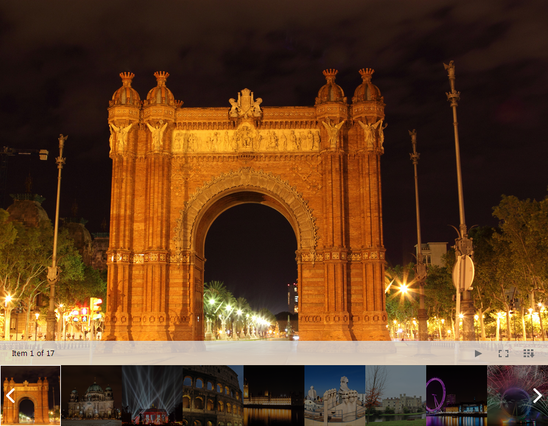
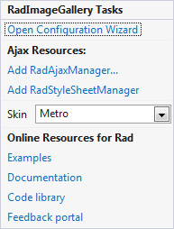
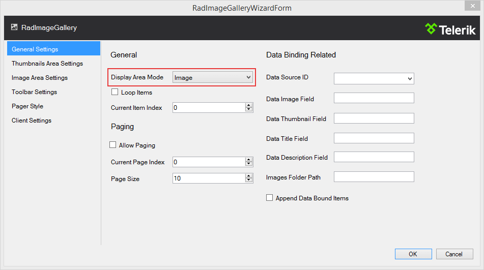
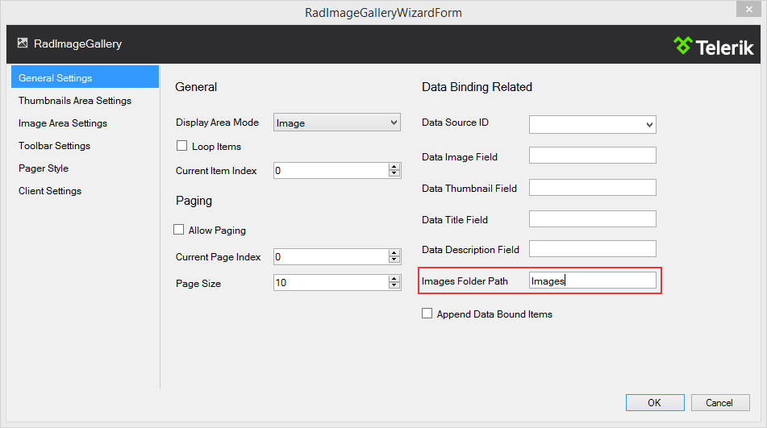
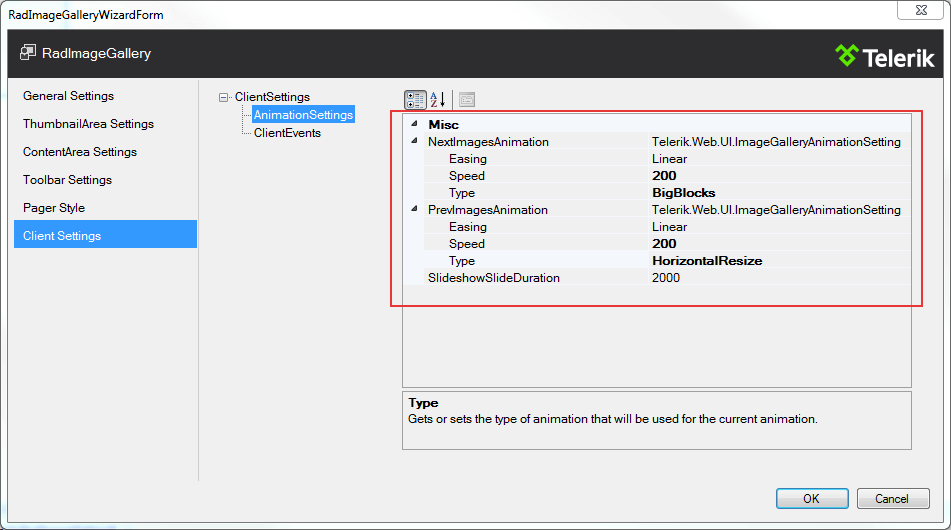

# Getting Started

**RadImageGallery** is the brand new member of the Teleriks control kit for ASP.NET AJAX. Like all controls in the suite itprovides an user friendly and convenient way for achieving fascinating results with little to no code.

You can use **RadImageGallery** for viewing a collection of images from different data sources in different [DisplayAreaMode](). At the same time its responsive design, animations and full-screen support gratefully improve the end user experience.

## Configuring the control

In this article, you will learn how to configure the **RadImageGallery** control to display images located in a local folder and select animations which to be performed when changing images. Configuring the control is easy as a,b,c.

1. First you need to drag it from the toolbox and drop it on the page after which its [Smart Tag](d4afd6d8-7828-45f0-9b88-963a8cc407c1)will appear from where you can configure the control and select any of the built-in skins.

2. In the **General Settings** section available after clicking **Open Configuration Wizard** you can select a **DisplayAreaMode** which by default is set to **Image**.

3. In the **Folder Path** input field you should type the path to the folder containing the images.

4. After we have selected our images source we need to configure the animations. This is achievable by clicking on the **ClientSettings** section and selecting **AnimationSettings**. As you can see now we can select a different animation to be performed when transitioning to the previous or next image. Additionally we can specify an easing function and time for which the animations should be performed.

That was it we now have a full-featured gallery and are ready to go.

# See Also

 * [Overview]()

 * [Data-Binding]()

 * [Modes]()

 * [Animations]()
