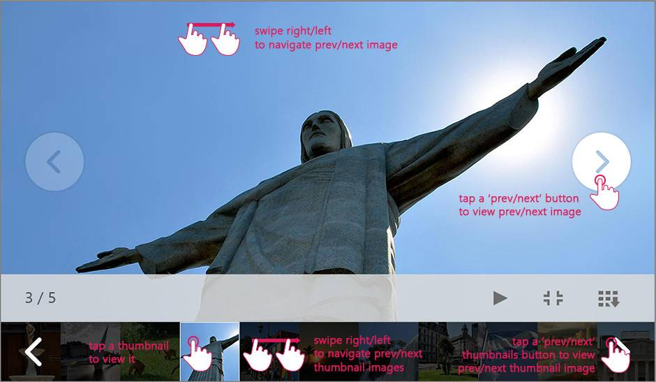
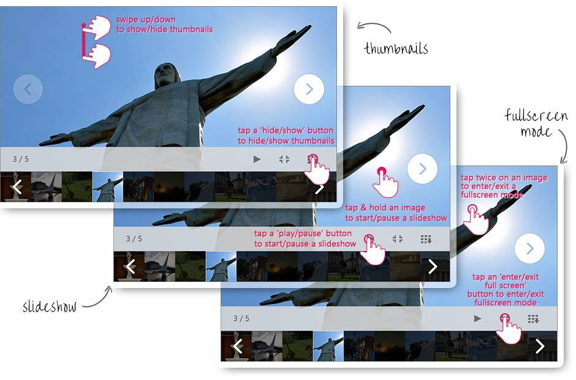
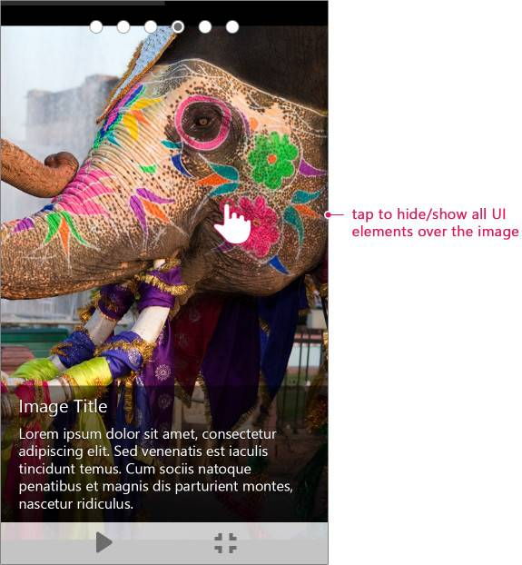

# Gestures

**RadImageGallery** for ASP.NET AJAX handles gestures from touch enabled screens.You can use tap, swipe, tap and hold and etc. to navigate through the images or turn on/off certain features of the control. In addition the **ImageGalleryItem** exposes a **PreventDefaultGestures** property which determines whether the gestures are enabled or not for the currently viewed item. When set to false the tap and hold, swipe and double tap gestures performed over the **ImageArea** will not trigger an action.

## Classic rendering

This is the default rendering of **RadImageGallery** control.

### Image Navigation

With the current implementation you can switch the main image using three gestures.

* Tapping on the previous/next image buttons

* Performing a left or right swipe over the main image

* Tapping on a thumbnail from the thumbnails area

Additionally you can swipe left or right over the thumbnails area to navigate to the next/previous subset of thumbnails. The same effect can be achieved by taping over the previous or next buttons.

### Tuning On/Off Features

In the list provided below you can find the control features that can be turned on/off after performing a certain gesture.

* Start/Stop the slideshow - Can be achieved either by tapping on the play slideshow button or performing a tap and hold over the main image

* Show/Hide the thumbnails area - Can be achieved by performing a swipe up/down over the main image or tapping on the show/hide thumbnails buttons

* Enter/Exit full screen - Can be achieved by double tapping on the main image or performing a single tap over the enter/exit full screen buttons

## Mobile rendering

When using **Mobile** render mode the gestures that you can perform are a little bit different in comparison  with the **Classic** rendering.

### Image Navigation

With the current implementation you can switch the main image using two gestures.

* Tapping on the previous/next image buttons

* Tapping on a thumbnail from the thumbnails area

Additionally you can swipe left or right over the thumbnails area to navigate to the next/previous subset of thumbnails. The same effect can be achieved by taping over the previous or next buttons. 
Also if the image is in full screen mode you can use a single tab. This gesture allows you to toggle the visibility of the elements displayed over the image. Such elements are the image title and the description.

### Tuning On/Off Features 

In the list provided below you can find the control features that can be turned on/off after performing a certain gesture.

* Start/Stop the slideshow - Can be achieved by tapping on the play slideshow button

* Show/Hide the thumbnails area - Can be achieved by performing tapping on the show/hide thumbnails buttons

* Enter/Exit full screen - Can be achieved by double tapping on the main image or performing a single tap over the enter/exit full screen buttons!

# See Also

 * [Image Gallery Mobile Demo](https://demos.telerik.com/aspnet-ajax/image-gallery/mobile-examples/overview/default.aspx?name=Overview)
