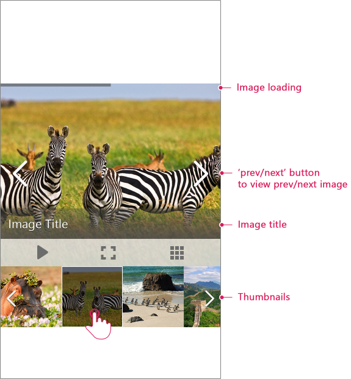
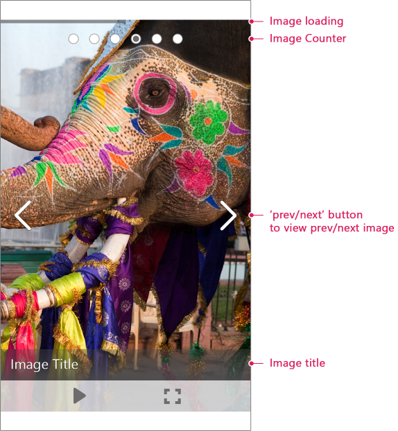

# Mobile Rendering

Since Q2 2015 release of Telerik UI for ASP.NET controls **RadImageGallery** is optimized for touch devices and comes with built-in **Adaptive behavior**. When you access the control via a mobile device, **RadImageGallery** will change to create a user experience tailored to the device screen size. By tweaking the rendering and improving the gesture interactions, the mobile mode has been greatly optimized for touchscreen devices. There are three general modes supported:

>caption Image (default) mode

>caption Image Slider mode

>caption Thumbnail Area mode

# Mobile vs Auto render modes

You can enable the mobile layout of the control by setting the **RenderMode** property of the ImageGallery to **"Mobile"**. To cover the rendering of both mobile and desktop devices, you could set the **RenderMode** property to **"Auto"**. This option will automatically decide how to render the control on a smartphone, tablet or PC. 

# Special Mobile rendering features 

When you change **RadImageGallery** **RenderMode** to **Mobile** or **Auto** there are some key structure differences compared to the classic version. 

* **Image title and description** – The description is visible in full screen mode only while the title is visible in both normal and full screen mode.

* **Navigation buttons** – They are visible in normal mode only and not in fullscreen.

* **Image loading bar** – It is positioned at the top of the image.

* **Image counter** (Image Slider mode) - It is positioned at the top of the image.