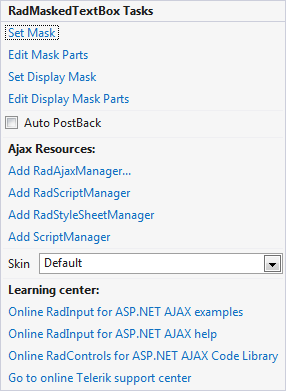

# Smart Tag

The **RadInput** Smart Tag allows easy access to frequently needed tasks. You can display the **Smart Tag** by right clicking on a **RadInput** control in the design window, and choosing **Show Smart Tag** from its context menu.

## RadTextBox Smart Tag

The **RadTextBox** Smart Tag lets you perform the following:

RadTextBox Tasks

* **Text** lets you specify the text that appears in the **RadTextBox** control.This control sets the **Text** property.

* **Empty Message** lets you specify the text that appears in the **RadTextBox** control when the value of the **Text** property is an empty string. This control sets the **EmptyMessage** property.

Ajax Resources

* **Add RadAjaxManager...** adds a RadAjaxManager component to your Web page, and displays the **RadAjax Property Builder** where you can configure it.

* **Replace ScriptManager with RadScriptManager** replaces the default **ScriptManager** component that is added for AJAX-enabled Web sites with **RadScriptManager**.

* Add **RadStyleSheetManager** adds a **RadStyleSheetManager** to your Web page.

Skin

The **Skin** drop-down lets you select from a list of available [skins]() to customize the look of your **RadTextBox** control.

Learning Center

Links navigate you directly to **RadInput** examples, help, or code library. You can also search the Telerik web site for a given string.

## RadMaskedTextBox

The **RadMaskedTextBox** Smart Tag contains the same **Ajax Resources**, **Skin**, and **Learning Center** sections as the other **RadInput** controls. In addition, the **RadMaskedTextBox** Smart Tag lets you do the following :

RadMaskedTextBox Tasks

* **Set Mask** brings up the [Input Mask Dialog](), where you can specify an input mask that controls what input the user can enter into the masked text box.The input mask you specify in this dialog is assigned to the **Mask** property.

* **Edit Mask Part** shows the [MaskPart Collection Editor ](), where you can create and modify the masks that are the values of the **RadMaskedTextBox**.

## RadNumericTextBox

The **RadNumericTextBox** Smart Tag contains the same **Ajax Resources**, **Skin**, and **Learning Center** sections as the other **RadInput** controls. In addition, the **RadNumericTextBox** Smart Tag lets you do the following :

RadNumericTextBox Tasks

* **NumericType** lets you set the **Type** property by selecting a type from the drop-down list. The **Type** property governs the basic formatting of numeric values, according to the settings of the current **Culture**.**Numeric Type** can be set to "Number", "Currency", or "Percent".

* **Value** lets you set the **Value** property to a numeric value.

* **Minimum Value** lets you set the **MinValue** property to a numeric value.

* **Maximum Value** lets you set the **MaxValue** property to a numeric value.

## RadDateInput

The **RadDateInput** Smart Tag contains the same **Ajax Resources**, **Skin**, and **Learning Center** sections as the other **RadInput** controls. In addition, the **RadDateInput** Smart Tag lets you do the following :

RadDateInput Tasks

* **Set Display Date Format** brings up the [Date Format Dialog](), where you can assign a value to the **DisplayDateFormat** property.The **DisplayDateFormat** property governs the format of the **SelectedDate** value when the **RadDateInput** control does not have focus.

* **Set Date Format** brings up the [Date Format Dialog](), where you can assign a value to the **DateFormat** property.The **DateFormat** property governs the format of the **SelectedDate** value when the **RadDateInput** control has focus (when the user can edit its value).

* **MinDate** specifies the minimal date which the user will be allowed to enter

* **MaxDate** specifies maximal date which the user will be allowed to enter

