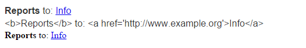
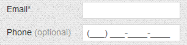

# RadLabel vs asp:Label vs Built-in Label


## Common Overview of Labels

In general, the Label controls are used to provide short descriptive text or other helpful information in a set location on the page, usually next to a value holder like a text field. Their common purpose is to hint the users about the data they need to enter or view. Unlike static text, you can customize the displayed text through properties allowing its programmatic manipulation. Basically, you can also use the Literal and PlaceHolder controls to display text on the Web Forms page. However, unlike the Label control, these controls do not render any additional tags. Of course, there are also the standard HTML label, span, etc. elements.

With such vast choice of displaying a simple text on your page, it may get confusing which way is the best to go. Therefore, we introduced the **RadLabel** control to provide a themeable alternative solution, coherently matching the consistent look and feel of the built-in Telerik skins and functionality.

The main property of the **RadLabel** control is **AssociatedControlID**. The control renders as an HTML label element, with the “for” attribute set to the ID of the associated control. The ID should be set relatively – if the Label and the associated control are placed within the same INamingContainer or document, the direct **ID** of the control is set to the **AssociatedControlID** property, e.g. “RadDateTimePicker1”. However, if they are located in separate INamingContainers, the **UniqueID** of the associated control should be used instead.

By standard, each Label control is explicitly associated with exactly one form control, but more than one Label may be associated with the same control by creating multiple references via the underlying “for” attribute. When a Label (or its inner content) is clicked, it passes the focus on to its associated control. Labels can be helpful also when using keyboard navigation via the **AccessKey** property. Again, the focus will be set on the associated control. Note that the **AccessKey** navigation requires different key combinations in different browsers.


## Advantages over asp:Label

We suggest that you use and leverage **RadLabel** when need to display a descriptive text next to your form controls. Here are some of the advantages:
* **Nice appearance and skins specific to Telerik AJAX controls.** This will save you the effort to manually modify the style of the displayed text to match your other controls on the page.

* **Seamless integration with the ASP.NET and Telerik Web Forms components.** For example, a regular asp:Label cannot access the input control of **RadDateTimePicker** automatically just by setting the **AssociatedControlID** property, while the **RadLabel** is specifically designed to achieve that.

* **Provides HtmlEncode property**.

````ASP.NET
<telerik:RadLabel runat="server" ID="RadLabel1" Text="<b>Reports</b> to: <a href='http://www.example.org'>Info</a>"
    AssociatedControlID="RadTextBox1" Skin="Bootstrap">
</telerik:RadLabel>
<br />
<telerik:RadLabel runat="server" ID="RadLabel2" Text="<b>Reports</b> to: <a href='http://www.example.org'>Info</a>"
    AssociatedControlID="RadTextBox1" Skin="Bootstrap" HtmlEncode="true">
</telerik:RadLabel>
<br />
<asp:Label ID="Label1" runat="server" Text="<b>Reports</b> to: <a href='http://www.example.org'>Info</a>"
    AssociatedControlID="RadTextBox1">
</asp:Label>
````

The code snippet above displays the following layout:


* **Easy combination of Image with text.** If you want to display an Image or Icon next to the text, you can add them as content within the **RadLabel**.

````ASP.NET
<telerik:RadLabel runat="server" ID="RadLabel1"
Text="Reports To:" AssociatedControlID="RadTextBox1">
    
</telerik:RadLabel>
````

* **RequiredMark and OptionalMark.** These properties will enable you to automatically display additional text at the end of the label **Text**.


* **Represents a control from the Telerik suite:**
 * Coherent functionality with **RadSkinManager**. You can change the entire Skin/Theme of the page just with a single click or depending on the currently logged user.
 * Easier to maintain since it does not require any additional CSS, decorations or extensions.
 * You can directly drag and drop **RadLabel** from the Telerik ASP.NET AJAX section under the VS Toolbox.


## Advantages over built-in Label

Some of the Telerik controls like RadTextBox, RadDateTimePicker, RadComboBox, RadSearchBox, etc. provide built-in **Label** property. We suggest that you use the new **RadLabel** control instead. Since the **RadLabel** is a separate control, it has the following advantages:
* It is easier to control the width of RadLabel. The built-in Label is part of the main control wrapper and thus, requires additional handling using the WrapperCssClass and custom CSS. Altering the Width of RadLabel won’t affect the Width of the associated form control, unlike the built-in label.
* You can define its position in regards to the associated control and place it before, after, top, below, etc.
* All the properties offered by the individual control – **HtmlEncode**, **RequiredMark**, **OptionalMark**, etc.


# See Also

 * [Overview]()

 * [Live Demo](https://demos.telerik.com/aspnet-ajax/label/overview/defaultcs.aspx)

 * [Getting Started]()
