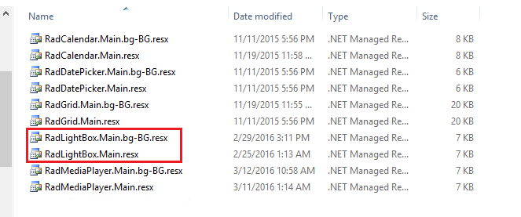
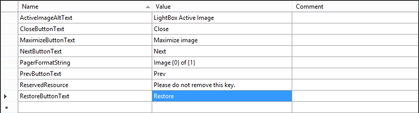

# Localization through Resource Files

**RadLightBox** supports localization through resource files (.*resx*). You can localize the tooltip of the buttons that are displayed in the control.  

The resource files should be placed within the **App_GlobalResources** folder in your application. You can either create your own language pack (see below) or use an existing one (if available for your language). Telerik controls installation wizard automatically copies the built-in resources to the **App_GlobalResources** in your local installation.

## Creating/Modifying resource files

The resource files are represented in a human-readable format (XML) and can be easily modified either in the built-in Visual Studio resource editor or directly in the file, by hand.

## Creating a new localization resource

You can easily create a new resource file by copying an old one and modifying its contents.

1. Copy the **RadLightBox.Main.resx** file and save it as **RadLightBox.Main.YOURLANGUAGE.resx** (e.g. **RadLightBox.Main.bg-BG.resx**)

2. Replace the default strings with translated ones

3. Set the **Culture** property of the control to the relevant language

>caution Do not modify or remove the **ReservedResource** key.
>

