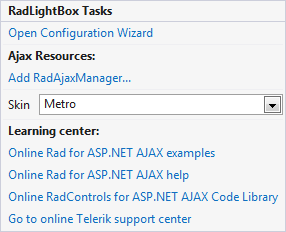
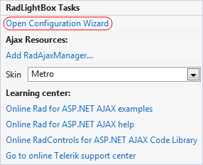
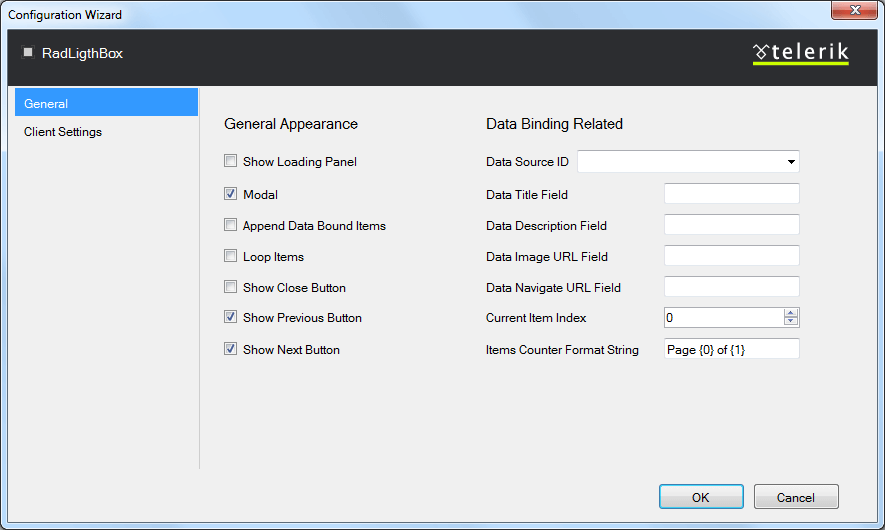
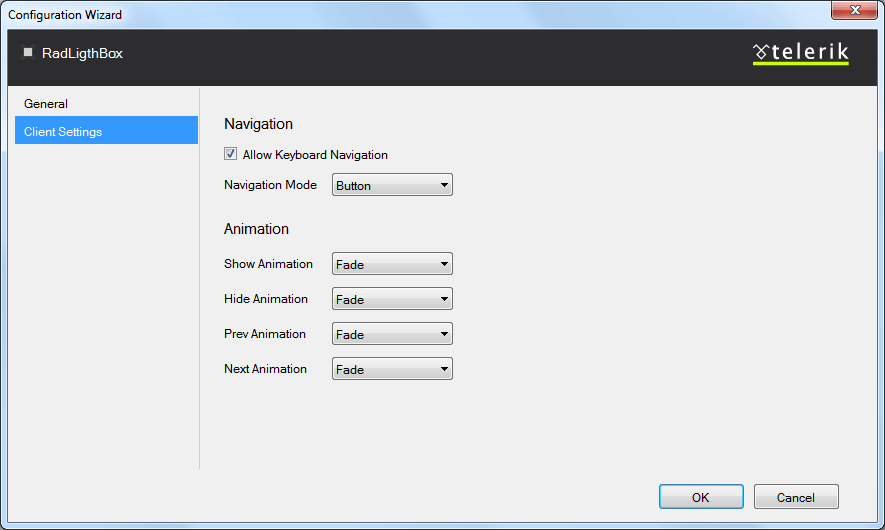
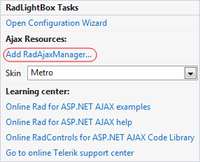
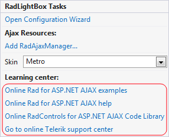

# Design Time

The RadFilter Smart Tag provides convenient access to the most common settings for the control. You can display the Smart Tag by rightclicking on the __RadLightBox__ in the design window, and choosing the "Show Smart Tag" option from its context menu.

The options which are exposed through the Smart Tag are:

## Open Configuration Wizard

Open Configuration Wizard link displays __RadLightBox__ wizard with General settings which lets you customize/configure the__RadLightBox__ control.

## General Settings

The General settings tag lets you perform the following:

__General Appearance:__

* __Show Loading Panel__ - Determines whether the LoadingPanel will be displayed when navigating between the page/image

* __Modal__ - When the property is enable the window can be closed by clicking outside of its frame.

* __Append Data Bound Items__ - Allows you to append a data bound items to a currently set static collection of items.

* __Loop Items__ - Determines whether the slideshow will begin from the start page after the last one has been reached

* __Show Close Button__ - Determines whether the close button will be displayed in the LightBox

* __Show Previous Button__ - Determines whether the previous button will be displayed in the LightBox

* __Show Next Button__ - Determines whether the next button will be displayed in the LightBox

__Data Binding Related:__

* __Data Source ID__ - Determines the id of the data source

* __Data Title Field__ - Determines the image title field when server data binding is used

* __Data Description Field__ - Determines the description field when server data binding is used

* __Data Image URL Field__ - Determines the image URL field when server data binding is used

* __Show Navigate URL Button__ - Determines the navigation URL field when server data binding is used

* __Current Item Index__ - Allows you to set index to the current item.

* __Item Counter Format String__ - You could use this property to set a custom format of the items counter.

## Client Settings

The Client settings tag lets you perform the following:

__Navigation:__

* __Allow Keyboard Navigation__ - Allows to use a keyboard to navigate within RadLightBox

* __Navigation Mode__ - Allows you to choose between two type of navigation: Zone and Button.Zone navigation mode allows you to navigate between the images by clicking on the left or right area of the RadLightBox, while the Button navigation is performing only by clicking on the arrow buttons.

__Animation:__

* __Show Animation__ - Allows you to choose the type of animation that will be displayed during showing RadLigthBox

* __Hide Animation__ - Allows you to choose the type of animation that will be displayed during hiding RadLigthBox

* __Prev Animation__ - Allows you to choose the type of animation that will be displayed during navigating to the previous item

* __Next Animation__ - Allows you to choose the type of animation that will be displayed during navigating to the next item

## RadAjaxManager

The __Add RadAjaxManager__ link adds a RadAjaxManager to your Web page.

## Learning Center

Link navigate you directly to APS.NET live examples.

Link navigate you directly to APS.NET help.

You can also search the Telerik web site for a given string.

You can navigate directly to the Telerik Support Center.
