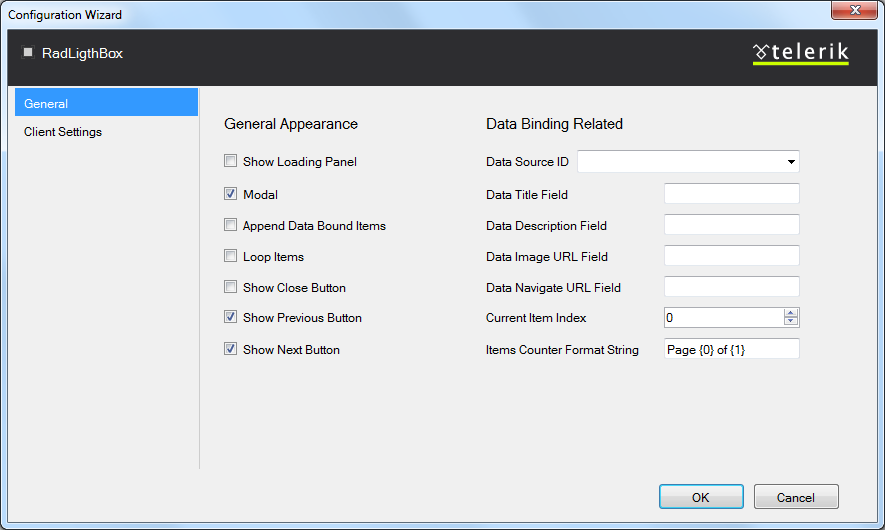

# Design Time

The RadFilter Smart Tag provides convenient access to the most common settings for the control. You can display the Smart Tag by rightclicking on the **RadLightBox** in the design window, and choosing the "Show Smart Tag" option from its context menu.

The options which are exposed through the Smart Tag are:

## Open Configuration Wizard

Open Configuration Wizard link displays **RadLightBox** wizard with General settings which lets you customize/configure the **RadLightBox** control.

## General Settings

The General settings tag lets you perform the following:

**General Appearance:**

* **Show Loading Panel** - Determines whether the LoadingPanel will be displayed when navigating between the page/image

* **Modal** - When the property is enable the window can be closed by clicking outside of its frame.

* **Append Data Bound Items** - Allows you to append a data bound items to a currently set static collection of items.

* **Loop Items** - Determines whether the slideshow will begin from the start page after the last one has been reached

* **Show Close Button** - Determines whether the close button will be displayed in the LightBox

* **Show Previous Button** - Determines whether the previous button will be displayed in the LightBox

* **Show Next Button** - Determines whether the next button will be displayed in the LightBox

**Data Binding Related:**

* **Data Source ID** - Determines the id of the data source

* **Data Title Field** - Determines the image title field when server data binding is used

* **Data Description Field** - Determines the description field when server data binding is used

* **Data Image URL Field** - Determines the image URL field when server data binding is used

* **Show Navigate URL Button** - Determines the navigation URL field when server data binding is used

* **Current Item Index** - Allows you to set index to the current item.

* **Item Counter Format String** - You could use this property to set a custom format of the items counter.

## Client Settings

The Client settings tag lets you perform the following:

**Navigation:**

* **Allow Keyboard Navigation** - Allows to use a keyboard to navigate within RadLightBox

* **Navigation Mode** - Allows you to choose between two type of navigation: Zone and Button.Zone navigation mode allows you to navigate between the images by clicking on the left or right area of the RadLightBox, while the Button navigation is performing only by clicking on the arrow buttons.

**Animation:**

* **Show Animation** - Allows you to choose the type of animation that will be displayed during showing RadLigthBox

* **Hide Animation** - Allows you to choose the type of animation that will be displayed during hiding RadLigthBox

* **Prev Animation** - Allows you to choose the type of animation that will be displayed during navigating to the previous item

* **Next Animation** - Allows you to choose the type of animation that will be displayed during navigating to the next item

## RadAjaxManager

The **Add RadAjaxManager** link adds a RadAjaxManager to your Web page.

## Learning Center

Link navigate you directly to APS.NET live examples.

Link navigate you directly to APS.NET help.

You can also search the Telerik web site for a given string.

You can navigate directly to the Telerik Support Center.

