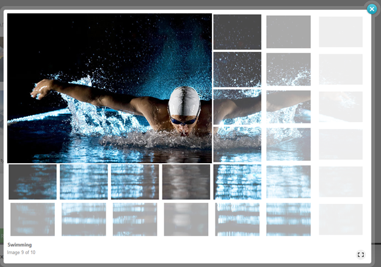

# Animations


The __RadLightBox__ control provides options for using advanced animations, which are transitions between the images.You can apply animation effects when you show an image, navigate to the next or previous images and when you hide the image.The four different properties that control the animation effects are __ShowAnimation__, __NextAnimation__,__PrevAnimation__ and __HideAnimation__. Each property provides a list with a different animation types.

## 

You can additionally modify the animation effects by using the __Easing__ and __Speed__ properties.Those properties are applicable for __ShowAnimationSettings__, __NextAnimationSettings__,__PrevAnimationSettings__ and __HideAnimationSettings__ sub properties of the __AnimationSettings__ property.

__Example 1__ gives you a better look how to use these properties and __Figure 1__ shows the output.

````ASPNET
	    <AnimationSettings NextAnimation="Blocks" HideAnimation="Blocks" PrevAnimation="Blocks" ShowAnimation="Blocks">
	        <HideAnimationSettings Easing="EaseInOutSine" Speed="1000" />
	        <NextAnimationSettings Easing="EaseInOutSine" Speed="1000" />
	        <PrevAnimationSettings Easing="EaseInOutSine" Speed="1000" />
	        <ShowAnimationSettings Easing="EaseInOutSine" Speed="1000" />
	    </AnimationSettings
````


__Figure 1:__ Blocks animation in action.

## Animation Types

The __ShowAnimation__, __NextAnimation__, __PrevAnimation__ and__HideAnimation__ properties allow you to choose an animation effect. __RadLightBox__ offers 14different animation effects, which will apply a different effect between the image transitions. You can check out the different animation effects in the[live example](http://demos.telerik.com/aspnet-ajax/lightbox/examples/functionality/animations/defaultcs.aspx) and	__Table 1__ shows the different animations.

__Table 1:__ All available animation effects.


|  __Fade__  |  __Resize__  |  __Blocks__  |  __BigBlocks__  |
| ------ | ------ | ------ | ------ |
| __SmallBlocks__ | __HorizontalResize__ | __VerticalResize__ | __DiagonalResize__ |
| __HorizontalSlide__ | __VerticalSlide__ | __HorizontalStripes__ | __VerticalStripes__ |
| __CollapsingHorizontalStripes__ | __CollapsingVerticalStripes__ |||

## Easing

Easing functions makes animation look more realistic by controlling the rate of the transition between the images.The simplest easing function, the line, is linear interpolation at constant rate.More advanced easing functions can have accelerating or decelerating at the beginning, the end or both.You could read the following [MSDN Easing Function](http://msdn.microsoft.com/en-us/library/ee308751%28v=vs.110%29.aspx)help article, which provides detailed information about the different easing functions. __Table 2__shows the different easing functions.

__Table 2:__ All available easing functions.


|  __Linear__  |  __EaseInSine__  |  __EaseOutSine__  |  __EaseInOutSine__  |
| ------ | ------ | ------ | ------ |
| __EaseInQuad__ | __EaseOutQuad__ | __EaseInOutQuad__ | __EaseInCubic__ |
| __EaseOutCubic__ | __EaseInOutCubic__ | __EaseInQuart__ | __EaseOutQuart__ |
| __EaseInOutQuart__ | __EaseInQuint__ | __EaseOutQuint__ | __EaseInOutQuint__ |
| __EaseInExpo__ | __EaseOutExpo__ | __EaseInOutExpo__ | __EaseInCirc__ |
| __EaseOutCirc__ | __EaseInOutCirc__ | __EaseInBack__ | __EaseOutBack__ |
| __EaseInOutBack__ | __EaseInElastic__ | __EaseOutElastic__ | __EaseInOutElastic__ |
| __EaseInBounce__ | __EaseOutBounce__ | __EaseInOutBounce__ ||

## Speed

The __Speed__ property determines the duration of the animation, measured in milliseconds.

# See Also

 * [RadLightBox Animation Live Demo](http://demos.telerik.com/aspnet-ajax/lightbox/examples/functionality/animations/defaultcs.aspx)

 * [RadLightBox Overview]()
