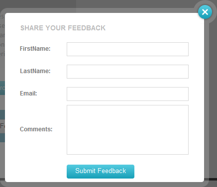

# Templates

This article explains the `ItemTemplate` and `DescriptionTemplate` features of **RadLightBox**. It contains the following sections:

* [Templates overview](#templates-overview)
* [Lifecycle and Loading Content](#lifecycle-and-loading-content)
* [Example](#example)

## Templates overview

**Templates** are fully supported by RadLightBox control. **RadLightBox** supports two base template types - *ItemTemplate* and *DescriptionTemplate*. The first one is instantiated at the top part of the control, where the main content is placed. The latter resides on the bottom, where the Title and Description are normally displayed.

Using these templates, you can display different type of content, for example:

* HTML markup
* iframes
* server controls

## Lifecycle and Loading Content

The templates in RadLightBox are optimized for minimal footprint on the page. This means that you need to keep the following in mind:

* There is only one templated item rendered on the page at any given time. Navigating to another templated item requires a postback. This is not the case when non-templated items are used, they change their content in the browser and only request the new image, even when used together with templated items.

* The template is removed from the DOM when the lightbox is closed or when it is navigated to another item.

	* Opening a lightbox that was closed results in a postback that will fetch the last item that was displayed in it. This will fire the `OnCommand` event.

	* You can avoid the template disposal and subsequent postback by setting the `PreserveCurrentItemTemplates` property to `true`. It defaults to `false`. 
	
		* This also applies to navigating to another non-templated item and then back to the templated item.

* The built-in loading panel will not work when templates are used. Nevertheless if you have AJAX-enabled the lightbox by using a **RadAjaxManager** or **RadAjaxPanel**, and you have applied a **RadLoadingPanel**, the loading sign will appear when navigating between the templates.


## Example

The example below shows how to use templates to create the following **RadLightBox**:



An `<ItemTemplate>` section is added to the `RadLightBoxItems` declaration. The controls needed for the form are placed accordingly into the item template.

````ASP.NET
<telerik:RadLightBox ID="FeedbackLightBox" runat="server" Width="400px" Height="350px"
	CssClass="lb_feedback" Modal="true">
	<ClientSettings>
		<AnimationSettings HideAnimation="Resize" NextAnimation="Fade" PrevAnimation="Fade" ShowAnimation="Resize" />
	</ClientSettings>
	<Items>
		<telerik:RadLightBoxItem>
			<ItemTemplate>
				<asp:Label ID="FormTitle" runat="server" Text="SHARE YOUR FEEDBACK" CssClass="feedback_header"></asp:Label>
				<br />
				<asp:Label Text="FirstName:" ID="FirstNameLabel" runat="server" CssClass="feedback_label" />
				<telerik:RadTextBox RenderMode="Lightweight" runat="server" ID="FirstNameTextBox" Width="245px" />
				<br />
				<asp:Label Text="LastName:" ID="LastNameLabel" runat="server" CssClass="feedback_label" />
				<telerik:RadTextBox RenderMode="Lightweight" runat="server" ID="LastNameTextBox" Width="245px" />
				<br />
				<asp:Label Text="Email:" ID="EmailLabel" runat="server" CssClass="feedback_label" />
				<telerik:RadTextBox RenderMode="Lightweight" runat="server" ID="EmailTextBox" Width="245px" />
				<br />
				<asp:Label Text="Comments:" ID="CommentsLabel" runat="server" CssClass="feedback_label" />
				<telerik:RadTextBox RenderMode="Lightweight" runat="server" Resize="None" TextMode="MultiLine" Width="245px" Height="100px"></telerik:RadTextBox>
				<br />
				<telerik:RadButton RenderMode="Lightweight" ID="RadButton1" Text="Submit Feedback" runat="server" Skin="Silk" CssClass="submit_feedback_btn rbPrimaryButton"></telerik:RadButton>
			</ItemTemplate>
		</telerik:RadLightBoxItem>
	</Items>
</telerik:RadLightBox>
````


