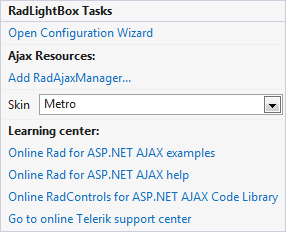

# Getting Started

The following help article will walk you through the process of setting a RadLightBox.

## Configuring the control

1. Create a new webpage in Visual Studio.

1. Drag a RadLightBox control from the toolbox onto your Web page. It's Smart Tag should appear automatically.

	

1. In the **General** section available after clicking **Open Configuration Wizard** you can select DataSource and set the **Title** and **Description** fields.

	

1. After we have selected our images source we need to configure the animations. This is achievable by clicking on the **Client Settings** section. As you can see now we can select a different animation to be performed when transitioning to the previous or next image and also a different animation when opening and closing the control.

	
	
That was it we now have a full-featured lightbox and are ready to go.
