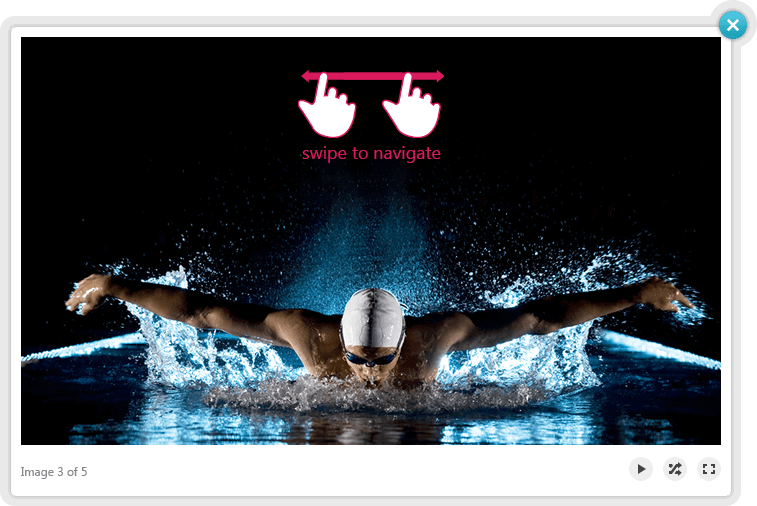

# Gestures Support

## 

RadLightBox supports two __mobile-specific__ types of interaction - __swipe__ and __tap__. When you __swipe__ left or right you will __navigate__ to the previous/next image. If you __tap__ on the image, the __navigation arrows__ (if visible) and the __description box__ (when overlay mode is enabled) will disappear with slide animation (__Image 1__). A subsequent tap will show these elements again.

__Image 1__
