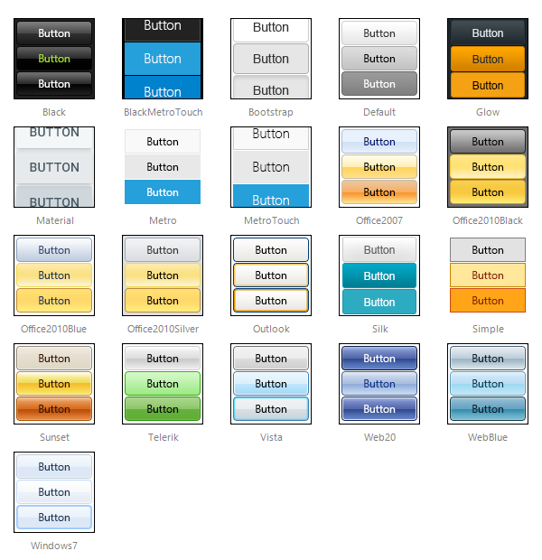

# Skins

**RadLinkButton** uses **skins** to control its overall look-and-feel. A skin is a set of images and a CSS stylesheet that can be applied to the control elements and defines their look and feel.

To apply a skin to a **RadLinkButton** control, set its **Skin** property.

**RadLinkButton** is installed with a number of preset skins. These are shown below:

 

 @[template - Material skin is available only in Lightweight mode](/_templates/common/skins-notes.md#material-only-in-lightweight) 

## Customizing Skins

You can tweak the existing skins or create your own. See [Create a Custom Skin For RadLinkButton]() for a step-by-step walk through. To use your own skin

1. Add the new CSS file to your project.

1. Drag and drop the CSS file from the Project Explorer onto your Web page.

1. Set the **EnableEmbeddedSkins** property of the control to **False**.

The stylesheet for a **RadLinkButton** skin has the name **Button.[SkinName].css** and can be found in the **...Skins/[SkinName]** directory. For example, the stylesheet for the "Black" skin is called Button.Black.css and is located in the ...Skins/Black directory.

## See Also

 * [Create a Custom Skin]()

 * [Primary Action Button]()
