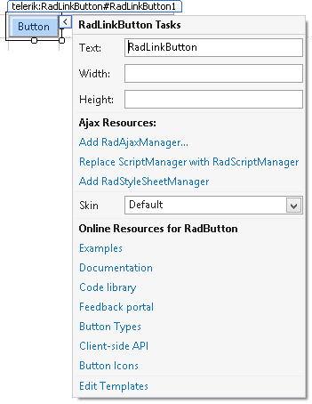

# Design Time

The Smart Tag of **RadLinkButton** (**Figure 1**) lets you configure your control or quickly get help. You can display the Smart Tag by right clicking on a **RadLinkButton** control and choosing "Show Smart Tag", or clicking the small rightward-pointing arrow located in the upper right corner of the control.

>caption Figure 1: RadLinkButton's smart tag.

## Ajax Resources

* **Add RadAjaxManager...** adds a **RadAjaxManager** component to your Web page.

* **Add RadScriptManager** adds a **RadScriptManager** component to your Web page.

* **Add RadStyleSheetManager** adds a **RadStyleSheetManager** component to your Web page.

* **Add ScriptManager** adds a **ScriptManager** component to your Web page.

## Skin

The **Skin** drop-down displays a list of available [skins]() that you can apply to your control, along with an example of what the **RadLinkButton** control looks like for each skin. Assign a skin by selecting the one you want from the list.

## Learning Center

* Links navigate you directly to examples, help, and code library.

* You can navigate directly to the [Telerik Support Center](http://www.telerik.com/support/home.aspx).

## See Also

 * [RadLinkButton Overview]()
 
 * [RadLinkButton Getting Started]()
 
 * [RadLinkButton Online Demos](http://demos.telerik.com/aspnet-ajax/linkbutton/examples/overview/defaultcs.aspx)

