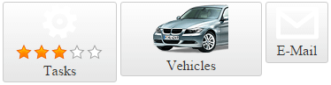

# ContentTemplate

This help article showcases how to add complex content (server-side controls and HTML elements) in **RadLinkButton** instead of plain text (**Figure 1**). You can do this both in the markup, or in the code-behind:

* [Add Elements to RadLinkButton in the Markup](#add-elements-to-radlinkbutton-in-the-markup)

* [Add Elements to RadLinkButton from the Code-behind](#add-elements-to-radlinkbutton-from-the-code-behind)

## Add Elements to RadLinkButton in the Markup

In order to add controls to the **RadLinkButton** in the markup, you should place them directly in the composite **ContentTemplate** property (**Example 1**).

>caption Figure 1: RadLinkButtons configured with contenttemplate in Example 1, Example 2 and Example 3.



>caption Example 1: Adding controls to **ContentTemplate** of **RadLinkButton** in the markup.

````ASP.NET
<telerik:RadLinkButton runat="server" ID="RadLinkButton1" NavigateUrl="http://www.telerik.com" Target="_blank">
	<ContentTemplate>
        
        <telerik:RadRating ID="RadRating1" runat="server" Enabled="false" Value="3" SelectionMode="Continuous" ItemCount="5" />
		<div>Tasks</div>
	</ContentTemplate>
</telerik:RadLinkButton>
````

## Add Elements to RadLinkButton from the Code-behind

You can add controls to **RadLinkButton** from the code-behind in two ways:

* Add elements to the **Controls** collection of **RadLinkButton** (**Example 2**). 

**Example 2**: Adding controls to the **Controls** collection of **RadLinkButton** from the code-behind.

````ASP.NET
<telerik:RadLinkButton runat="server" ID="RadLinkButton1" Width="160px" Height="85px" NavigateUrl="http://www.telerik.com" Target="_blank">
</telerik:RadLinkButton>
````
````C#	
protected void Page_Init(object sender, EventArgs e)
{
	Literal radButtonContent = new Literal();
	radButtonContent.ID = "radButtonContent";
	radButtonContent.Text = "<span>Vehicles</span>";
	RadLinkButton1.Controls.Add(radButtonContent);
}
````
````VB	
Protected Sub Page_Init(sender As Object, e As EventArgs)
	Dim radButtonContent As New Literal()
	radButtonContent.ID = "radButtonContent"
	radButtonContent.Text = "<span>Vehicles</span>"
	RadLinkButton1.Controls.Add(radButtonContent)
End Sub
````

* Set the **ContentTemplate** property to an instance of a class that implements the **ITemplate** interface (**Example 3**).

**Example 3**: Adding controls to the **RadLinkButton** by using the **ITemplate** class.

````ASP.NET
<telerik:RadLinkButton runat="server" ID="RadLinkButton1" Width="71px" Height="70px" NavigateUrl="http://www.telerik.com" Target="_blank">
</telerik:RadLinkButton>
````
````C#
protected void Page_Init(object sender, EventArgs e)
{
	RadLinkButton1.ContentTemplate = new ButtonContentTemplate();
}

public class ButtonContentTemplate : ITemplate
{
	void ITemplate.InstantiateIn(Control container)
	{
		System.Web.UI.WebControls.Image contentImage = new System.Web.UI.WebControls.Image();
		contentImage.ID = "contentImage";
		contentImage.ImageUrl = "http://demos.telerik.com/aspnet-ajax/button/examples/contenttemplate/Images/envelope.png";
		contentImage.AlternateText = "envelope";
		container.Controls.Add(contentImage);

		Label contentLabel = new Label();
		contentLabel.ID = "contentLabel";
		contentLabel.Text = "E-Mail";
		container.Controls.Add(contentLabel);
	}
}
````
````VB
Protected Sub Page_Init(sender As Object, e As EventArgs)
	RadLinkButton1.ContentTemplate = New ButtonContentTemplate()
End Sub

Public Class ButtonContentTemplate
	Implements ITemplate
	Private Sub ITemplate_InstantiateIn(container As Control) Implements ITemplate.InstantiateIn
		Dim contentImage As New System.Web.UI.WebControls.Image()
		contentImage.ID = "contentImage"
		contentImage.ImageUrl = "http://demos.telerik.com/aspnet-ajax/button/examples/contenttemplate/Images/envelope.png"
		contentImage.AlternateText = "envelope"
		container.Controls.Add(contentImage)

		Dim contentLabel As New Label()
		contentLabel.ID = "contentLabel"
		contentLabel.Text = "E-Mail"
		container.Controls.Add(contentLabel)
	End Sub
End Class
````


## See Also

 * [Split Button]()

 * [Image Button]()
