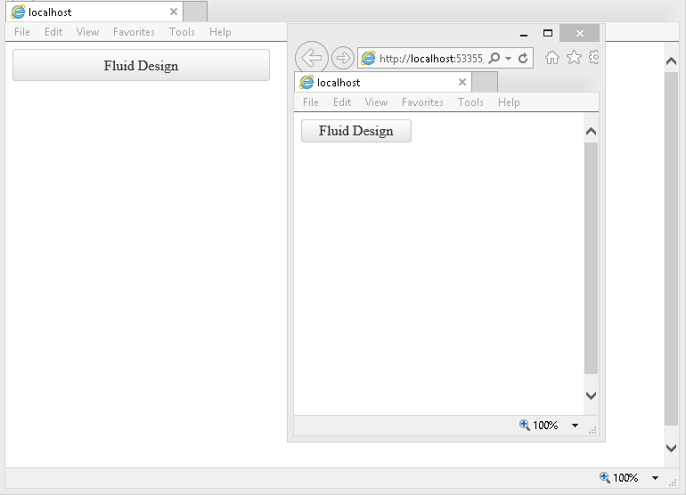

# Fluid Design

This article explains the **fluid design capabilities RadLinkButton offers**. The **Example 1** below shows how you can set button size in percent so it can resize with its parent element.

@[template](/_templates/common/render-mode.md#resp-design-desc "slug-el: linkbutton/mobile-support/elastic-design, slug-fl: no")

>caption Figure 1: RadLinkButton set to 100% width and and 25% height.



>caption Example 1: Shows the markup that provides fluid design of the RadLinkButton in Figure 1.

````ASP.NET
<style>
	html, body, form {
		height:100%;
	}
</style>

<div style="width:40%; height:30%;">
	<telerik:RadLinkButton runat="server" ID="StandartButton" NavigateUrl="https://www.telerik.com" Target="_blank"
		Text="Fluid Design" Skin="Default" Width="100%" Height="25%">
	</telerik:RadLinkButton>
</div>
````

## See Also

 * [Mobile Support Overview]()

 * [Render Modes]()

 * [Elastic Design]()

