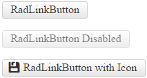

# PushButton Overview

The **RadLinkButton** control (**Figure 1**) enriches the features, that ASP.NET HyperLink control has. It provides additional events, ability to [define icons]() and [content template]() and numerous [themes](). 

The control can be easily styled by changing the **Skin** property, and alternatively setting properties that change the look of the control. This will eliminate the need to use the [RadFormDecorator](), just to style a single button. Developers can easily migrate their applications from using the standard ASP.NET HyperLink control to the new **RadLinkButton** control, because most of their functionality is provided by the control, and is controlled by the same or similar (intuitive) properties.

>caption Figure 1: RadLinkButton control provides a rich API and UI.

>note **RadLinkButton** does not support a Classic [render mode](). Setting its RenderMode to Classic will default to the Lightweight render mode.

<!--
Code that creates Figure 1:
<telerik:RadLinkButton runat="server" ID="RadLinkButton1" Text="RadLinkButton"></telerik:RadLinkButton>
 
 
<telerik:RadLinkButton runat="server" ID="RadLinkButton2" Text="RadLinkButton Disabled" Enabled="false"></telerik:RadLinkButton>
 
 
<telerik:RadLinkButton runat="server" ID="RadLinkButton3" Text="RadLinkButton with Icon">
	<Icon CssClass="rbSave" />
</telerik:RadLinkButton>
-->

## See Also

 * [RadLinkButton Online Demos](http://demos.telerik.com/aspnet-ajax/linkbutton/examples/overview/defaultcs.aspx)
 
 * [RadLinkButton Getting Started]()
 
 * [RadLinkButton Properties and Events]()
 
 * [FormDecorator Overview]()