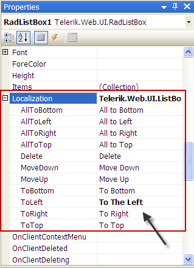

# Localization

The localization support for **RadListBox** lets you completely translate the user interface, or simply adapt a few strings.

## Localization property

The **Localization** property specifies the strings that appear in the runtime user interface of **RadListBox**. By changing the values of each named sub-property, you change the appearance of the string the ListBox uses:

````ASPNET
<telerik:RadListBox RenderMode="Lightweight" ID="RadListBox1"    
	runat="server"
	Localization-ToLeft="To The Left"    
	AllowReorder="true" ...>
</telerik:RadListBox>
````



````C#
RadListBox1.Localization.MoveDown = "Down";
````
````VB.NET
RadListBox1.Localization.MoveDown = "Down"
````

>tip This technique is useful when customizing some of the messages of a **particular instance** . The messages are not shared between RadListBox instances. A complete translation using this approach is not appropriate.
>


>caption  

|  **Key**  |  **Default Value**  |  **Description**  |
| ------ | ------ | ------ |
|AllToTop|All to Top|Sets the text of the **All to Top** button. The button appears when **ShowTransferAll="True"** and **Position** is either *Top* or *Bottom* |
|AllToBottom|All to Bottom|Sets the text of the **All to Bottom** button. The button appears when **ShowTransferAll="True"** and **Position** is either *Top* or *Bottom* |
|AllToLeft|All to Left|Sets the text of the **All to Left** button. The button appears when **ShowTransferAll="True"** and **Position** is either *Left* or *Right* |
|AllToRight|All to Right|Sets the text of the **All to Right** button. The button appears when **ShowTransferAll="True"** and **Position** is either *Left* or *Right* |
|Delete|Delete|Sets the text of the **Delete** button. The button appears when **AllowDelete="True"** |
|MoveDown|Move Down|Sets the text of the **Move Down** button. The button appears when **AllowReorder="True"** |
|MoveUp|Move Up|Sets the text of the **Move Up** button. The button appears when **AllowReorder="True"** |
|ToBottom|To Bottom|Sets the text of the **To Bottom** button. The button appears when **AllowTransfer="True"** and **Position** is either *Top* or *Bottom* |
|ToTop|To Top|Sets the text of the **To Top** button. The button appears when **AllowTransfer="True"** and **Position** is either *Top* or *Bottom* |
|ToLeft|To Left|Sets the text of the **To Left** button. The button appears when **AllowTransfer="True"** and **Position** is either *Left* or *Right* |
|ToRight|To Right|Sets the text of the **To Right** button. The button appears when **AllowTransfer="True"** and **Position** is either *Left* or *Right* |


## Global Resource Files

The primary means for localization in ASP.NET is to use resource files. Resource files are simple XML files that can be easily edited and transferred to other applications. You can use resource files to change the default (English) localization for **RadListBox** that is stored in the Telerik.Web.UI assembly.

To create a global resource file to localize the ListBox follow these steps:

1. Create the **App_GlobalResources** folder in the root of your web application. 2. Copy the default resource **RadListBox.resx** file into it. This file can be found in the **App_GlobalResources** folder of the directory where you installed the RadControls. 3. **Make a copy** of the file and rename the copy so that its name contains the Culture Identifier. The resource files used by RadListBox follow a strict naming convention:

**RadListBox.<Culture Identifier>.resx**


>tip The **Culture Identifier** consists of a language code followed by a dash and the country code.Example: “en-US”, “fr-CA” and so on.
>


For example copy the RadListBox.resx file to RadListBox.fr-CA.resx


4. Edit the strings using the Visual Studio editor or your favorite text editor. Customize strings just as you would set the **Localization** property.


You can now switch the listbox so that it uses your new resource file by setting the active culture:


# See Also

 * [Reorder]()

 * [Transfer]()

 * [Drag and Drop]()

 * [Button Settings]()
